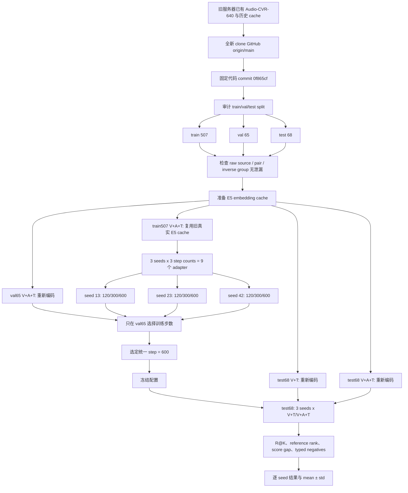
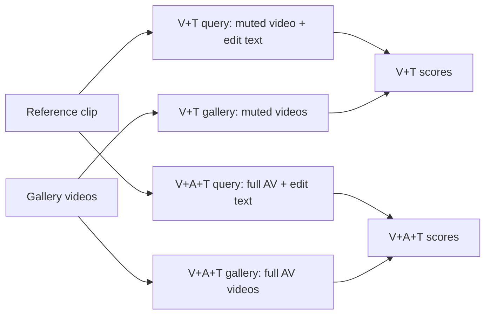

# Audio-CVR-640 最终三种子实验：服务器执行过程详解

> 日期：2026-07-18  
> 用途：解释旧服务器如何从 Audio-CVR-640 得到正式 `test68` 三种子结果。  
> 代码版本：`0f865cf4fe5e213c3094cc53570891c3e7931455`。  
> 原则：服务器只运行 GitHub `origin/main` 的代码，没有修改仓库代码。

## 1. 这次实验要回答什么

这次实验不是为了重新得到旧的 `R@1=40%`，而是要回答一个更严格的问题：

> 在 raw-source-disjoint 的独立 test split 上，使用完全相同的 query、gallery、adapter 和随机种子设置时，开启 audio 是否比关闭 audio 更有利于检索正确 target？

正式比较只有两个模式：

```text
V+T   : reference muted video + edit_text -> muted video gallery
V+A+T : reference full AV + edit_text     -> full AV gallery
```

控制变量包括：

- 相同的 68 个 test queries；
- 相同的 1000 个 gallery items；
- 相同的 positive/reference indices；
- 相同的 adapter 结构和训练数据；
- 相同的训练步数、学习率和 batch size；
- 只改变 audio 是否在 query 和 gallery 两侧同时启用。

因此，`V+A+T - V+T` 才能解释为当前协议下 audio 带来的增量。

## 2. 三组容易混淆的实验

| 实验 | Query | Gallery | R@1 | 论文用途 |
|---|---:|---|---:|---|
| 早期 reference 诊断 | 30 | 30 target + 30 reference + 940 random | 40.00% | 证明 reference negative 必须进入 gallery |
| 开发阶段七模态实验 | 128 | val+test 合并、typed/local/random | 33.59% | 检查七种模态和训练步数，不进正式主表 |
| 最终 source-disjoint test | 68 | reference + typed + random，共 1000 | 24.51 ± 1.83% | 正式主结果 |

三个数字来自不同 query pool 和不同 gallery，不能理解为同一个实验从 40% 退化到 24.51%。

## 3. 全流程图



## 4. 阶段 0：建立不可变的代码环境

旧仓库位于：

```text
/data02/usr/wangqihao/Demo/test/cvr_clean_main
```

它处于历史开发分支，并包含未推送 commits。直接运行会无法证明实验使用公开代码，也可能让旧代码、cache 和新结果互相污染。

因此服务器新建干净 clone：

```text
/data02/usr/wangqihao/Demo/test/cvr_aaai_repro_main
```

并验证：

```text
local HEAD  = 0f865cf4fe5e213c3094cc53570891c3e7931455
origin/main = 0f865cf4fe5e213c3094cc53570891c3e7931455
git status  = clean
```

旧仓库随后只提供数据、split、视频路径和可安全复用的 embeddings。训练与评估逻辑全部来自干净 clone。

## 5. 阶段 1：只读核实旧 40% 结果

历史结果路径：

```text
runs/e5_pilot1pct_refneg_reuse_fixed_20260522_233802
```

gallery 构成为：

```text
30 targets + 30 references + 940 random = 1000
```

| Model | R@1 | R@5 | R@10 |
|---|---:|---:|---:|
| Base E5 | 6.67% | 100.00% | 100.00% |
| Adapter | 40.00% | 100.00% | 100.00% |

这一步没有重新训练，只是确认旧记录真实存在。它说明 target 通常在 top-5 内，但 reference 经常占据 top-1，因此只作为 `early reference-aware diagnostic`。

## 6. 阶段 2：审计 source-disjoint split

数据 run：

```text
/data02/usr/wangqihao/Demo/test/cvr_clean_main/
runs/audio_cvr_bline_6_9s_merged_all_220_20260527_164758
```

| Split | Records | 用途 |
|---|---:|---|
| train | 507 | 训练 adapter |
| val | 65 | 选择统一训练步数 |
| test_main | 68 | 配置冻结后的最终评估 |

服务器检查以下 group 在任意两个 split 间均无交集：

```text
source_disjoint_group_id
raw source video id
pair_group_id
inverse_pair_group_id
```

结果：

```text
train ∩ val  = 0
train ∩ test = 0
val ∩ test   = 0
```

test 还满足 `is_inverse=0`、`derived_from_inverse=0`，且 val/test 的 `proposal_id` 无交集。

### 6.1 为什么 source-disjoint 很重要

如果一个 raw video 的不同切片分别进入 train 和 test，adapter 可能记住场景、人物或录音条件，而不是学习 composed retrieval。按 raw source 分组可以避免这种泄漏。

### 6.2 test68 的实际组成

```text
63 B-main + 5 B-extended = 68 records
```

所以正式写作应称为 `source-disjoint held-out test68`，不能称为纯 B-main test。

| Subtype | Count |
|---|---:|
| sound_event | 31 |
| speech_topic_in_video_context | 34 |
| unknown | 3 |
| music | 0 |

## 7. 阶段 3：构造正式 test gallery

每个 query 面对同一个共享的 1000-item gallery：

| Gallery type | Count |
|---|---:|
| target positive | 68 |
| reference negative | 68 |
| visual hard | 68 |
| audio hard | 68 |
| ASR hard | 68 |
| random distractor | 660 |
| total | 1000 |

每条 query 显式保存：

```text
positive_gallery_index[i]  -> target 在 gallery 中的位置
reference_gallery_index[i] -> reference 在 gallery 中的位置
```

R@K 和 target/reference 比较均使用显式 index，不假设 query 与 gallery 顺序天然对齐。

### 7.1 为什么正式 test 没有 strict local

`typed_hardneg` gallery 中，source-disjoint 的 `forbidden_source` 规则屏蔽了 local candidates：

```text
strict local_same_source = 0
local_fallback_visual    = 0
```

报告中的 `same_source_any` 不能等同于 strict local recall，论文不能用它宣称 local retrieval 性能。

## 8. 阶段 4：准备 E5 embeddings

E5-Omni-7B 很大，实验中真正耗时的是把视频编码成 3584 维向量，而不是训练 adapter。

### 8.1 Cache 中保存什么

```text
query embedding
target embedding
reference embedding
negative embeddings
gallery embeddings
positive_gallery_index
reference_gallery_index
records metadata
```

主要 shape 可以理解为：

```text
query   : [N_query, 3584]
gallery : [1000, 3584]
scores  : [N_query, 1000]
```

### 8.2 train507 为什么可以复用

旧 `cache_V_A_T` 中的训练记录通过四字段联合键匹配：

```text
sample_id
reference_video
target_video
edit_text
```

匹配结果为 `507/507`。这 507 条还被独立验证为纯 train，与 val/test raw source 不重叠，因此复用不会引入评估数据。

### 8.3 val/test 为什么重新编码

旧 eval cache 把 val 和 test 合成 128 条，同时缺少 test68 中 5 条 extended，gallery distractors 也与正式 test 不一致。

现有 `--reuse-cache-from` 要求目标 cache 需要的记录全部命中，只要缺一条就拒绝复用。服务器没有绕过安全检查，而是用真实 E5-Omni-7B 重新编码：

```text
val65 V+A+T
test68 V+T
test68 V+A+T
```

### 8.4 V+T 与 V+A+T 的输入差别



模态消融的硬规则是：

```text
audio off: query off AND gallery off
audio on : query on  AND gallery on
```

只关闭一侧会改变匹配定义，不能用于 audio necessity 对照。

## 9. 阶段 5：Adapter 到底训练了什么

E5-Omni-7B 完全冻结。训练组件是三个从单位矩阵初始化的线性投影：

```text
query_proj : 3584 -> 3584
doc_proj   : 3584 -> 3584
edit_proj  : 3584 -> 3584
```

投影后重新做 L2 normalization：

```text
z_query = normalize(W_query * e_query)
z_doc   = normalize(W_doc   * e_doc)
z_edit  = normalize(W_edit  * e_edit)
```

初始化时：

```text
W_query = I
W_doc   = I
W_edit  = I
```

因此 adapter 从 Base E5 embedding geometry 出发，而不是随机重建整个空间。

### 9.1 使用的训练 recipe

三个 seed 全部使用相同的 `e5_omni_recipe`：

```text
masked DCL contrastive objective
modality-aware temperature
negative curriculum / false-negative filtering
query-target CORAL alignment, lambda = 0.05
batch whitening, lambda = 0.01
```

明确关闭：

```text
AudioDelta L_ref / L_delta / L_hn
edit-type loss
visual auxiliary loss
hardness weighting
multi-positive
memory bank
local segment training
LoRA
```

所以论文中的方法是 `E5-Omni recipe adapter-only baseline`，不能写成提出了新的 AudioDelta loss。

### 9.2 Masked DCL 的直观含义

对于 batch 中第 `i` 个 query：

```text
positive           = target_i
in-batch negatives = target_j, j != i
explicit negatives = record 中保存的 negatives
```

核心形式为：

```text
loss_i = -log(
    exp(score(q_i, target_i))
    /
    (exp(score(q_i, target_i)) + debiased_negative_sum)
)
```

同 pair/inverse group 的潜在 false negatives 会被 mask 或降权，避免把可能正确的候选强行推远。

### 9.3 CORAL 与 whitening

CORAL 约束 query 与 target 投影后的 batch covariance 不要差异过大：

```text
L_coral = ||Cov(query) - Cov(target)||^2
```

Batch whitening 抑制 embedding 维度之间过强的相关性和均值漂移。两者都是 e5-omni recipe 的辅助正则，不是本项目新增的 AudioDelta loss。

## 10. 阶段 6：为什么训练 9 个 Adapter

候选步数：

```text
steps = 120, 300, 600
```

随机种子：

```text
seeds = 13, 23, 42
```

所以：

```text
3 seeds x 3 step counts = 9 adapters
```

固定条件：

```text
learning rate = 3e-4
batch size    = 8
train records = 507
```

等价伪代码：

```python
for seed in [13, 23, 42]:
    for steps in [120, 300, 600]:
        adapter = identity_initialized_adapter()
        train(
            adapter=adapter,
            frozen_embeddings=train507_cache,
            profile="e5_omni_recipe",
            seed=seed,
            steps=steps,
            learning_rate=3e-4,
            batch_size=8,
        )
```

每个 adapter 都从相同 identity initialization 开始，300 steps 不是接着 120-step checkpoint 继续训练。

## 11. 阶段 7：只用 val65 选择 600 steps

9 个 adapter 都在 val65 的 V+A+T cache 上评估。跨三个 seed 的平均 R@1：

| Steps | Val Mean R@1 |
|---:|---:|
| 120 | 18.46% |
| 300 | 24.61% |
| 600 | **25.64%** |

600 steps 的平均 `target_beats_reference=41.03%` 也最高，因此最终选择：

```text
final steps = 600
```

选择顺序：

```text
1. val R@1
2. 如并列，看 val target_beats_reference
3. 再并列，看 val target-reference gap
```

选定后配置冻结。test68 在此前不参与选步数，避免 test leakage。

## 12. 阶段 8：正式 test 执行的 6 组评估

最终只使用三个 600-step adapter：

```text
seed13_steps600
seed23_steps600
seed42_steps600
```

每个 adapter 评估两种输入：

```text
3 seeds x {V+T, V+A+T} = 6 evaluations
```

评分过程：

```python
query = adapter.query(query_embedding)      # [68, 3584]
gallery = adapter.doc(gallery_embeddings)   # [1000, 3584]
scores = query @ gallery.T                  # [68, 1000]
```

每一行 `scores[i]` 是第 `i` 个 query 对 1000 个 gallery videos 的相似度。

## 13. 指标怎样计算

### 13.1 Recall@K

将每条 query 对 1000 个 gallery 的分数降序排列。如果 target 的显式 index 位于前 K：

```text
hit@K_i = 1
```

否则为 0。整体：

```text
R@K = sum(hit@K_i) / 68
```

例如 R@1=26.47% 对应约 18/68 条 query 的 target 排名第一。

### 13.2 Target Beats Reference

```text
delta_i = score(query_i, target_i)
        - score(query_i, reference_i)
```

若 `delta_i > 0`，target 击败 reference：

```text
target_beats_reference = count(delta_i > 0) / 68
```

它比普通 R@1 更直接地测量 edit direction。

### 13.3 Target-reference gap

```text
gap_mean = mean(delta_i)
```

- 正数：平均 target 高于 reference；
- 负数：平均 reference 仍占优；
- 越接近并超过 0 越好。

正式 V+A+T 的 gap 仍为 `-0.0082`，说明 adapter 有改进，但整体尚未解决 reference directionality。

### 13.4 Positive Beats Typed Negative

它统计：

```text
score(query, target) > score(query, typed_negative)
```

的 query 比例。visual/audio/ASR hard 均为 100%，说明它们在当前 test 中偏容易，而不是模型彻底解决了 hard-negative 问题。

## 14. 三种子结果如何聚合

每个 seed 先独立得到一个指标，再计算：

```text
mean = (metric_13 + metric_23 + metric_42) / 3
std  = 三个 seed 指标的标准差
```

### 14.1 V+A+T

| Metric | Seed 13 | Seed 23 | Seed 42 | Mean ± Std |
|---|---:|---:|---:|---:|
| R@1 | 26.47% | 22.06% | 25.00% | **24.51 ± 1.83%** |
| R@5 | 97.06% | 94.12% | 94.12% | **95.10 ± 1.39%** |
| R@10 | 98.53% | 98.53% | 98.53% | **98.53 ± 0.00%** |
| target beats reference | 38.24% | 30.88% | 35.29% | **34.80 ± 3.02%** |

### 14.2 V+T

| Metric | Seed 13 | Seed 23 | Seed 42 | Mean ± Std |
|---|---:|---:|---:|---:|
| R@1 | 17.65% | 14.71% | 19.12% | **17.16 ± 1.83%** |
| R@5 | 95.59% | 95.59% | 91.18% | **94.12 ± 2.08%** |
| R@10 | 100.00% | 100.00% | 97.06% | **99.02 ± 1.39%** |
| target beats reference | 26.47% | 19.12% | 32.35% | **25.98 ± 5.41%** |

### 14.3 Audio gain

| Metric | V+T | V+A+T | Audio gain |
|---|---:|---:|---:|
| R@1 | 17.16% | 24.51% | **+7.35pp** |
| R@5 | 94.12% | 95.10% | +0.98pp |
| R@10 | 99.02% | 98.53% | -0.49pp |
| target beats reference | 25.98% | 34.80% | **+8.82pp** |

三个 seed 的 R@1 audio gain：

```text
seed13: +8.82pp
seed23: +7.35pp
seed42: +5.88pp
```

方向一致是重要证据，但 test 只有 68 条，仍需 paired bootstrap、McNemar 或其他配对显著性检验。

## 15. Base E5 与 Adapter 的区别

Base E5 在 V+T 和 V+A+T 下均为：

```text
R@1  = 1.47%
R@5  = 100%
R@10 = 100%
```

这意味着 Base E5 几乎总能把 target 放进 top-5，但 top-1 基本被 reference 占据。开启 audio 对 Base E5 R@1 没有帮助，说明原始 embedding 没有自然学会当前任务的相对音频方向。

Adapter 将 V+A+T R@1 提高到 `24.51%`，但 `target_beats_reference=34.80%` 仍低于 50%。准确结论是：

```text
adapter 显著改善任务适配
但尚未解决 reference-target directionality
```

不能写成“模型已经解决 Audio-CVR”。

## 16. Subtype 结果

V+A+T adapter：

| Subtype | Count | Base R@1 | Adapter R@1 Mean |
|---|---:|---:|---:|
| sound_event | 31 | 0.0% | 36.6% |
| contextual speech | 34 | 2.9% | 14.7% |
| unknown | 3 | 0.0% | 11.1% |

sound event 在当前样本上更容易被 adapter 利用。由于 music 数量为 0，不能写任何 music 性能结论。

## 17. 为什么新结果更低但更可信

### 17.1 旧 40%

只有 30 queries，gallery 主要由 random distractors 构成。它适合发现 reference 问题，不适合估计最终泛化性能。

### 17.2 旧 33.59%

使用 128-query val+test 合并池，而且是单 seed。它帮助选择实验方向，但不能作为独立 test 主结果。

### 17.3 新 24.51 ± 1.83%

满足：

```text
source-disjoint train/val/test
validation-only model selection
independent test68
three random seeds
fixed 1000-item gallery
same-gallery audio on/off control
```

因此它数值更低，但证据等级最高。

## 18. 服务器产生的文件

最终输出：

```text
/data02/usr/wangqihao/Demo/test/cvr_clean_main/
runs/aaai_audiocvr_adapter_final_3seed_20260718_173146/
```

大小约 1.7 GB。日志位于：

```text
/data02/usr/wangqihao/Demo/test/cvr_clean_main/
logs/aaai_audiocvr_adapter_final_3seed_20260718_173146/
```

自然生成的主要文件：

```text
adapter_seed{seed}_steps600/adapter.pt
adapter_seed{seed}_steps600/adapter_config.json
adapter_seed{seed}_steps600/train_summary.json
adapter_seed{seed}_steps600/loss_curve.jsonl

eval_*/summary.json
eval_*/comparison.md
eval_*/diagnostics.json
eval_*/score_diagnostics.json
eval_*/adapter_geometry.json
eval_*/per_query_topk.jsonl
eval_*/per_query_scores.jsonl

cache_*/summary.json
records_*/summary.json
```

每个 600-step `loss_curve.jsonl` 有 600 行，全部无 NaN/Inf。

当前代码没有自动生成跨 seed 聚合文件，例如：

```text
test_main_mean_std.json
test_main_comparison.md
audio_gain_summary.md
error_breakdown.json
```

这不影响底层实验，因为每个 seed 的原始 summary、per-query scores 和 top-k 都存在。后续增加只读聚合命令可以减少人工抄录错误。

## 19. 整体执行伪代码

下面不是服务器新增的脚本，而是对已有 CLI 调用逻辑的等价概括：

```python
# 1. 从 Audio-CVR-640 的固定 split 读取数据
train = load_split("train")       # 507
val = load_split("val")           # 65
test = load_split("test_main")    # 68
assert source_disjoint(train, val, test)

# 2. 准备真实 E5 embeddings
train_cache = reuse_verified_cache(train, mode="V+A+T")
val_cache = encode_with_e5(val, mode="V+A+T")
test_vt_cache = encode_with_e5(test, mode="V+T")
test_vat_cache = encode_with_e5(test, mode="V+A+T")

# 3. 训练 9 个独立 adapter
adapters = {}
for seed in [13, 23, 42]:
    for steps in [120, 300, 600]:
        adapters[seed, steps] = train_adapter(
            cache=train_cache,
            profile="e5_omni_recipe",
            seed=seed,
            steps=steps,
            learning_rate=3e-4,
            batch_size=8,
        )

# 4. 只根据 val 选择统一步数
val_results = evaluate_all(adapters, val_cache)
selected_steps = select_by_val(val_results)  # 600

# 5. 配置冻结后评估 test
test_results = {}
for seed in [13, 23, 42]:
    adapter = adapters[seed, selected_steps]
    test_results[seed, "V+T"] = evaluate(adapter, test_vt_cache)
    test_results[seed, "V+A+T"] = evaluate(adapter, test_vat_cache)

# 6. 跨 seed 聚合
report_mean_std(test_results)
report_audio_gain(test_results["V+A+T"], test_results["V+T"])
```

真实服务器使用的是仓库已有的：

```text
python -m app.e5_audio_delta_train prepare
python -m app.e5_audio_delta_train cache-embeddings
python -m app.e5_audio_delta_train train-adapter
python -m app.e5_audio_delta_train eval
```

服务器只多次调用这些已有命令，没有创建或修改训练代码。

## 20. 可以与不可以得出的结论

### 20.1 可以得出

1. 旧 40% 是真实的早期诊断结果，但不是正式泛化性能。
2. split 在 raw source、pair 和 inverse group 层面无泄漏。
3. Base E5 能召回 target，却无法把 target 排在 reference 前面。
4. adapter-only training 显著改善 Audio-CVR 任务适配。
5. 三个 seed 上，V+A+T 的 R@1 均高于 V+T。
6. audio 对当前严格 test 的平均 R@1 增益为 7.35pp。
7. reference negative 是当前主要难点；typed negatives 已偏容易。

### 20.2 不可以得出

1. audio 对所有 composed video retrieval 都必要；
2. Audio-CVR 模型已经解决 directionality；
3. 当前结果能代表 music；
4. 当前 formal test 已验证 strict local retrieval；
5. 68-query 结果必然具有统计显著性；
6. Audio-CVR-640 是大规模或 fully human-validated benchmark。

## 21. 阅读这次实验时最重要的三句话

```text
第一，40%、33.59% 和 24.51% 来自三个不同协议，不能直接比较。

第二，正式结果不能只看 R@1，还要看 target 是否击败 reference。

第三，新结果虽然更低，但 split、model selection 和三种子更规范，
所以它才是论文应该使用的主结果。
```
