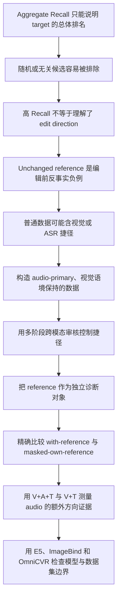

# Audio-CVR AAAI 论文故事线总纲

> 状态：**Canonical / Narrative Locked / Evidence Pending**  
> 用途：这是 Audio-CVR 论文标题、摘要、正文、图表、答辩和对外介绍的最高优先级叙事基准。  
> 规则：论文可以随最终实验更新数字、统计结论和限制，但不得随意改变本文定义的科学问题、三项贡献及因果链。  
> 冲突处理：其他项目文档若与本文的论文定位冲突，以本文为准；具体实验数字以最终冻结结果和实验 dossier 为准。  
> 最近整理：2026-07-23。

## 0. 一句话定稿

Audio-CVR 研究一种被整体检索指标掩盖的方向性失败：模型往往已经找到了正确视觉语境，却仍将未发生修改的 reference 排在满足声音修改要求的 target 前面。本文通过模态隔离的自动数据构造、精确 reference 反事实屏蔽，以及跨模型和跨 benchmark 对照，对这一失败进行诊断。

英文核心命题：

> Aggregate retrieval metrics can obscure poor edit-direction understanding: models may retrieve the correct context yet rank the unchanged reference above the target that satisfies the requested audio edit.

## 1. 永久不变的论文定位

本文是：

```text
Reference-focused diagnostic benchmark
+ audio-primary directional task formulation
+ modality-isolated automatic curation
+ controlled cross-model and cross-benchmark evidence
```

本文不是：

```text
新 adapter 架构论文
新 loss 论文
E5-Omni recipe 论文
宣称 audio 对所有视频检索都必要的论文
只追求更高 aggregate R@K 的普通模型论文
```

adapter、E5-Omni 和 ImageBind 都是用于检验 benchmark 与科学问题的 baseline。模型不是全文中心。

全文统一把 Audio-CVR 称为：

> **a reference-focused diagnostic benchmark**

必要时也可使用 `controlled diagnostic testbed` 或 `reference-focused stress test`。不得将其包装成全面覆盖开放世界检索难度的 general-purpose benchmark。它有意隔离一个具体失败模式：

> Audio-CVR is designed to isolate the confusion between an edited target and its unchanged reference, rather than to cover the full diversity of open-world video retrieval.

## 2. 核心科学问题

组合视频检索的输入和目标是：

```text
query  = reference video/audio + modification text
target = target video/audio
```

例如：

```text
reference：视觉场景中伴随钢琴声
edit：将钢琴声变为吉他声
target：视觉语境基本保持，但声音已变为吉他声
```

普通语义检索只需要找到“看起来相关”的视频。Audio-CVR 要求模型进一步理解：

```text
reference 不满足 edit
target 满足 edit
钢琴 -> 吉他 是有方向的变化
```

reference 因而不是一个普通负样本。本文首先把它定义为：

> **query-specific pre-edit negative control**

它是一个真实观测到的修改前状态，而不是人工生成的虚构视频；它在评测中承担 counterfactual role，即代表“请求的 edit 尚未发生”的状态。为简洁起见，后文可称为 pre-edit counterfactual negative，但首次出现必须给出上述朴素定义。

```text
语义和视觉语境高度相关
但仍处于修改前状态
```

本文把模型将 reference 排在 target 前面的现象称为：

> **reference-target confusion**

首次涉及 OmniCVR 时说明，OmniCVR 使用 `source video` 一词，因此 `source-target confusion` 是同一现象在其命名体系中的表达。Audio-CVR 正文默认使用 `reference`。

## 3. 全文唯一因果链



任何正文段落、表格或实验如果不能服务这条链，应移入附录、限制或删除。

## 4. 三项核心贡献

### 4.1 Reference-specific counterfactual diagnosis

第一贡献不是“又定义一个包含 audio 的 CVR 任务”，而是提出一个被 aggregate Recall 掩盖的诊断问题：

> 模型是否把满足 edit 的 target 排在尚未发生 edit 的 reference 前面？

我们把 unchanged reference 形式化为 query-specific pre-edit negative control，并说明它在评测中承担 counterfactual role。随后通过以下指标和干预显式隔离 reference-target confusion：

```text
target-over-reference accuracy
target-reference score margin
reference rank
reference-specific top-1 error attribution
exact query-specific reference masking
```

这一诊断建立在 audio-primary directional CVR 定义上：

> Directional audio edit under preserved visual context.

数据以以下条件为目标：

```text
自动审核判断 reference 不满足 audio edit
自动审核判断 target 满足 audio edit
edit text 被筛选为主要描述可听见的变化
pairs 经筛选，以降低静音视频直接确定 target 的风险
主测试集经过 transcript / ASR shortcut screening
```

准确边界：

- CoVA 和 OmniCVR 已研究 audio-visual composed retrieval。
- OmniCVR 已将 source 放入 gallery。
- 我们的差异是 `audio-primary directional isolation + reference-specific diagnosis`，而不是单独的 audio inclusion 或 reference inclusion。

### 4.2 Modality-isolated automatic curation

数据构造方法本身是主要贡献，不是简单调用模型生成文本：

```text
自然视频分组与 6-9 秒切片
-> source-aware candidate pairing
-> audio-only change analysis
-> audio-grounded edit generation
-> reference/target directional verification
-> muted-video shortcut screening
-> full audiovisual consistency checking
-> ASR-shortcut screening
-> sampled repeat auditing
-> pair/source deduplication
-> source-disjoint splitting
```

各阶段分别回答：

```text
声音是否真的发生了明确变化？
edit 是否来自声音证据？
reference 是否不满足 edit？
target 是否满足 edit？
只看静音画面是否会形成捷径？
完整音视频中 edit 是否仍然成立？
speech 是否退化成 transcript matching？
自动审核决定是否稳定？
train/val/test 是否存在 source 或 pair 泄漏？
```

论文统一称为：

> **multi-stage multimodal automatic curation pipeline**

`agent`、shard、cache、resume 和高并发属于可复现工程实现。科学贡献是分阶段的跨模态反事实审核，而不是 prompt orchestration。

### 4.3 Controlled cross-model and cross-benchmark evidence

第三贡献是受控实证研究，而不是新模型。我们使用：

```text
Base E5-Omni
E5-Omni + few-shot low-rank adapter
ImageBind-Huge zero-shot
OmniCVR external benchmark
```

共同检验：

```text
reference-target confusion 是否跨模型存在
reference-target confusion 是否跨 benchmark 存在
audio 改善的是 R@1、target-over-reference，还是 score margin
task adaptation 是否改变失败模式
```

严格 reference 干预定义：

```text
With-reference:
    完整 gallery 参与排名

Without-reference / masked-own-reference:
    只把当前 query 自己的 reference score 设为 -inf
    不删除其他 query 的 references
    不补随机项
    不重新编码
    其余分数完全不变
```

这一实证结构使论文可以区分：

```text
模型找不到正确语境
vs.
模型找到正确语境，但分不清修改前与修改后
```

## 5. Benchmark 的固定设计

### 5.1 主测试集

最终 full benchmark 已冻结为：

```text
Test1000 = 1000 queries
sound_event = 829
music = 171
speech = 0
```

冻结文件：

```text
runs/audio_cvr_test1000_unified_auditonly_20260723_142000/
final_test1000/test_main_1000.jsonl
```

SHA256：

```text
70bd998c33bd4c2168ac18afb26ec6fbe928b234c61241f53412be387d52ec9e
```

质量口径必须分层：

```text
Core150:
    model-verified 核心敏感性子集
    两位作者共同人工查看随机抽取的 10 条
    抽查样本被定性判断为高质量
    不是 150 条全量人工审核，也没有正式人工一致率

Full Test1000:
    automatically curated and model-verified
    不是完整双人独立人工标注集
    冻结后完成 78/78 条 sampled repeat review
    repeat review 是模型稳定性审计，不是人工共识标注或选择门槛
```

不得把 Full Test1000 写成 `human-validated`。如报告人工检查，只能准确写明检查者数量、范围和协议。

### 5.2 主 gallery

Test1000 的主 gallery 固定为：

```text
1000 target entries
+ 1000 unchanged reference entries
= 2000 logical gallery entries
```

这里的 `2000` 指逻辑 gallery entries，不预先等同于 `2000 unique media identities`。所有 query 共用同一个全局 gallery。主结论围绕：

```text
with-reference
vs.
mask only the query-specific reference
```

typed hard negatives、random distractors 和 strict local clips 是补充诊断，不是最终主故事的必要组成。若没有完整 verified strict-local coverage，必须作为限制披露，不能写成已完成的主要实验。

### 5.3 Gallery 与 masking 提交前硬审计

Exact masking 是全文最重要的受控干预，最终结果只有通过以下审计才能进入论文：

```text
logical gallery entry count = 2000
实际 unique path 数量已记录
实际 unique content hash 数量已记录
重复路径和内容相同但路径不同的条目已列出
reference 恰好也是其他 query target 的交叉角色已统计
每个 query 的 target index 存在且唯一
每个 query 的 own-reference index 存在且唯一
每个 query 的 target index != own-reference index
E5 与 ImageBind 使用相同 sample IDs 和 gallery identity/order
with-reference 与 masked-own-reference 复用同一 score matrix
每行只有 own-reference 对应的一个 score 从原值变为 -inf
其余 score 在 mask 前后逐元素完全相同
```

必须保存：

```text
gallery_identity_audit.json
target_reference_index_audit.json
reference_masking_audit.json
cross_model_alignment_audit.json
```

若实际文件名不同，可以使用等价产物，但论文与补充材料必须能追溯上述字段。该审计属于可复现性保障，不包装成研究贡献。

## 6. 模型在论文中的角色

### 6.1 E5-Omni

```text
frozen E5-Omni-7B backbone
+ identity-initialized low-rank residual adapter
```

角色：

- Base E5 测量未经任务适配的能力。
- Adapter 是 few-shot task-adapted baseline。
- 五个 seed 用于测量训练方差。
- Adapter 不是主要方法贡献。

准确表述：

> We establish a lightweight adapter-based baseline on top of a frozen E5-Omni backbone.

### 6.2 ImageBind

```text
ImageBind-Huge
zero-shot
fixed V/A/T embedding composition
no Audio-CVR training
```

角色：

- 提供独立于 E5-Omni 的模型家族验证。
- 检查 reference-target confusion 是否跨模型出现。
- 检查 audio 的作用是改善 R@1、margin，还是只在 task-adapted E5 中明显。

ImageBind 不需要训练集，不应与 E5 adapter 写成相同训练方案。

ImageBind 的融合协议必须在查看 Full Test1000 结果前固定：

```text
所有 V/A/T 基础向量先分别 L2 normalize
V+T、A+T、V+A、V+A+T 使用预先固定的等权向量和
组合后再次 L2 normalize
不在 Full Test1000 上选择融合权重
不根据结果切换 normalization 或公式
```

ImageBind 原论文证明共享 embedding space 支持跨模态检索和 embedding arithmetic，这为固定组合提供方法依据，但不代表我们的具体等权公式已经在 Audio-CVR test 上优化。

### 6.3 OmniCVR

OmniCVR 是外部 cross-benchmark diagnostic，不是 Audio-CVR 的替代测试集。

它回答：

> reference/source confusion 是否只由我们自己构造的数据造成？

它不用于声称：

```text
Audio-CVR adapter 具有跨 benchmark 性能优势
OmniCVR 上 audio R@1 得到显著提升
现有 benchmark 没有把 source 放入 gallery
```

## 7. 三层证据结构

### 7.1 Core sensitivity evidence

Core150 用于：

- 提供模型复核核心上的质量敏感性结果。
- 两位作者共同查看随机抽取的 10 条，并定性判断这些样本质量较高。
- 保留已确认的 audio gain 和 reference masking 结果。
- 对 Full Test1000 的趋势进行质量敏感性对照。

已确认结果：

```text
E5 Adapter V+T R@1       = 11.33%
E5 Adapter V+A+T R@1     = 22.93%
Audio gain               = +11.60pp
V+A+T masked-reference   = 99.47% R@1
```

这些结果是已确认的 core evidence，但最终摘要应优先报告 Full Test1000，并在正文同时给出 Core150。

当前准确口径：

> A random sample of 10 Core150 queries was manually inspected by both authors and judged qualitatively to be of high quality; Full Test1000 was automatically curated and model-verified.

不得把这 10 条定性抽查写成 Core150 全量人工审核、独立双盲标注或正式人工一致率。

若未来补做正式人工验证，应由两位作者独立盲审 Core150 或分层抽取的 50 至 100 条。盲审表固定检查：

```text
reference 是否不满足 edit
target 是否满足 edit
edit 是否主要描述可听变化
静音后是否仍存在明显 target shortcut
是否存在 transcript / ASR shortcut
```

若完成，报告：

```text
审核人数与抽样方法
各字段通过率
exact decision agreement
字段级 agreement
分歧数量
分歧裁决规则
```

该正式独立盲审当前未完成，不得提前写入摘要、贡献或数据质量结论。

### 7.2 Full benchmark evidence

Full Test1000 用于正式主表：

```text
E5 Base
E5 Adapter, five seeds
ImageBind zero-shot
seven modality settings
with-reference vs masked-own-reference
paired statistical tests
Core150 vs Full1000 sensitivity analysis
```

最终数字尚未完成时只能使用 `TBD`，不得从当前编码进度或旧 Test150 外推。

### 7.3 Cross-benchmark evidence

OmniCVR 已确认：

```text
995 valid audio-centered queries
1994 effective gallery items

E5 Adapter V+A+T:
    with source 0.12% R@1
    masked source 14.21% R@1

Base E5 V+A+T:
    with source 0.00% R@1
    masked source 17.39% R@1
```

OmniCVR 上 audio 的 R@1 增益不显著，因此这里只支持 reference-specific diagnosis 的跨 benchmark 必要性。

## 8. 论文的准确主张

### 可以稳定主张

1. Aggregate retrieval metrics 可能掩盖 reference-target directional failures。
2. Unchanged reference 是检验 edit direction 的 query-specific pre-edit negative control，并承担 counterfactual role。
3. Audio-CVR 提供一个以 audio-primary 和视觉语境保持为构造目标的诊断环境。
4. 多阶段自动构造流程显式筛查并降低视觉、方向和 ASR 捷径风险。
5. Core150 上 audio 显著改善 E5 adapter 的方向检索。
6. Core150 和 OmniCVR 上，精确 mask 自身 reference 会显著改变 R@1。
7. Adapter 经过任务适配后仍存在明显 reference confusion。

### 需要等待 Full Test1000 才能定稿

1. Full Test1000 上 audio 对 E5 R@1 的效应大小和显著性。
2. Full Test1000 上 audio 对 target-reference margin 的效应。
3. ImageBind 是否复现 reference masking 效应。
4. ImageBind 是否复现 audio R@1 增益，或仅复现 margin 改善。
5. Core150 与 Full Test1000 的趋势是否一致。
6. 不同数据来源和 sound/music 子类上的效果。

### 永远不得声称

1. 我们首次将 reference/source 放入 composed retrieval gallery。
2. Audio 对所有视频检索任务都必要。
3. Adapter 已经解决 Audio-CVR。
4. Adapter 或 E5 recipe 是本文原创方法。
5. Full Test1000 已完成大规模独立人工验证。
6. 1000 条测试集代表所有音频类型、语言、视频领域或真实分布。
7. 自动模型审核等价于人工 gold annotation。
8. ImageBind 必须优于 E5 才能证明 benchmark 有效。

## 9. 正文章节的固定推进逻辑

### 9.1 Introduction

五段式：

1. 定义 composed video retrieval 及其方向性要求。
2. 指出现有 aggregate Recall 无法区分语境检索与 edit-direction understanding。
3. 引出 unchanged reference 作为编辑前反事实负例。
4. 说明为什么需要 audio-primary 自动构造与捷径筛查。
5. 概括三项贡献和核心发现。

Introduction 不以 adapter 开头，也不以“提高多少 R@1”定义问题。

### 9.2 Related Work

顺序固定：

```text
Composed image/video retrieval
-> audio-visual composed retrieval, CoVA and OmniCVR
-> automatic audio/video dataset curation
-> multimodal embedding baselines
```

必须主动承认：

- OmniCVR 已将 source 放入 gallery。
- 近期工作已研究 audio-visual composed retrieval。
- 自动构造和模型辅助审核已有先例。

我们的差异落在：

```text
audio-primary directional isolation
+ multi-stage cross-modal shortcut screening
+ reference-specific counterfactual diagnosis
```

### 9.3 Task and Benchmark

依次写：

1. `reference + edit -> target`。
2. reference 不满足、target 满足 edit。
3. preserved visual context 与 non-speech scope。
4. reference-target confusion 的定义。
5. global gallery 与 exact reference mask。
6. Core150 和 Full Test1000 的关系。

### 9.4 Automatic Curation

按真实流水线顺序写，不按代码文件顺序写：

```text
source collection
-> clipping/grouping
-> candidate pairing
-> audio-grounded edit generation
-> audio-only direction gate
-> muted-video shortcut gate
-> full-AV consistency gate
-> ASR screening
-> repeat audit
-> deduplication and split audit
```

报告完整漏斗、数据来源、拒绝原因、一致率和失败案例。

### 9.5 Reference-aware Evaluation

先定义 gallery，再定义指标和 paired intervention：

```text
R@K / MRR
target-over-reference
target-reference margin
reference rank
reference-specific error attribution
masked-own-reference
```

强调 masking 发生在相同 score matrix 上。

### 9.6 Baselines

顺序：

```text
Base E5-Omni
E5-Omni + lightweight adapter
ImageBind-Huge zero-shot
```

训练细节只服务可复现性，不扩大成方法章节。

### 9.7 Experiments

主表顺序固定：

1. Full Test1000 主结果。
2. V+A+T vs V+T。
3. With-reference vs masked-own-reference。
4. Base E5 vs Adapter。
5. E5 vs ImageBind failure pattern。
6. Core150 sensitivity analysis。
7. OmniCVR cross-benchmark diagnosis。
8. 分项、错误案例和限制。

### 9.8 Limitations

必须正面披露：

- Full Test1000 主要是模型复核，不是完整独立人工 gold set。
- Core150 的人工检查范围和检查者数量有限。
- 主集只覆盖 sound event 和 music，不覆盖 speech。
- 数据来源分布不均衡。
- 训练 pair 很少，adapter 是 few-shot baseline。
- strict local negative coverage 不是主 benchmark 的完整证据。
- 自动审核模型可能带来 selection bias。
- 精确 reference masking 是诊断干预，不是实际部署时删除 reference 的建议。

## 10. 七页主文的图表叙事

AAAI-27 主文限 7 页，且审稿人没有义务阅读补充材料。正文固定压缩为 **2 图 + 3 表**。

### Figure 1：任务、核心失败与 exact masking

一张图完成三件事：

```text
左：reference + directional audio edit -> target
中：with-reference 时模型把 unchanged reference 排第一
右：在同一 score matrix 上只 mask own reference，target 排名变化
```

图中直接写出：

```text
s(q_i, r_i) = -inf
```

并注明所有其他 candidate scores 保持不变。Figure 1 必须让审稿人在一分钟内理解 reference-target confusion 和反事实干预。

### Figure 2：自动构造流水线

展示 audio-only、muted-video 和 full-AV 三种信息条件分别解决什么问题，并标出 ASR screening、sampled repeat audit、deduplication 和 source-disjoint audit。

### Table 1：数据与质量

合并：

```text
构造漏斗
sound/music 分布
Core150 / Full1000
数据来源
审核一致性
dedup / leakage audit
```

### Table 2：模型主结果

同表包含：

```text
E5 Base / E5 Adapter / ImageBind
V+T / V+A+T
with-reference / masked-own-reference
R@1 / target-over-reference / margin
```

完整七模态、per-seed 和来源分项移入补充材料。

### Table 3：证据层次与外部诊断

紧凑比较：

```text
Core150 with a 10-query dual-author spot check
Full Test1000
OmniCVR
reference-induced R@1 drop
```

正文仍需在文字中报告关键 CI 和显著性；不能只把统计检验放补充材料。

## 11. 固定贡献表述

```text
Our contributions are threefold:

1. We formulate reference-target confusion as a counterfactual
   diagnostic problem in audio-primary composed video retrieval. We
   treat the unchanged reference as a query-specific pre-edit negative
   control representing the state before the requested edit. Our
   protocol isolates the resulting failure through target-over-reference
   accuracy, directional score margins, reference-specific error
   attribution, and exact query-specific reference masking.

2. We introduce a scalable, modality-isolated multimodal curation pipeline
   that constructs natural-video triplets through audio-grounded edit
   generation, audio-only directional verification, muted-video
   shortcut-risk screening, audiovisual consistency checking, sampled
   repeat auditing, and source-disjoint quality control.

3. We conduct controlled cross-model and cross-benchmark analyses with
   a frozen foundation model, a lightweight task-adapted baseline, an
   independent zero-shot audiovisual model, and OmniCVR. These analyses
   test whether reference-target confusion extends beyond one adapter
   and clarify when audio improves directional separation.
```

只允许根据证据做轻微措辞调整，不改变三个贡献的顺序和角色。

## 12. 标题与 TL;DR

### 固定标题

> **Audio-CVR: Automatic Curation and Reference-Aware Evaluation for Directional Audio Composed Video Retrieval**

这是 2026-07-21 提交到 OpenReview 的标题。除非出现明确的 novelty 冲突或会议强制要求，不再随意改名。

### 固定 TL;DR 含义

> Audio-CVR shows that composed video retrieval models often rank an unchanged reference above the target satisfying the requested audio edit, and provides automatic curation and reference-specific diagnostics for this failure.

TL;DR 可以压缩文字，但必须同时保留：

```text
unchanged reference > edited target 的失败
automatic curation
reference-specific diagnosis
```

## 13. 摘要结构与 7 月 21 日版本的更新规则

2026-07-21 提交摘要的前六步逻辑是正确的，继续保留：

```text
1. 定义 composed video retrieval
2. 指出 aggregate recall 不能隔离 unchanged source/reference failure
3. 引入 Audio-CVR
4. 定义 reference 不满足、target 满足 edit
5. 概括多阶段自动构造
6. 定义 reference-specific metrics 与 exact masking
```

最终实验完成后只替换证据段：

```text
旧：150 queries + 1000-item gallery
新：Full Test1000 + 2000-item target/reference gallery

旧：只报告 E5 adapter
新：报告 E5 Base、E5 Adapter 和 ImageBind 中与主张直接相关的结果

保留：Core150 作为模型复核的质量敏感性结果，并准确披露 10 条双作者定性抽查
保留：OmniCVR 995-query cross-benchmark reference diagnostic
```

最终摘要不得堆满七模态结果。优先顺序：

```text
Full1000 reference masking effect
-> Full1000 audio effect或margin effect
-> independent ImageBind evidence
-> OmniCVR cross-benchmark effect
```

若 ImageBind 只支持 reference masking、不支持 audio R@1，则准确写成：

> Reference-target confusion transfers across model families, whereas top-1 gains from audio depend on representation and task adaptation.

## 14. 最终结果的解释规则

### E5 与 ImageBind 都复现 reference masking

可以写：

> Reference-target confusion is a cross-model failure mode rather than an artifact of one adapter.

### E5 与 ImageBind 都获得 audio R@1 增益

可以写：

> Audio provides additional top-rank retrieval evidence under preserved visual context.

### E5 的 R@1 改善，ImageBind 只改善 margin

写成：

> Audio consistently improves target-reference separation, while top-1 gains depend on representation and task adaptation.

### Full1000 效应弱于 Core150

同时报告两者，写成：

> The effect is strongest on the author-checked core and attenuates on the larger model-verified set.

不得删除 Full1000，也不得重新筛 test 追求更好数字。

### ImageBind 整体性能很低

它仍然是独立 zero-shot baseline。只有在其 paired reference masking 效应成立时，才用于跨模型 reference-confusion 结论。

## 15. 写作检查口令

每写完一个章节，检查：

```text
这一节是否解释 reference-target confusion？
是否把数据构造写成方法贡献？
是否把 exact reference masking 写清？
是否区分了 audio 方向证据与普通相似性检索？
是否把 shortcut screening 误写成彻底消除 shortcut？
是否错误地把 adapter 写成主要创新？
是否承认 OmniCVR 已含 source？
是否把 model-verified 误写成 human-validated？
是否把 Core150 与 Full1000 混为同一质量等级？
是否使用了尚未冻结的实验数字？
```

## 16. 最终全文逻辑

```text
现有模型可以排除大量无关视频
但 aggregate Recall 不能说明模型理解了 edit direction
↓
unchanged reference 与 target 语境相近，却处于修改前状态
它是最直接的反事实负例
↓
普通数据中的视觉和 ASR 捷径会掩盖这个问题
↓
Audio-CVR 通过多阶段多模态自动构造，
筛选 audio-primary、视觉语境保持、方向明确的 triplets
↓
reference-aware protocol 在同一 score matrix 上
精确 mask 当前 query 的 unchanged reference
↓
E5 adapter 测量少样本任务适配，
ImageBind 测量独立零样本模型，
OmniCVR 测量跨 benchmark 现象
↓
论文最终回答两个问题：
模型是否真的理解 reference-to-target 的修改方向？
audio 是否为这种方向判断提供额外证据？
```

这条线是全文的长期主线。后续只更新“证据有多强”，不再改变“论文究竟研究什么”。

## 17. 文献边界与写作依据

以下文献只支撑论文定位和设计边界，不能替代我们自己的实验：

| 工作 | 已有贡献 | 对 Audio-CVR 的约束或启发 |
|---|---|---|
| [CoVR, AAAI 2024](https://ojs.aaai.org/index.php/AAAI/article/view/28334) | 从 web video captions 自动构造大规模 CoVR triplets，并使用人工标注 evaluation set | 自动构造不是首创；我们必须突出跨模态方向审核，同时准确披露 Full1000 不是人工 gold set |
| [CoVA, 2026](https://arxiv.org/abs/2601.22508) | 同时考虑视觉与听觉变化，构建 AV-Comp，并对 test pairs、修改文本和幻觉问题进行人工验证 | “把 audio 加入 CoVR”不是 novelty；第一贡献必须是 reference-specific diagnosis，同时必须正视 Full1000 与人工 gold verification 的质量差异 |
| [OmniCVR, ICLR 2026](https://openreview.net/forum?id=KxxR7emO5K) | 覆盖 audio/vision/integrated changes，gallery 含 source、target 和 source-local distractors | “首次加入 reference”不可写；我们的区别是 exact masking、专用指标和错误归因 |
| [EgoCVR, ECCV 2024](https://www.ecva.net/papers/eccv_2024/papers_ECCV/html/5363_ECCV_2024_paper.php) | 通过 fine-grained benchmark 与不同 evaluation settings 暴露现有模型缺陷 | 支持将受控、细粒度评测明确定位为 diagnostic testbed |
| [ImageBind, CVPR 2023](https://openaccess.thecvf.com/content/CVPR2023/html/Girdhar_ImageBind_One_Embedding_Space_To_Bind_Them_All_CVPR_2023_paper) | 统一多模态 embedding，并展示跨模态检索和 embedding arithmetic | 支持使用预先固定的零样本 V/A/T 组合，但不允许在 Test1000 上挑 fusion |
| [AAAI-27 Main Track Call](https://aaai.org/conference/aaai/aaai-27/main-technical-track-call/) | 明确认可 empirical、integrative 和 critical contributions；主文限 7 页 | 诊断型贡献可成立，但必须保证主张严谨、正文证据完整、图表紧凑 |

## 18. 变更控制

在 Full Test1000 和 ImageBind 结果完成前：

```text
科学问题：锁定
三项贡献顺序：锁定
diagnostic benchmark 定位：锁定
标题：锁定
实验数字与效应强度：待更新
摘要证据段：待更新
Table 2 / Table 3：待填
gallery identity / index / masking audit：待最终验收
第二作者独立盲审：可选但高优先级，完成前不得声称
```

只有以下情况允许修改主线：

1. 发现与已发表工作的直接 novelty 冲突。
2. 冻结实验否定了当前科学主张，而不是仅改变效应大小。
3. 作者共同明确决定重新定位论文。

一般的指标升降、单个 baseline 表现不佳或版面微调，不构成改变主线的理由。

## 19. 2026-07-23 最终冻结证据与解释边界

Full1000 与最终 E5/ImageBind 实验已经完成，因此第 18 节中的“待更新”
项目由以下冻结证据替代：

```text
Full1000:
  1000 queries
  829 sound_event + 171 music + 0 speech
  gallery = 1000 targets + 1000 unchanged references
  SHA256 = 70bd998c33bd4c2168ac18afb26ec6fbe928b234c61241f53412be387d52ec9e
  duplicate / leakage / missing media = 0

E5-Omni low-rank adapter, five seeds:
  V+T R@1 = 5.94% +/- 0.99%
  V+A+T R@1 = 12.78% +/- 2.55%
  audio gain = +6.84pp
  95% CI = [5.18, 8.54]pp
  Holm-adjusted p = 0.00025
  target-over-reference = 6.06% -> 13.20%
  own-reference masking:
    V+T = 5.94% -> 98.28%
    V+A+T = 12.78% -> 97.26%
  4317 / 4361 top-1 errors are won by the own reference

ImageBind-Huge, zero-shot equal-weight composition:
  V+T = 11.7% -> 99.3% after own-reference masking
  V+A+T = 2.5% -> 98.5% after own-reference masking
  adding audio changes R@1 by -9.2pp
```

最终解释分为两条，二者不可混写：

1. **跨模型 reference confusion。** E5-Omni 与 ImageBind 在保留 own
   reference 时都发生严重方向混淆，精确 mask 后均接近饱和。这是论文最稳的
   主发现，也是 reference-aware diagnostic protocol 的直接证据。
2. **音频收益依赖任务适配。** 任务适配后的 E5 adapter 能显著利用 audio
   改善方向判断；未经训练的 ImageBind 等权融合反而下降，说明简单加入模态
   可能造成干扰。因此不能写“audio 对所有模型都提高 Recall”。

Core150 继续作为质量敏感性子集；两位作者只共同查看了随机抽取的 10 条，
不能写成 150 条全量人工审核或独立双盲标注。Full1000 是 automatically
curated and model-verified，不是 fully human-validated gold set。Full1000
冻结后完成了 78/78 条 sampled repeat review，exact-decision agreement 为
79.49%，field-level agreement 为 85.64%；该结果是 post-freeze、audit-only
的同模型稳定性证据，不能写成 human consensus review 或 independent double
annotation，也没有改变冻结 Test1000 的成员或 SHA256。

从本节开始，论文主线、标题与三项贡献保持锁定；后续只允许压缩表达、调整图表
和补充可追溯性信息，不再通过改变测试集或融合权重追求更好结果。
