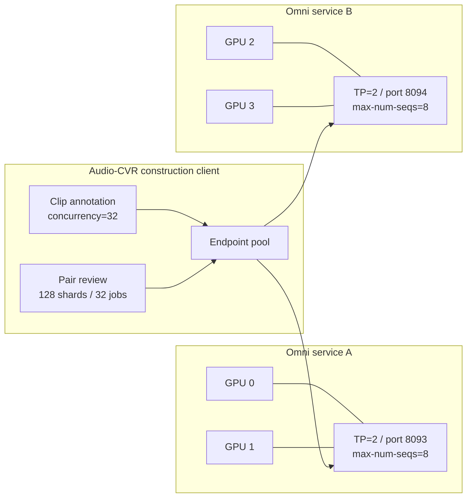
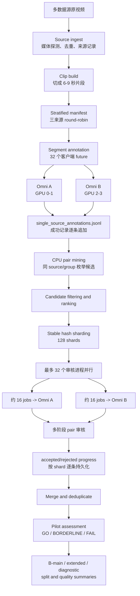
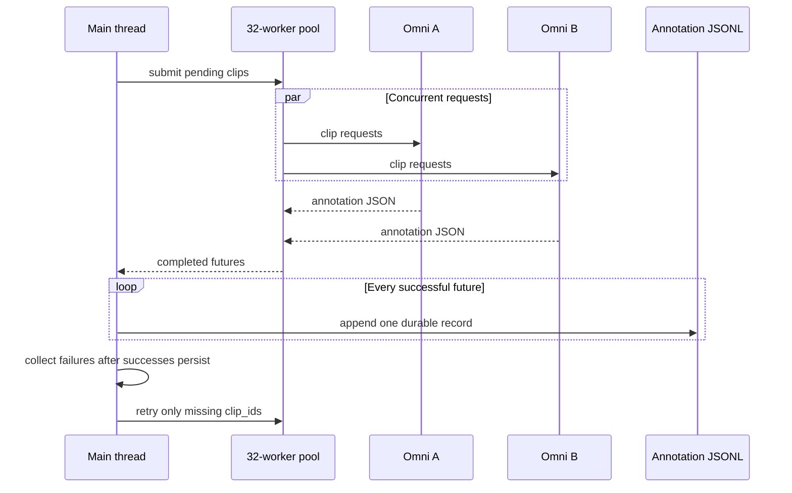
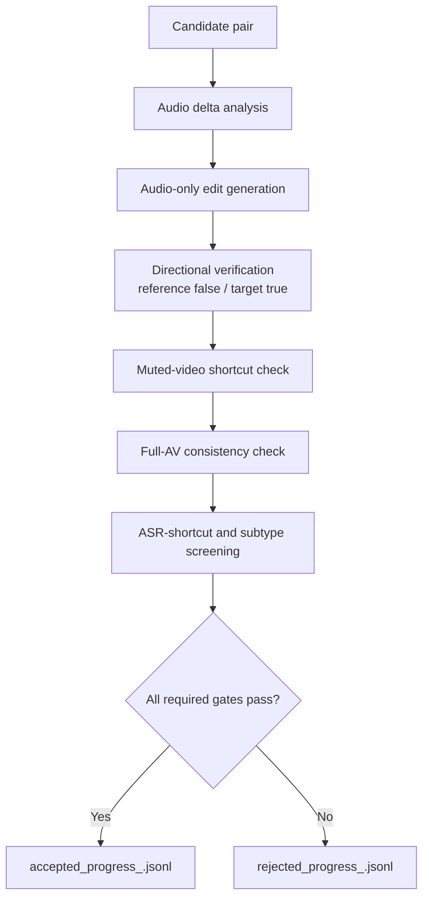
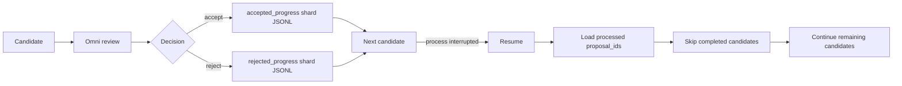
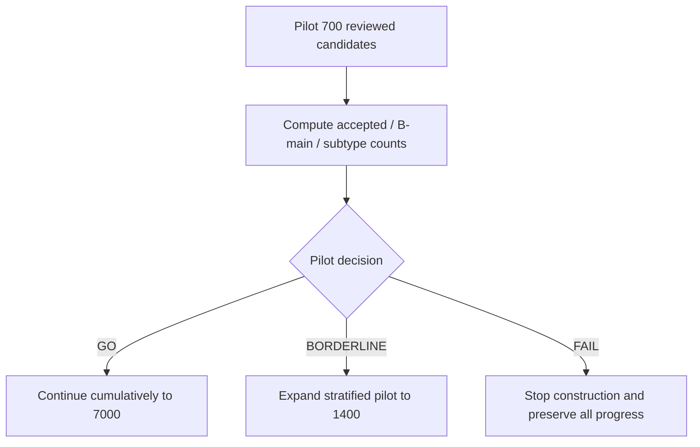
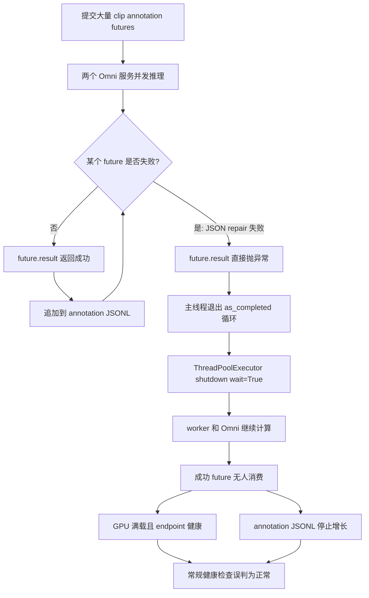
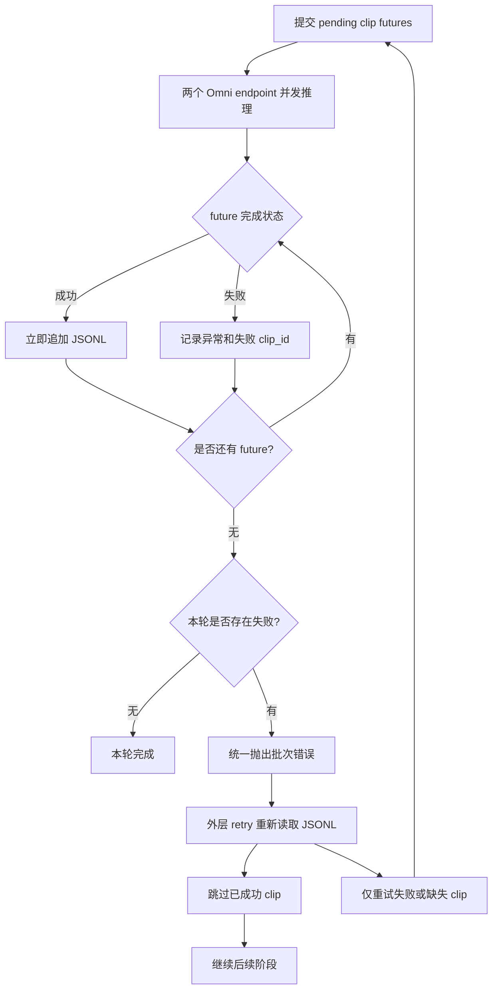
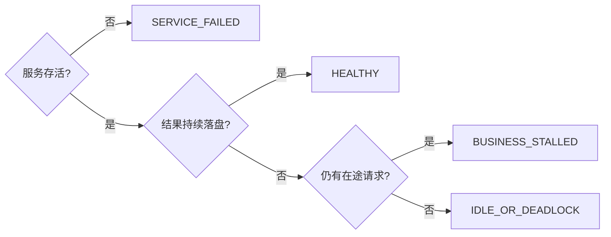
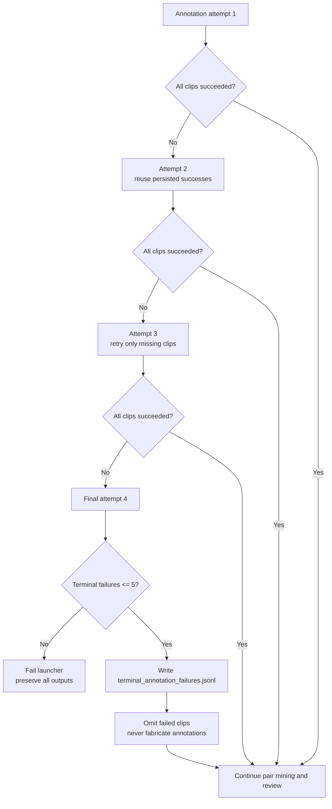

# Audio-CVR 并发标注停滞故障复盘

> 日期：2026-07-22
> 事件类型：并发任务仍占用 GPU，但标注结果停止持久化
> 影响阶段：Test1000 staged pilot 的 segment annotation
> 修复提交：`14409f4bf759a184ceab19c06111da7e44edf853`
> 相关并发扩展提交：`e214390184104ff657948ee55744efefa40ad172`

## 1. 文档目的

本文记录 Audio-CVR Test1000 数据构造期间一次容易误判的并发故障：

```text
Omni 服务健康
GPU 持续满载
客户端进程仍存活
网络连接仍存在
但 annotation JSONL 长时间不再增长
```

该现象最初看起来像 Omni 推理变慢、GPU 负载过高或媒体解码异常，最终确认根因是客户端并发异常处理方式不正确。某个任务抛出异常后，主线程停止消费其他已完成任务，线程池却继续等待全部任务结束，于是出现“计算仍在继续，但成功结果不再落盘”的假运行状态。

本文说明：

1. 故障如何被发现；
2. 为什么常规健康检查没有发现它；
3. 真正根因是什么；
4. 为什么选择“延迟抛错、成功结果先落盘”的修复；
5. 还考虑过哪些方案，以及为什么没有采用；
6. 后续如何避免类似问题。

## 2. 实验背景

### 2.1 当前任务

本轮目标是在不停止现有 Omni 服务的前提下，为 Audio-CVR Test1000 执行分层 staged pilot：

```text
source ingest
-> clip build
-> stratified clip annotation
-> pair proposal
-> pair review
-> pilot assessment
-> GO / BORDERLINE / FAIL
```

pilot 第一阶段包含 1,800 个待标注 clip，三种来源各 600 个：

| 数据来源 | Clip 数量 |
|---|---:|
| `existing_vggsound` | 600 |
| `avqa_videos` | 600 |
| `avscapbench` | 600 |
| 合计 | 1,800 |

### 2.2 并发拓扑

为了提高吞吐量，4 张 A6000 被拆成两个独立 Qwen3-Omni 服务：

| 服务 | GPU | 端口 | Tensor Parallel | `max-num-seqs` |
|---|---|---:|---:|---:|
| Omni A | 0,1 | 8093 | 2 | 8 |
| Omni B | 2,3 | 8094 | 2 | 8 |

客户端使用 endpoint pool，并将总并发设置为 32。正常时，双服务把标注速度从单个 TP=4 服务约 `3.7 clips/min` 提高到约 `10.6-11 clips/min`。

### 2.3 持久化要求

这轮构造没有重跑机会，因此必须满足：

```text
每条成功 annotation 立即追加到 JSONL
进程中断后按 clip_id 恢复
已经完成的 annotation 不能丢失
失败任务可以重试，但不能覆盖成功结果
```

这也是本次修复的首要约束。

### 2.4 高并发数据构造方法

本轮 Test1000 不是由一个进程顺序完成所有工作，而是把数据构造拆成 CPU 预处理、clip 标注、候选挖掘、候选审核和结果合并五类阶段。不同阶段使用不同的并发参数，不能把“标注并发”和“审核并发”混为一谈。

#### 2.4.1 两类并发控制参数

| 参数 | 控制对象 | 当前配置 | 含义 |
|---|---|---:|---|
| `--concurrency` | Segment annotation | 32 | 最多同时提交 32 条 clip 标注任务 |
| `--propose-shards` | Candidate review | 128 | 将候选稳定切分为 128 个审核 shard |
| `--propose-parallel-jobs` | Candidate review | 32 | 最多同时运行 32 个候选审核进程 |
| Omni `max-num-seqs` | 服务端生成 | 每个 endpoint 8 | 每个 Omni 服务最多同时执行约 8 个生成序列 |

关键区别：

```text
--concurrency 32
只控制 clip annotation，不直接控制候选 pair 审核。

--propose-parallel-jobs 32
才是候选 pair 审核的实际并发度。
```

候选审核开始后，128 个 shard 中最多有 32 个同时运行。每个 shard 进程顺序处理自己分到的候选，但不同 shard 之间并行。因此，系统同时存在最多约 32 条独立候选审核流水线。

#### 2.4.2 四张 GPU 上的双服务部署

4 张 A6000 没有组成一个 TP=4 服务，而是拆成两个 TP=2 服务：



该部署的目的不是增加单次请求可用显存，而是增加独立服务吞吐：

```text
单 TP=4：一个请求队列，一个服务调度器
双 TP=2：两个请求队列，两个服务调度器，可并行处理两组请求
```

两个 endpoint 理论上可同时生成约 `8 + 8 = 16` 个请求。客户端保持 32 个工作流在途，超过 16 的部分在服务端排队，用来隐藏媒体上传、prompt 构造、JSON 解析和请求长尾带来的空隙。

这不代表 32 个请求都在同一时刻进行 GPU decode。更准确的解释是：

```text
16 个左右正在服务端生成
+ 若干请求正在上传、预处理或等待
+ 若干请求处于服务端队列
= 客户端保持较高的总体在途并发
```

#### 2.4.3 端到端高并发构造流水线



该设计中，并不是所有阶段都使用 GPU：

| 阶段 | 主要资源 | 并发方式 |
|---|---|---|
| Source ingest | CPU、磁盘、网络 | 多 worker 媒体探测 |
| Clip build | CPU、FFmpeg、磁盘 | 多 source 并行切片 |
| Segment annotation | GPU 0-3 | 32 个 future + 双 endpoint |
| Pair mining | CPU | 按 source group 枚举与排序 |
| Pair review | GPU 0-3 | 128 shards，最多 32 shard jobs |
| Merge/postprocess | CPU、磁盘 | 确定性去重与汇总 |

#### 2.4.4 Segment annotation 的并发机制

Segment annotation 先为每个 clip 生成声音内容和视觉语境描述。其并发单位是“单条 clip”：

```text
1 future = 1 clip annotation request
```

客户端通过 `ThreadPoolExecutor(max_workers=32)` 维持请求池。完成顺序可能与输入顺序不同，因此运行过程中按完成顺序逐条写入 durable JSONL，阶段完成后再按原始 manifest 恢复确定性顺序。



这一阶段使用 `--concurrency`。它与后续审核 shard 数量没有直接关系。

#### 2.4.5 Candidate pair 审核的高并发机制

Segment annotation 完成后，系统先在同一 source/group 内挖掘 reference-target 候选，再把候选按稳定 `proposal_id` hash 切成 128 个 shard。

审核阶段使用：

```text
PROPOSE_SHARDS=128
PROPOSE_PARALLEL_JOBS=32
```

每个活跃 shard 启动一个独立 `propose-single-source-pairs` 进程。shard 按 round-robin 分配给两个 endpoint：

```text
shard 0  -> Omni A
shard 1  -> Omni B
shard 2  -> Omni A
shard 3  -> Omni B
...
```

当 32 个 job 同时运行时，理想分配约为：

```text
Omni A：16 条候选审核流水线
Omni B：16 条候选审核流水线
```

每个 shard 进程内部按顺序读取候选。每条候选要经历 `b_audio_blind_review_v2_volume` 的多阶段判断，典型逻辑为：



候选内部各审核步骤通常有先后依赖，不能简单地把同一候选的所有阶段同时执行。例如，只有生成了可用 edit text 后，才能验证 reference 和 target 的方向关系。因此高并发主要发生在“不同候选之间”，而不是“同一候选内部”。

#### 2.4.6 为什么采用 shard 进程并发，而不是一个 32 线程审核器

候选审核比单 clip 标注更复杂，单条候选可能包含多次 Omni 调用、多个媒体输入和多个持久化结果。使用独立 shard 进程有四个优势：

1. **故障隔离**：一个 shard 超时或异常不会直接破坏其他 shard 的 progress；
2. **断点恢复**：每个 shard 有独立 accepted/rejected progress；
3. **负载分配**：shard 可稳定地轮流分配给两个 endpoint；
4. **降载重试**：失败轮次可以减少并行 shard 数，而不重做成功 shard。

代价是进程数更多、日志更分散，因此必须依靠统一 merge 和 summary 汇总。

#### 2.4.7 审核结果的逐条持久化

每个审核 shard 维护独立文件：

```text
b_shards/ranked_<shard_id>.jsonl
b_shards/accepted_<shard_id>.jsonl
b_shards/accepted_progress_<shard_id>.jsonl
b_shards/rejected_progress_<shard_id>.jsonl
b_shards/logs/b_speech_audio_content_<shard_id>.log
```

其中 progress 文件是恢复依据。每条 candidate 完成后立即写入 accepted 或 rejected progress，而不是等 700 条全部审核完才统一保存。



因此即使在第 500 条 candidate 时中断，前 499 条的决策仍然保留。恢复时只处理没有出现在 progress 文件中的 `proposal_id`。

#### 2.4.8 自动降载和重试

审核 shard 默认最多重试 4 轮。若某轮存在超时或失败 shard，下一轮将并发 job 数降低到原来的约三分之二，最低不小于 6：

```text
第 1 轮：32 parallel jobs
失败后第 2 轮：21 parallel jobs
再次失败第 3 轮：14 parallel jobs
再次失败第 4 轮：9 parallel jobs
```

每一轮都复用已经写入的 progress，因此降载不会让已成功候选重新审核。

该策略解决两个相互冲突的目标：

```text
正常时尽量高并发，缩短总时间；
服务出现排队、长尾或瞬时错误时自动降低压力，提高完成概率。
```

#### 2.4.9 当前 staged pilot 如何控制风险

高并发不会直接一次审核全部 7,000 个候选。当前流程先处理累计前 700 条：

```text
分层 annotation
-> 生成候选
-> 高并发审核累计 700 条
-> 统计 acceptance 和 subtype 产出
```

根据 pilot 结果自动决策：



这样既能利用高并发，也避免在原始数据质量未知时直接花费全部审核预算。

#### 2.4.10 高并发配置的容量解释

当前配置可以粗略理解为：

| 层级 | 容量 | 作用 |
|---|---:|---|
| GPU 服务 | 2 个 endpoint | 隔离两个独立队列 |
| 服务端 active generation | 约 16 | 两个 endpoint 各约 8 |
| Candidate workflows | 最多 32 | 保持服务端持续有请求可执行 |
| Annotation futures | 最多 32 | 隐藏上传、解析和请求长尾 |
| Review shards | 128 | 提供稳定切分、恢复和负载分配 |

并发不是越高越好。如果把审核 job 从 32 盲目提高到 64，可能出现：

- 服务端队列大幅增加；
- 单条候选延迟变长；
- 超时和 transient error 增加；
- 大量 shard 同时失败；
- 磁盘日志和 progress 写入竞争；
- 总吞吐不升反降。

因此当前方法采用“服务容量约 16、客户端审核流水线 32”的两倍超额订阅，并配合失败后自动降载。它优先填满两个 endpoint 在媒体上传、预处理和生成之间的空隙；如果排队导致超时，则自动回退到 21、14、9 路，而不是无限提高并发。

#### 2.4.11 高并发阶段的验收指标

仅观察 GPU 利用率不足以判断高并发构造是否正常。每个阶段应分别检查：

**Segment annotation：**

```text
annotation JSONL 行数持续增长
两个 endpoint 都有请求完成
最近成功落盘时间持续更新
单条失败不阻止其他成功结果落盘
```

**Candidate review：**

```text
活跃 shard 数接近 propose_parallel_jobs
accepted_progress 和 rejected_progress 总行数持续增长
两个 endpoint 分配到的 shard 数大致均衡
失败 shard 会降载重试
已完成 proposal_id 不会被重复审核
```

**阶段完成：**

```text
ranked = accepted + rejected 或有明确 missing/transient 统计
merge 后没有 duplicate proposal_id
phase_<limit>_complete.json 写入
pilot_assessment.json 给出 GO / BORDERLINE / FAIL
```

## 3. 故障现象

### 3.1 Annotation 先变慢，随后完全停止

故障发生前后的计数如下：

| 时间 | Durable annotation 数量 | 增量 |
|---|---:|---:|
| 14:57 | 829 | - |
| 14:59 | 849 | +20 |
| 15:01 | 867 | +18 |
| 15:03 | 882 | +15 |
| 15:05 | 895 | +13 |
| 15:07 | 902 | +7 |
| 15:09 | 915 | +13 |
| 15:09-15:28 | 915 | 0 |

前期吞吐逐渐下降，随后 annotation 在 915 条处冻结约 19 分钟。

### 3.2 容易误导判断的健康信号

在 annotation 不增长期间，下列信号全部看起来正常：

- 两个 Omni endpoint 的健康检查延迟约 `11-15 ms`；
- 两个服务各有约 `7-8` 个 running request，并存在请求队列；
- generation throughput 约 `70-118 tokens/s`；
- KV cache 使用率约 `20%-42%`；
- GPU 0-3 仍然满载；
- 32 个客户端 TCP 连接仍处于活动状态；
- 系统内存、磁盘和文件描述符均未耗尽；
- 没有 CUDA OOM，也没有 vLLM 服务崩溃；
- launcher 和 annotation 进程仍然存活。

因此，单看 GPU 利用率、PID 和 endpoint health，会误判任务仍在健康推进。

### 3.3 日志中的关键异常

构造日志中反复出现：

```text
ValueError: model response JSON repair failed:
response did not contain a JSON object
```

异常同时出现在 `avqa_videos`、`avscapbench` 和 `existing_vggsound`，说明它不是单一数据源损坏，也不是某一个特定视频导致的确定性媒体错误。

## 4. 排查过程

### 4.1 首先排除 Omni 服务故障

检查内容：

```text
两个 endpoint 的 /health
服务 PID/PGID
GPU 显存与利用率
running/queued requests
token generation throughput
vLLM 日志中的 OOM、Traceback、worker exit
```

结果：两个 Omni 服务均正常，不应重启。

### 4.2 排除系统资源耗尽

检查内容：

```text
系统内存和 swap
磁盘剩余空间
ulimit -n
线程数
TCP 连接
GPU 显存
```

结果：资源仍充足，没有证据支持文件描述符、共享内存或系统线程耗尽。

### 4.3 检查业务进度而不是计算负载

关键判断从“GPU 是否忙”切换为：

```text
annotation JSONL 是否增长？
最近一次成功追加是什么时间？
已成功 future 的结果是否仍被主线程消费？
```

这一步确认：推理请求继续运行，但 durable annotation 固定在 915 条。

### 4.4 定位客户端并发控制代码

原实现的核心结构是：

```python
with ThreadPoolExecutor(max_workers=concurrency) as executor:
    futures = [executor.submit(annotate_one, item) for item in pending]
    for future in as_completed(futures):
        record = future.result()
        _append_jsonl_record(output_path, record)
```

问题不在 `ThreadPoolExecutor` 本身，而在 `future.result()` 的异常传播位置。

## 5. 根因分析

### 5.1 异常如何触发停滞

当某个 Omni 响应在多次 JSON repair 后仍无有效 JSON 时：

```python
record = future.result()
```

会立即抛出异常。异常未在单个 future 层捕获，因此直接退出 `for future in as_completed(...)`。

随后 Python 开始退出 `with ThreadPoolExecutor(...)` 上下文。线程池默认执行：

```python
executor.shutdown(wait=True)
```

这会等待已经提交的所有任务结束。

### 5.2 为什么 GPU 继续忙但文件不增长

此时形成了一个特殊状态：

1. worker 线程仍在向两个 Omni 服务提交或等待请求；
2. Omni 服务继续推理，所以 GPU 仍然满载；
3. 主线程已离开 `as_completed` 消费循环；
4. 后续成功 future 无人读取，也无人追加到 JSONL；
5. 主线程等待全部 worker 结束后才会把异常交给外层 retry；
6. 高并发和长尾请求使等待过程持续很久。

因此，任务不是完全死锁，而是进入“线程池排空等待期”。从业务角度看，它等价于停滞，因为新增成功结果不会被持久化。

### 5.3 故障流程图



### 5.4 为什么原 watchdog 没有报警

原 watchdog 主要检查：

```text
launcher PID 是否存在
annotation PID 是否存在
Omni endpoint 是否健康
status.json 是否为 FAILED
```

本次故障中，这些条件均为“健康”。真正失效的是业务进度：

```text
durable_annotation_count 在阈值时间内没有增长
```

因此这是典型的“服务健康、业务停滞”，需要 progress-aware watchdog，而不只是 liveness watchdog。

## 6. 采用的修复方案

### 6.1 修复原则

修复必须同时满足：

1. 单条失败不能阻止其他成功结果落盘；
2. 失败不能被静默吞掉；
3. 不降低 JSON、音频或视频质量门槛；
4. 外层 retry 能只处理尚未成功的 clip；
5. 已有 915 条 annotation 必须原样保留；
6. 不重启两个健康的 Omni 服务。

### 6.2 新的异常处理方式

修复后的核心逻辑为：

```python
annotation_errors = []

with ThreadPoolExecutor(max_workers=concurrency) as executor:
    futures = [executor.submit(annotate_one, item) for item in pending]

    for future in as_completed(futures):
        try:
            record = future.result()
        except Exception as exc:
            annotation_errors.append(exc)
            continue

        _append_jsonl_record(output_path, record)

if annotation_errors:
    raise RuntimeError(
        "Concurrent annotation finished with failures; "
        "successful records were persisted"
    ) from annotation_errors[0]
```

核心变化是：

```text
旧逻辑：第一个 future 失败 -> 立即退出结果消费循环
新逻辑：记录单条失败 -> 继续消费并持久化所有成功 future -> 批次结束后统一报错
```

### 6.3 修复后的恢复语义

外层 retry 在下一次尝试前重新读取 annotation JSONL，并按 `clip_id` 建立已完成集合：

```text
成功并已落盘的 clip -> 直接复用
失败且未落盘的 clip -> 重新提交
尚未处理的 clip -> 正常提交
```

这使整个过程具备幂等恢复能力，不会因为一条异常重做整批 annotation。

### 6.4 修复后流程图



## 7. 运行时处置步骤

为了避免数据损失和误杀服务，实际处置顺序如下：

1. 确认 annotation 已在 915 条处持续不增长；
2. 验证两个 Omni endpoint 健康；
3. 记录 construction launcher 的准确 PID 和 PGID；
4. 确认 construction PGID 与 Omni PGID 不同；
5. 仅终止 construction 进程组；
6. 再次确认 annotation 仍为 915 条，没有文件回退或截断；
7. 不停止 Omni A/B 服务；
8. 修复并推送 GitHub；
9. 服务器 `git pull --ff-only`；
10. 执行针对性单元测试；
11. 使用同一个 OUT 和 `--resume` 重启 construction；
12. 观察 durable annotation 是否重新增长。

禁止使用：

```text
pkill -f
删除 annotation JSONL
删除 progress/cache
重启整个 run
停止健康的 Omni 服务
```

## 8. 单元测试与验收

### 8.1 新增回归测试

在 `tests/test_composed_data.py` 中加入并发异常持久化测试，场景为：

```text
三个 clip 并发标注
其中两个返回合法 JSON
其中一个始终返回非法 JSON
```

第一轮预期：

```text
命令最终报错
两个成功 clip 已写入 JSONL
失败 clip 未被伪造为成功
```

第二轮预期：

```text
读取第一轮 JSONL
两个成功 clip 不再请求 Omni
只重试失败 clip
失败 clip 成功后，最终 manifest 恢复稳定输入顺序
```

### 8.2 本地测试结果

```text
tests.test_composed_data
tests.test_scripts
合计 258 tests passed
```

### 8.3 服务器恢复结果

服务器拉取修复提交后：

```text
HEAD = 14409f4bf759a184ceab19c06111da7e44edf853
针对性测试通过
两个 Omni 服务未重启
annotation 从 915 条继续增长
```

恢复后的一个观测窗口：

| 时间 | Annotation 数量 |
|---|---:|
| 15:35:28 | 920 |
| 15:38:28 | 948 |

三分钟增加 28 条，约 `9.3 clips/min`，说明双 endpoint 吞吐恢复，且已有记录没有丢失。

## 9. 为什么选择这个方案

### 9.1 最大限度保留昂贵的成功结果

每个 Omni annotation 都需要多模态推理。一个 future 失败时，其他 future 很可能已经成功完成或接近完成。立即终止并取消所有任务会浪费这些结果。

延迟抛错允许成功结果先落盘，使失败成本局限在失败 clip 本身。

### 9.2 不降低数据质量

修复只改变并发调度和持久化时机，没有改变：

- prompt；
- JSON schema；
- repair 次数；
- audio-only / video-only / full-AV 门控；
- accepted/rejected 规则。

因此它不是“遇到错误就跳过质量检查”，而是“成功结果先保存，失败结果继续按原规则重试”。

### 9.3 与现有 resume 机制兼容

现有流程已经能够按 `clip_id` 复用成功 annotation。延迟抛错只需要让所有成功结果在抛错前写入，就能直接利用已有恢复机制，不必引入新的状态数据库。

### 9.4 改动范围小且可验证

此次修改集中在 concurrent future 消费层，不涉及模型服务、数据 schema 或后续 pair review。风险较小，并可以用三条虚拟 clip 的确定性单元测试覆盖。

## 10. 考虑过但未采用的方案

### 10.1 继续等待

不采用原因：

```text
主线程已停止消费成功 future
等待只会让线程池慢慢排空
期间不会产生新的 durable annotation
```

GPU 忙不等于任务有业务进展。

### 10.2 从双 TP=2 退回单 TP=4

不采用原因：

- 两个 Omni 服务均健康；
- 根因在客户端 future 异常传播；
- 单服务同样可能遇到非法 JSON；
- 退回 TP=4 只会降低吞吐，不会修复持久化停滞。

### 10.3 单纯降低客户端并发

可能作用：减少同时在途的请求数，缩短线程池排空时间。

不作为根治方案的原因：即使并发降到 2，只要第一个失败 future 让主线程退出消费循环，仍然可能丢失后续成功结果。它只能缓解症状，不能修复语义错误。

### 10.4 遇到非法 JSON 时生成 fallback annotation

不采用原因：这会把解析失败伪装为有效标注，直接降低数据质量，并污染后续 pair proposal 和 benchmark 审核。

正确做法是保留失败状态并重试，而不是制造默认答案。

### 10.5 第一个异常时立即取消所有 futures

优点：失败更快暴露。

缺点：

- 已经完成但尚未消费的成功结果会丢失；
- 正在进行的昂贵 Omni 请求被浪费；
- 重启后需要重新处理更多 clip；
- 不符合“一次构造、逐条保存”的要求。

因此本项目更适合“尽可能收割成功结果，再统一失败”。

### 10.6 为每个 clip 引入独立状态数据库

这是长期最完整的方案，可以记录：

```text
pending / running / succeeded / retryable_failed / terminal_failed
attempt_count
endpoint
latency
last_error
```

但当前阶段引入数据库会扩大改动面和迁移成本。现有 JSONL + `clip_id` resume 已足够支撑本轮恢复，所以暂不采用。

## 11. 次要观察：Endpoint 分配不均

排查期间还观察到，基于稳定 hash 的 endpoint 选择在小窗口内可能出现不均，例如 32 个请求被分成约 `12/20`，而不是严格 `16/16`。

这会导致：

- 某个 endpoint 队列更长；
- 吞吐随时间出现波动；
- 少量请求形成长尾。

但它不是 annotation 在 915 条完全冻结的根因。即使分配不均，主线程正常消费 future 时，JSONL 仍应持续增长。

后续可选优化：

```text
least-inflight endpoint routing
带权 round-robin
按 endpoint 记录 running/queued request 数
```

应把该问题作为吞吐优化，而不是本次故障修复。

## 12. 后续监控改进

### 12.1 增加业务进度 watchdog

除 PID 和 endpoint health 外，应定期记录：

```text
durable_annotation_count
last_successful_append_timestamp
completed_future_count
failed_future_count
inflight_future_count
per-endpoint submitted/completed/failed
```

推荐规则：

```text
如果 Omni 健康、inflight > 0，
但 durable_annotation_count 连续 10-15 分钟不增长，
则标记 BUSINESS_STALLED，而不是 HEALTHY。
```

### 12.2 区分三种健康状态



### 12.3 将错误统计写入状态文件

建议 `status.json` 增加：

```json
{
  "annotation_success_count": 948,
  "annotation_error_count": 3,
  "annotation_inflight_count": 29,
  "last_annotation_success_at": "2026-07-22T15:38:28+08:00",
  "last_annotation_error": "model response JSON repair failed",
  "progress_state": "advancing"
}
```

这样监控端不需要从多个日志和 JSONL 临时推断状态。

## 13. 可复用的故障判断清单

以后遇到“标注变慢或不增长”时，按以下顺序检查：

1. JSONL 行数在最近 5-10 分钟是否增长；
2. 最后一次成功落盘时间；
3. launcher、annotation worker、Omni PID 是否分别存活；
4. endpoint health 是否正常；
5. running/queued request 是否变化；
6. 日志是否出现单条 future 异常；
7. 主线程是否仍在消费 `as_completed`；
8. 是否正在等待 executor shutdown；
9. 系统资源是否真的耗尽；
10. 停止时只操作 construction PGID，不误杀 Omni PGID。

不要仅凭以下现象判断任务健康：

```text
GPU utilization = 100%
进程 PID 存在
HTTP health = 200
TCP connection 活跃
```

这些只证明计算服务还活着，不证明成功结果仍在产生和持久化。

## 14. 后续补充：少量永久失败的隔离机制

并发持久化修复部署后，annotation 从 915 条继续增长到 1,798 条，证明成功 future 已能正常落盘。但最后两条 clip 在 4 轮外层重试、每轮多次 Omni repair 后，仍持续返回不包含 JSON 对象的响应：

```text
existing_vggsound：600/600 成功
avqa_videos：599/600 成功
avscapbench：599/600 成功
总计：1798/1800 成功
```

原严格策略要求 1,800 条全部成功，因此 launcher 最终仍会退出。对于大规模自动构造，这种策略会让极少数永久失败媒体阻断全部后续候选挖掘和审核。

新的处置原则是：

```text
正常重试预算保持不变；
只有最后一轮允许有限数量的 terminal failure；
失败 clip 写入独立 JSONL；
不生成 fallback annotation；
候选挖掘只读取真实成功 annotation；
失败数超过硬上限时仍然终止。
```

Test1000 launcher 的硬上限设置为 5 条，占 1,800 条 pilot clip 的 0.28%。通用构造脚本默认上限仍为 0，只有该大规模 volume launcher 显式启用有限隔离。



每条 terminal failure 记录至少包含：

```json
{
  "clip_id": "...",
  "output_path": "...",
  "dataset": "...",
  "terminal_failure": true,
  "omitted_from_annotations": true,
  "reason": "annotation_failed_after_retry_budget",
  "error_type": "ValueError",
  "error": "model response JSON repair failed ..."
}
```

这种机制与放宽数据质量门槛不同。失败 clip 没有 annotation，也无法进入 pair proposal，更不会成为 accepted triplet。它只是把不可用媒体从候选池中显式隔离，使其余 99.89% 已验证成功的计算结果可以继续使用。

对应实现还包含两个硬性回归测试：

1. 失败数不超过上限时，只输出成功 annotation，并准确写入失败清单；
2. 失败数超过上限时仍抛出异常，不能因 volume 模式而无限跳过错误。

## 15. 最终结论

本次问题不是 Omni 推理能力不足，也不是双 TP=2 架构本身不稳定，而是客户端并发异常处理破坏了“成功结果逐条持久化”的语义。

根因可以概括为：

```text
一个 future 抛错
-> 主线程停止消费其余 future
-> executor 等待全部 worker
-> GPU 和服务继续忙
-> 成功结果不再写盘
-> 任务表现为假运行
```

最终修复为：

```text
单条 future 失败只记录异常
-> 继续消费全部 future
-> 每条成功结果立即落盘
-> 本轮结束后统一抛错
-> resume 仅重试失败和缺失 clip
```

该方案保留了全部已有 annotation，不降低审核门槛，不重启健康的 Omni 服务，并恢复到约 `9.3 clips/min` 的双服务吞吐。更重要的是，它把构造流程从“进程看起来活着”提升为“成功结果可持续、可观察、可恢复地落盘”。
