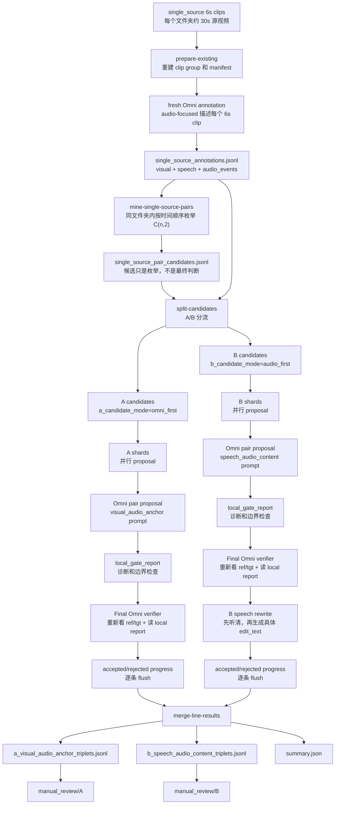
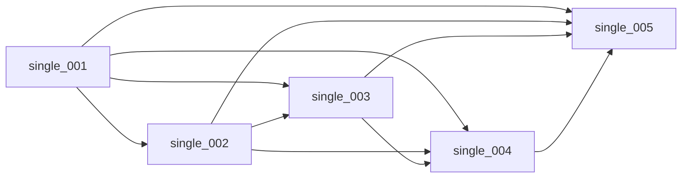
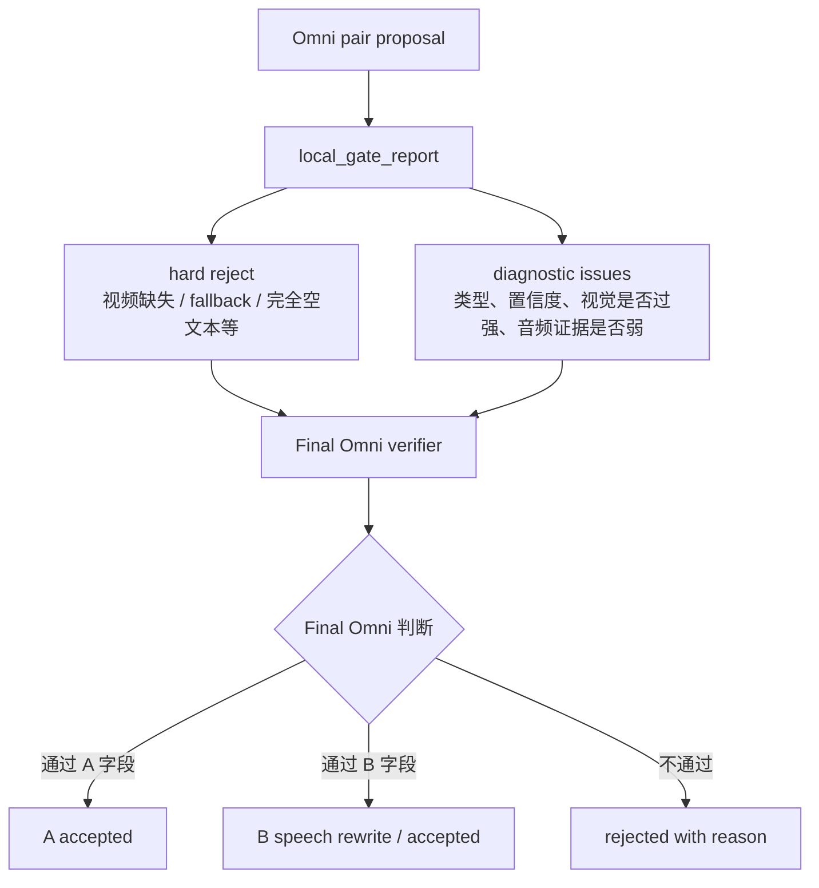

# Audio Dataset A/B Lines 构造流程

日期：2026-05-11

这份文档说明当前音频敏感 CVR 数据集的 A/B 两条线应该如何构造、如何运行、以及当前服务器实验的阶段性策略。它不是替换旧的 943 条视觉 CVR 数据集，也不会修改原始切片；它是在旧 CVR 构造方法基础上，针对 audio-sensitive retrieval 做出的安全扩展。

## 2026-05-13 更新：Audio-CVR v1 大规模策略

本轮开始进入大规模构造，但执行顺序改为 **B 线优先**：

- 旧 B 线数据不再作为主数据保留；正式 B 线只使用最新 `b_audio_blind_review_v2` 方法。
- 切片长度改为 `8-12s`，默认 `10s`；低于 `8s` 的旧 6s 切片不进入主构造。
- 所有原数据集都先经过 B 线；B 线产生的 accepted 样本全部保留，不再按 target count 或 subtype 比例裁剪。
- A 线暂时不跑大规模；等 B 线数量和质量稳定后，再看 A 线数量并做合理配比。

新的服务器运行顺序：

```bash
cd /data02/usr/wangqihao/Demo/test/cvr_clean_main
git pull --ff-only origin main

mkdir -p logs

setsid nohup bash scripts/build_audio_cvr_8_12s_clips.sh \
  --root /data02/pretrained_model/cvr_learn/cvr_data/composed_omni_retrieval \
  --clip-seconds 10 \
  --min-clip-seconds 8 \
  --max-clip-seconds 12 \
  > logs/audio_cvr_8_12s_clip_build_$(date +%Y%m%d_%H%M%S).log 2>&1 < /dev/null &

setsid nohup bash scripts/run_audio_cvr_v1_b_first.sh \
  --root /data02/pretrained_model/cvr_learn/cvr_data/composed_omni_retrieval \
  --single-source-root /data02/pretrained_model/cvr_learn/cvr_data/composed_omni_retrieval/clips/audio_cvr_8_12s \
  --base-url http://127.0.0.1:8093/v1 \
  --model qwen3-omni-30b-a3b-instruct \
  --propose-shards 32 \
  --propose-parallel-jobs 4 \
  --concurrency 4 \
  > logs/audio_cvr_v1_b_first_$(date +%Y%m%d_%H%M%S).log 2>&1 < /dev/null &
```

验收重点：

- `clips/audio_cvr_8_12s/` 下的 clip 都应在 `8-12s` 范围内，默认约 `10s`。
- `summary.json` 中 `keep_all_b=true`。
- `b_speech_audio_content_triplets.jsonl` 保留所有 accepted B 样本。
- `manual_review/B/` 可直接用于人工抽查 B 线质量。

历史 pilot 输入曾固定为旧 CVR 已经切好的 6 秒片段；从 2026-05-13 的正式 Audio-CVR v1 开始，主流程改用 `clips/audio_cvr_8_12s`：

```text
/data02/pretrained_model/cvr_learn/cvr_data/composed_omni_retrieval/clips/audio_cvr_8_12s
```

其中每个子文件夹代表一个原视频，包含 8-12 秒切片，默认约 10 秒。旧 CVR 方法里最有价值的结构仍然保留：**同一个源视频文件夹内枚举所有时间顺序 pair，让 Omni 直接比较 reference 和 target 两段视频，再由 Omni final verifier 最终审核**。A/B 线都应继承这个骨架，而不是只靠本地 heuristic 提前筛死。

## 1. 两条线目标

**A 线：`visual_audio_anchor`**

- 目标：音频上下文相似或连续，但视觉发生明显变化。
- `edit_text` 只描述视觉变化，不能提 audio、speech、music、sound、voice、transcript。
- 合格风格：同一新闻/节目/比赛/直播音频上下文中，画面从主播切到洪水航拍、比赛现场、室外事故画面等。
- 科学作用：验证“音频作为上下文锚点”是否帮助视觉 CVR。A 线不一定要求 audio-on 明显强于 audio-off。

**B 线：`speech_audio_content`**

- 目标：视觉上下文尽量锁定，主要差异来自说话内容或清楚的非语音音频事件。
- `edit_text` 只能描述声音内容变化，尤其是 speech topic/content 的变化。
- 合格风格：同一人物、同一直播/演讲/访谈/比赛转播场景中，前一个 10 秒讲预算，后一个 10 秒讲医疗；或同类比赛画面中 target 有明显欢呼、掌声、音乐、环境声。
- 科学作用：这是证明 audio 有效的主线。预期 e5/audio-on 在 B 线上应强于 audio-off，因为不听声音很难检索对。

## 2. 关键原则

1. 不改旧 943 条数据，不改原始视频，不 remux，不生成视频。
2. B 线不能复用旧普通视觉描述来做正式 pilot；B 线需要 fresh audio-focused annotation。
3. 同源文件夹内枚举所有时间顺序 pair。10 秒切片下，3 个片段就是 3 个组合，更多片段继续按 `n * (n - 1) / 2` 枚举。
4. 本地规则只做候选排序、日志记录和少量不可救硬边界；不要让本地第二层规则提前杀掉可能正确的样本。
5. 最终是否接受，必须由 Omni final verifier 再看 ref/tgt 视频、听音频后决定。
6. 本地 gate 的输出应作为 `local_gate_report` 给 final Omni 参考，而不是当成绝对裁判。

## 3. 总流程图



## 4. Annotation 阶段

当前 pilot 和大规模运行都应使用 fresh audio-focused annotation。原因是旧 943 的构造重点是视觉差异，旧描述没有充分强调 speech content、speaker、audio events、ambient sound，会直接伤害 B 线。

每个 clip 的 audio-focused annotation 至少应覆盖：

- visual scene summary
- main subjects / actions / camera context
- speech / transcript / paraphrase / topic
- speaker identity if observable
- non-speech audio events
- music / crowd / applause / ambient sound
- whether speech/audio is clear enough to support an edit

重要产物：

- `single_source_clip_groups.jsonl`：每个源视频文件夹的分组。
- `clips_to_annotate.jsonl`：本轮要描述的 clips。
- `single_source_annotations.jsonl`：最终给 pair mining、proposal 和 rewrite 使用的 clip 级标注。

注意：fresh200 已经生成的 200 条新 annotation 可以复用；不能复用更早的普通视觉 annotation。

## 5. Pair 枚举阶段

旧 CVR 方法里不是只取相邻片段，而是同源文件夹内按时间顺序枚举所有 pair。



如果一个源视频有 5 个切片，就有 10 个候选。这样 B 线才有足够多的 speech/audio content 差异，因为一个人连续说话时，不同 6 秒片段的讲话内容天然会变化。

## 6. A 线策略

A 线使用：

```text
--a-candidate-mode omni_first
```

含义：

- 只要同源 pair 的 audio anchor 分数足够高，就允许进入 A 候选。
- 本地 `difference.type` 只是 hint，不再因为它不是视觉类就提前杀掉。
- 进入 Omni 后，A prompt 要求模型自己从 ref/tgt 视频中寻找清楚的大视觉变化。

A 线 final Omni 必须确认：

- `accept=true`
- `large_visual_delta=true`
- `audio_context_preserved=true`
- `reference_satisfies_edit=false`
- `target_satisfies_edit=true`
- `edit_text_accurate=true`
- `edit_text` 不依赖音频词汇

A 线应拒绝：

- 视觉几乎一样，只是亮度、镜头远近、小手势、小物体变化。
- `edit_text` 提到声音、语音、音乐、旁白、音效。
- 主差异其实是 speech/audio/visible_text。
- final Omni 无法确认 large visual delta。

## 7. B 线策略

B 线使用：

```text
--b-candidate-mode audio_first
```

含义：

- 从 fresh annotation 里优先挖 speech topic/content 差异。
- 同一源视频文件夹内所有 pair 都可以考虑，不只相邻 pair。
- 本地 visual similarity 只作为排序和诊断，不应过早杀掉候选。

B 线 final Omni 必须确认：

- `accept=true`
- `audio_primary=true`
- `visual_locked=true`
- `visual_too_different_for_B=false`
- `edit_text_audio_only=true`
- `reference_satisfies_edit=false`
- `target_satisfies_edit=true`

B 线可以接受：

- 同一人物、同一直播/演讲/访谈场景，说话主题改变。
- 同一比赛或同类转播画面，target 出现明显欢呼、掌声、音乐或环境声。
- 视觉有轻微姿态、镜头、动作变化，只要仍是同一场景/同一人/同类视角，并且音频是主差异。

B 线应拒绝：

- 主差异是视觉场景、主体、动作、物体、字幕、镜头远近。
- `edit_text` 描述视觉变化。
- speech 内容变化被误标成 `audio_event`；讲话内容变化应是 `speech`。
- 只有模糊 hum/click/tone 猜测，没有明确可听证据。

## 8. B 线 speech rewrite 补救

当前最新代码加入了 B 线专用补救阶段：**先听清，再生成 edit_text**。

触发条件：

- `difference.type=speech`
- pair 的视觉/音频关系本身较好
- 原始或 refinement 后的 `edit_text` 仍然空洞，例如：
  - `change the speech from discussing A to discussing B`
  - `speech content has been altered`
  - `unintelligible speech`
  - `not transcribed`
  - `speaking but content unclear`

补救过程：

1. 对 reference 和 target 两个 6 秒视频再调用 Omni。
2. Prompt 不要求比较视觉，只要求专门听语音内容。
3. 允许 paraphrase，不强求逐字 transcript。
4. 如果听出具体内容，生成：
   - `change the speech from discussing {ref_topic} to discussing {target_topic}`
   - `change the voice from saying "{ref_phrase}" to saying "{target_phrase}"`
   - `change the singing from "{ref_lyric_or_theme}" to "{target_lyric_or_theme}"`
5. 如果仍然只能听出“说话变了”，则拒绝，不导出。

新增 trace 字段：

- `speech_rewrite`
- `raw_speech_rewrite`
- `speech_rewrite_refined_edit_text`
- `speech_rewrite_confidence`
- `speech_rewrite_reject_reason`
- `speech_rewrite_used`

硬规则：

- `A/B` 占位符永远不能直接导出。
- rewrite 仍不具体时拒绝。
- from/to 相同或都是空洞词时拒绝。

## 9. 本地规则和 Final Omni 的关系



最重要的区别：

- 本地第二层规则不能当最终裁判。
- `local_gate_report` 应给 final Omni 参考，让它知道哪里有风险。
- final Omni 可以捞回低置信度、视觉轻微变化、audio evidence 字段不完整但实际听起来成立的样本。
- 真正不可救的只有视频缺失、proposal fallback、完全无法生成 edit、路径错误等工程问题。

## 10. 已完成 pilot 结果

fresh 200 pilot 已完成人工初查：

| 线 | ranked | accepted | exported | triplets |
|---|---:|---:|---:|---:|
| A `visual_audio_anchor` | 327 | 40 | 8 | 8 |
| B `speech_audio_content` | 398 | 26 | 16 | 16 |

结论：

- A 线和 B 线都能产出合格人工审核样本。
- B 线不再是 0，说明 `audio_first + fresh audio-focused annotation + final Omni` 方向是对的。
- 早期主要剩余问题是 context 超长和空洞 edit_text。当前代码已压缩 prompt，并加入 speech rewrite。

## 11. 当前 fresh800 B 线运行状态

当前大规模 B 线已经启动并正在运行：

| 指标 | 当前值 |
|---|---:|
| 候选总量 | 1701 |
| 已处理 | 28 / 1701 |
| Accepted | 4 |
| Rejected | 24 |
| 当前通过率 | 约 14.3% |
| Input length 错误 | 0 |
| Fallback | 0 |
| Placeholder 拦截 | 16 |
| speech_rewrite 触发 | 1 |
| 并发 | 4 |

观察：

- 当前过滤效果是好的：`A/B` 占位符被硬规则拦截，空洞 audio wording 也被拦截。
- 4 条 accepted 的 `edit_text` 都是具体描述，没有空洞占位符。
- 按当前早期通过率估算，B 线可能产出约 180-280 条 accepted；样本还少，最终数量要等全量跑完。
- 当前速度约 2 条/分钟，1701 条可能需要约 12-16 小时。

重要决策：

**不要在 B 线运行时启动 A 线。**

原因：

- 8093 的 Qwen3-Omni 是共享瓶颈。
- B 线是最难、最能证明 audio 有效的主线，应该优先跑完。
- 同时开 A 线会抢 vLLM，增加假死和超时风险。

## 12. 当前服务器监控命令

服务器 AI 只能运行命令和回传日志，不能改代码。

当前只监控 B 线，不启动 A 线：

```bash
cd /data02/usr/wangqihao/Demo/test/cvr_clean_main

RUN_ROOT=$(ls -td runs/audio_ab_fresh800_omni_first_* /data02/usr/wangqihao/Demo/test/runs/audio_ab_fresh800_omni_first_* 2>/dev/null | head -1)
echo "$RUN_ROOT"

echo "[B accepted]"
cat "$RUN_ROOT"/b_shards/accepted_progress_*.jsonl 2>/dev/null | wc -l

echo "[B rejected]"
cat "$RUN_ROOT"/b_shards/rejected_progress_*.jsonl 2>/dev/null | wc -l

echo "[latest log]"
tail -50 logs/audio_ab_rerun_b_speech_rewrite_*.log

echo "[summary if exists]"
cat "$RUN_ROOT/summary.json" 2>/dev/null || true
```

如果电脑或 SSH 断开，不影响服务器进程，因为使用了 `setsid nohup`。

主要风险是 vLLM 假死。如果 `/v1/models` 能回但 `/v1/chat/completions` 超时、GPU 利用率长期 0%，需要重启 8093 服务后再从 shard 进度继续。

## 13. B 线完成后如何跑 A 线

B 线跑完后，再复用同一个 `RUN_ROOT` 和同一批 fresh800 annotation 跑 A 线。不要重跑 annotation。

服务器 AI 执行：

```bash
cd /data02/usr/wangqihao/Demo/test/cvr_clean_main
git pull --ff-only origin main

RUN_ROOT=$(ls -td runs/audio_ab_fresh800_omni_first_* /data02/usr/wangqihao/Demo/test/runs/audio_ab_fresh800_omni_first_* 2>/dev/null | head -1)
echo "$RUN_ROOT"

STAMP=$(date +%Y%m%d_%H%M%S)
test -d "$RUN_ROOT/a_shards" && mv "$RUN_ROOT/a_shards" "$RUN_ROOT/a_shards_before_a_rerun_$STAMP"

python3 -m app.audio_lines_single_source shard-jsonl \
  --input-path "$RUN_ROOT/a_candidates.jsonl" \
  --output-dir "$RUN_ROOT/a_shards" \
  --shards 32 \
  --prefix a

LOG=logs/audio_ab_rerun_a_after_b_$(date +%Y%m%d_%H%M%S).log

setsid nohup bash -lc '
set -euo pipefail
cd /data02/usr/wangqihao/Demo/test/cvr_clean_main

ROOT=/data02/pretrained_model/cvr_learn/cvr_data/composed_omni_retrieval
BASE_URL=http://127.0.0.1:8093/v1
MODEL=qwen3-omni-30b-a3b-instruct
REQUEST_TIMEOUT_SECONDS=180
SHARD_TIMEOUT_SECONDS=7200
PROPOSE_PARALLEL_JOBS=4
TARGET_A_COUNT=300
SEGMENT_ANNOTATIONS="$RUN_ROOT/single_source_annotations.jsonl"
WHOLE_ANNOTATION="$RUN_ROOT/single_source_whole_annotation.jsonl"

mkdir -p "$RUN_ROOT/a_shards/logs"
pids=()
active=0

for shard in "$RUN_ROOT"/a_shards/a_shard_*.jsonl; do
  rows=$(wc -l < "$shard")
  test "$rows" -eq 0 && continue
  shard_id=$(basename "$shard" .jsonl | sed "s/a_shard_//")

  (
    timeout "$SHARD_TIMEOUT_SECONDS" python3 -m app.composed_data propose-single-source-pairs \
      --root "$ROOT" \
      --clip-annotations-path "$SEGMENT_ANNOTATIONS" \
      --pair-candidates-path "$shard" \
      --whole-annotation-path "$WHOLE_ANNOTATION" \
      --output-path "$RUN_ROOT/a_shards/ranked_${shard_id}.jsonl" \
      --accepted-output-path "$RUN_ROOT/a_shards/accepted_${shard_id}.jsonl" \
      --accepted-progress-path "$RUN_ROOT/a_shards/accepted_progress_${shard_id}.jsonl" \
      --rejected-progress-path "$RUN_ROOT/a_shards/rejected_progress_${shard_id}.jsonl" \
      --base-url "$BASE_URL" \
      --api-key EMPTY \
      --model "$MODEL" \
      --timeout-seconds "$REQUEST_TIMEOUT_SECONDS" \
      --max-accepted-pairs "$TARGET_A_COUNT" \
      --zero-accepted-stop-after 0 \
      --acceptance-profile b_audio_review \
      --audio-dataset-line visual_audio_anchor \
      --omni-retries 2 \
      --fail-on-transient-omni-errors
  ) > "$RUN_ROOT/a_shards/logs/a_visual_audio_anchor_${shard_id}.log" 2>&1 &

  pids+=($!)
  active=$((active + 1))
  if [ "$active" -ge "$PROPOSE_PARALLEL_JOBS" ]; then
    wait -n || true
    active=$((active - 1))
  fi
done

for pid in "${pids[@]}"; do wait "$pid" || true; done

python3 -m app.audio_lines_single_source merge-line-results \
  --run-root "$RUN_ROOT" \
  --target-a-count 300 \
  --target-b-count 300

cat "$RUN_ROOT/summary.json"
' > "$LOG" 2>&1 < /dev/null &

echo $! | tee logs/audio_ab_rerun_a_after_b.pid
echo "$LOG"
```

注意：

- A 线要等 B 线结束后再跑。
- A 线复用 `single_source_annotations.jsonl`。
- A 线和 B 线最后用同一个 `merge-line-results` 汇总。

## 14. 最终验收

```bash
cd /data02/usr/wangqihao/Demo/test/cvr_clean_main
RUN_ROOT=$(ls -td runs/audio_ab_fresh800_omni_first_* /data02/usr/wangqihao/Demo/test/runs/audio_ab_fresh800_omni_first_* 2>/dev/null | head -1)
echo "$RUN_ROOT"

cat "$RUN_ROOT/audio_line_candidate_summary.json"
cat "$RUN_ROOT/summary.json"
wc -l "$RUN_ROOT/single_source_annotations.jsonl"
wc -l "$RUN_ROOT/a_candidates.jsonl" "$RUN_ROOT/b_candidates.jsonl"
wc -l "$RUN_ROOT/a_visual_audio_anchor_triplets.jsonl" "$RUN_ROOT/b_speech_audio_content_triplets.jsonl"

mkdir -p "$RUN_ROOT/manual_review"
python3 -m app.composed_data build-review-bundle \
  --root /data02/pretrained_model/cvr_learn/cvr_data/composed_omni_retrieval \
  --pairs-path "$RUN_ROOT/a_visual_audio_anchor_triplets.jsonl" \
  --output-dir "$RUN_ROOT/manual_review/A" \
  --clip-annotations-path "$RUN_ROOT/single_source_annotations.jsonl"

python3 -m app.composed_data build-review-bundle \
  --root /data02/pretrained_model/cvr_learn/cvr_data/composed_omni_retrieval \
  --pairs-path "$RUN_ROOT/b_speech_audio_content_triplets.jsonl" \
  --output-dir "$RUN_ROOT/manual_review/B" \
  --clip-annotations-path "$RUN_ROOT/single_source_annotations.jsonl"

ls "$RUN_ROOT/manual_review/A" | head
ls "$RUN_ROOT/manual_review/B" | head
```

## 15. 明天人工审核重点

A 线：

- 视觉差异是否足够大。
- `edit_text` 是否纯视觉。
- ref/tgt 音频是否像同一上下文或连续节目。

B 线：

- 视觉上下文是否仍是同一人、同一场景、同一节目或同类转播。
- 声音差异是否真实、清楚、可人工确认。
- `edit_text` 是否只写声音变化。
- 优先保留 speech 内容变化样本，因为它最能证明 audio-on 检索的必要性。
- 检查 `speech_rewrite_used` 和 `speech_rewrite_refined_edit_text`，确认不是 A/B 占位符或泛化空话。

后续 e5/audio 评测必须严格对照：

- `audio_on`：reference query 和 target gallery 都开启视频音频。
- `audio_off`：reference query 和 target gallery 都关闭视频音频。

不能只关 reference/query 的音频，否则实验结论不干净。
