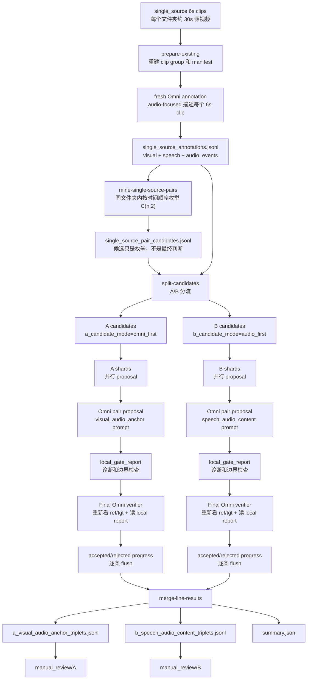
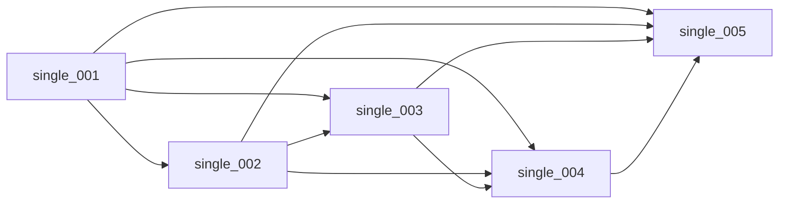
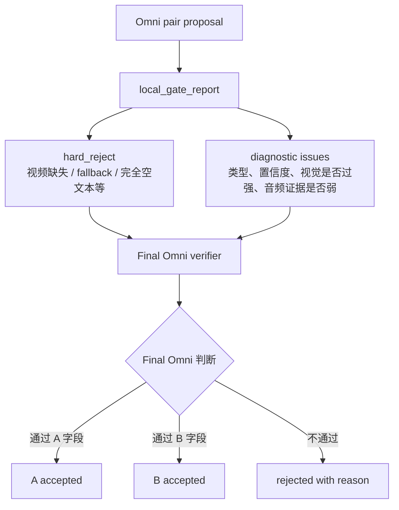

# Audio Dataset A/B Lines 构造流程

日期：2026-05-11

这份文档说明当前音频敏感 CVR 数据集的 A/B 两条线应该怎么构造。它不是替换旧的 943 条视觉 CVR 数据集，也不会修改原始切片；它是在旧 CVR 构造方法的基础上，针对音频数据集目标做出的安全扩展。

输入固定为旧 CVR 已经切好的 6 秒片段：

```text
/data02/pretrained_model/cvr_learn/cvr_data/composed_omni_retrieval/clips/single_source
```

其中每个子文件夹代表一个约 30 秒的源视频，通常包含 5 个 6 秒片段。旧 CVR 方法里最有价值的结构是：**同一个源视频文件夹内按时间顺序枚举所有 pair，让 Omni 直接比较 reference 和 target 两段视频，再由 Omni final verifier 最终审核**。A/B 线都应该继承这个骨架，而不是只靠本地 heuristic 提前筛死。

## 1. 两条线的目标

**A 线：`visual_audio_anchor`**

- 目标：音频上下文相似或连续，但视觉发生明显变化。
- `edit_text` 只描述视觉变化，不能提 audio、speech、music、sound、voice、transcript。
- 好样本风格：同一新闻或节目音频上下文里，画面从演播室主播切到洪水航拍、比赛现场、户外事故画面等。
- 科学作用：验证“音频作为上下文锚点”是否帮助视觉 CVR，但 A 线不一定要求 audio-on 明显强于 audio-off。

**B 线：`speech_audio_content`**

- 目标：视觉上下文尽量锁定，主要差异来自说话内容或清楚的非语音音频事件。
- `edit_text` 只能描述声音变化，尤其是 speech topic/content 的变化。
- 好样本风格：同一人物、同一直播/演讲/访谈/比赛转播场景中，前一个 6 秒讲预算，后一个 6 秒讲医疗；或者同类比赛画面中 target 有明显欢呼、掌声、音乐、环境声。
- 科学作用：这是证明 audio 有效的主线。预期 e5/audio-on 在 B 线上应强于 audio-off，因为不听声音很难检索对。

## 2. 关键原则

1. 不改旧 943 条数据，不改原始视频，不 remux，不生成视频。
2. 不复用旧的普通视觉描述来做 B 线 pilot；B 线需要 fresh audio-focused annotation。
3. 同源文件夹内枚举所有时间顺序 pair。5 个片段时就是 `5 * 4 / 2 = 10` 个组合。
4. 本地规则只做候选排序、日志记录和少量不可救硬边界；不要让本地第二层规则提前杀掉可能正确的样本。
5. 最终是否接受，必须由 Omni final verifier 再看 ref/tgt 视频、听音频后决定。
6. 本地 gate 的输出要作为 `local_gate_report` 给 final Omni 参考，而不是当成绝对裁判。

## 3. 总流程图



## 4. Annotation 阶段

当前 pilot 应该用 fresh audio-focused annotation。原因是旧 943 的构造重点是视觉差异，旧描述没有充分强调 speech content、speaker、audio events、ambient sound，这会直接伤害 B 线。

每个 clip 的 audio-focused annotation 至少应该覆盖：

- visual scene summary
- main subjects / actions / camera context
- speech / transcript / paraphrase / topic
- speaker identity if observable
- non-speech audio events
- music / crowd / applause / ambient sound
- whether speech/audio is clear enough to support an edit

重要产物：

- `single_source_clip_groups.jsonl`：每个源视频文件夹的分组。
- `clips_to_annotate.jsonl`：本轮要描述的 clips。
- `single_source_annotations.jsonl`：最终给 pair mining 和 proposal 使用的 clip 级标注。

## 5. Pair 枚举阶段

旧 CVR 方法里不是只拿相邻片段，而是同源文件夹内按时间顺序枚举所有 pair。



如果一个源视频有 5 个切片，就有 10 个候选。这样 B 线才有足够多的 speech/audio content 差异，因为一个人连续说话时，不同 6 秒片段的讲话内容天然会变化。

## 6. A 线候选策略

A 线现在使用：

```text
--a-candidate-mode omni_first
```

含义：

- 只要同源 pair 的 audio anchor 分数够高，就允许进入 A 候选。
- 本地的 `difference.type` 只是 hint，不再因为它不是视觉类就提前杀掉。
- 进入 Omni 后，A prompt 要求模型自己从 ref/tgt 视频中寻找清楚的视觉变化。

A 线 final Omni 必须确认：

- `accept=true`
- `large_visual_delta=true`
- `audio_context_preserved=true`
- `reference_satisfies_edit=false`
- `target_satisfies_edit=true`
- `edit_text_accurate=true`
- `edit_text` 不依赖音频词汇

A 线应该拒绝：

- 视觉几乎一样，只是亮度、镜头远近、小手势、小物体变化。
- `edit_text` 提到声音、语音、音乐、旁白、音效。
- 主差异其实是 speech/audio/visible_text。
- final Omni 无法确认 large visual delta。

## 7. B 线候选策略

B 线现在使用：

```text
--b-candidate-mode audio_first
```

含义：

- 从 fresh annotation 里优先挖 speech topic/content 差异。
- 同一源视频文件夹内所有 pair 都可以被考虑，不只相邻 pair。
- 本地 visual similarity 只作为排序和诊断，不应该过早杀掉候选。

B 线 final Omni 必须确认：

- `accept=true`
- `audio_primary=true`
- `visual_locked=true`
- `visual_too_different_for_B=false`
- `edit_text_audio_only=true`
- `reference_satisfies_edit=false`
- `target_satisfies_edit=true`

B 线可以接受：

- 同一人物、同一直播/演讲/访谈场景，说话主题改变。
- 同一比赛或同类转播画面，target 出现明显欢呼、掌声、音乐或环境声。
- 视觉有轻微姿态、镜头、动作变化，只要仍是同一场景/同一人/同类视角，并且音频是主差异。

B 线应该拒绝：

- 主差异是视觉场景、主体、动作、物体、字幕、镜头远近。
- `edit_text` 描述视觉变化。
- speech 内容变化被误标成 `audio_event`；讲话内容变化应该是 `speech`。
- 只有模糊 hum/click/tone 猜测，没有明确可听证据。

## 8. 本地规则和 Final Omni 的关系



最重要的区别：

- 本地第二层规则不能当最终裁判。
- `local_gate_report` 应该给 final Omni 参考，让它知道哪里有风险。
- final Omni 可以捞回低置信度、视觉轻微变化、audio evidence 字段不完整但实际听起来成立的样本。
- 真正不可救的只有视频缺失、proposal fallback、完全无法生成 edit、路径错误等工程问题。

## 9. 当前推荐 pilot 命令

fresh 200 pilot 已经完成并通过人工初查：

| 线 | ranked | accepted | exported | triplets |
|---|---:|---:|---:|---:|
| A `visual_audio_anchor` | 327 | 40 | 8 | 8 |
| B `speech_audio_content` | 398 | 26 | 16 | 16 |

结论：

- A 线和 B 线都能产出合格人工审核样本。
- B 线不再是 0，说明 `audio_first + fresh audio-focused annotation + final Omni` 方向是对的。
- 主要剩余问题是 context 超长：部分请求约 8800-9100 tokens，超过 8093 服务的 8192 限制。
- 当前代码已将 A/B 专用 proposal prompt、final verifier prompt、annotation JSON、candidate JSON、local gate JSON 进一步压缩，准备进入大规模 run。

fresh 200 pilot 命令如下，主要用于小规模复查：

```bash
cd /data02/usr/wangqihao/Demo/test/cvr_clean_main
git pull --ff-only origin main
mkdir -p logs

LOG=logs/audio_ab_fresh200_omni_first_$(date +%Y%m%d_%H%M%S).log

MAX_A_CANDIDATES=400 \
MAX_B_CANDIDATES=400 \
CONCURRENCY=4 \
ANNOTATION_TIMEOUT_SECONDS=900 \
setsid nohup bash scripts/run_audio_lines_single_source_reuse.sh \
  --single-source-root /data02/pretrained_model/cvr_learn/cvr_data/composed_omni_retrieval/clips/single_source \
  --run-root runs/audio_ab_fresh200_omni_first_$(date +%Y%m%d_%H%M%S) \
  --base-url http://127.0.0.1:8093/v1 \
  --model qwen3-omni-30b-a3b-instruct \
  --audio-dataset-line both \
  --target-a-count 8 \
  --target-b-count 16 \
  --max-source-folders 80 \
  --max-clips 200 \
  --annotation-search-root /data02/usr/wangqihao/Demo/test/cvr_clean_main/runs/audio_ab_fresh200_omni_first_20260511_085645 \
  --propose-shards 16 \
  --propose-parallel-jobs 8 \
  --request-timeout-seconds 120 \
  --shard-timeout-seconds 3600 \
  --audio-line-quality-profile v5_audio_primary \
  --a-candidate-mode omni_first \
  --b-candidate-mode audio_first \
  --omni-transient-retries 2 \
  > "$LOG" 2>&1 < /dev/null &

echo $! | tee logs/audio_ab_fresh200_omni_first.pid
echo "$LOG"
```

## 10. 大规模运行命令

如果 8093 的 Qwen3-Omni 服务健康，下一步可以直接扩大到更多 source folders。建议先用 800 clips 作为中大规模缓存/样本生成，再根据质量扩到全量。  
这里复用上一次 fresh 200 run 里产出的 200 条新 audio-focused annotation，不使用旧的历史 Omni 描述。

```bash
cd /data02/usr/wangqihao/Demo/test/cvr_clean_main
git pull --ff-only origin main
mkdir -p logs

LOG=logs/audio_ab_fresh800_omni_first_$(date +%Y%m%d_%H%M%S).log

MAX_A_CANDIDATES=1600 \
MAX_B_CANDIDATES=2400 \
CONCURRENCY=4 \
ANNOTATION_TIMEOUT_SECONDS=900 \
setsid nohup bash scripts/run_audio_lines_single_source_reuse.sh \
  --single-source-root /data02/pretrained_model/cvr_learn/cvr_data/composed_omni_retrieval/clips/single_source \
  --run-root runs/audio_ab_fresh800_omni_first_$(date +%Y%m%d_%H%M%S) \
  --base-url http://127.0.0.1:8093/v1 \
  --model qwen3-omni-30b-a3b-instruct \
  --audio-dataset-line both \
  --target-a-count 64 \
  --target-b-count 128 \
  --max-source-folders 240 \
  --max-clips 800 \
  --annotation-search-root /data02/usr/wangqihao/Demo/test/cvr_clean_main/runs/audio_ab_fresh200_omni_first_20260511_085645 \
  --propose-shards 32 \
  --propose-parallel-jobs 8 \
  --request-timeout-seconds 120 \
  --shard-timeout-seconds 7200 \
  --audio-line-quality-profile v5_audio_primary \
  --a-candidate-mode omni_first \
  --b-candidate-mode audio_first \
  --omni-transient-retries 2 \
  > "$LOG" 2>&1 < /dev/null &

echo $! | tee logs/audio_ab_fresh800_omni_first.pid
echo "$LOG"
```

验收：

```bash
LATEST=$(ls -td runs/audio_ab_fresh800_omni_first_* runs/audio_ab_fresh200_omni_first_* 2>/dev/null | head -1)
echo "$LATEST"
cat "$LATEST/audio_line_candidate_summary.json"
cat "$LATEST/summary.json"
wc -l "$LATEST/single_source_annotations.jsonl"
wc -l "$LATEST/a_candidates.jsonl" "$LATEST/b_candidates.jsonl"
wc -l "$LATEST/a_visual_audio_anchor_triplets.jsonl" "$LATEST/b_speech_audio_content_triplets.jsonl"
ls "$LATEST/manual_review/A" | head
ls "$LATEST/manual_review/B" | head
```

服务器 AI 只运行命令和回传日志，不能修改代码。

## 11. 明天人工审核重点

A 线：

- 看视觉差异是否足够大。
- 看 `edit_text` 是否纯视觉。
- 听 ref/tgt 音频是否像同一上下文或连续节目。

B 线：

- 看视觉上下文是否仍是同一人、同一场景、同一节目或同类转播。
- 听声音差异是否真实、清楚、可人工确认。
- 看 `edit_text` 是否只写声音变化。
- 优先保留 speech 内容变化样本，因为它最能证明 audio-on 检索的必要性。

后续 e5/audio 评测必须严格对照：

- `audio_on`：reference query 和 target gallery 都开启视频音频。
- `audio_off`：reference query 和 target gallery 都关闭视频音频。

不能只关 reference/query 的音频，否则实验结论不干净。
