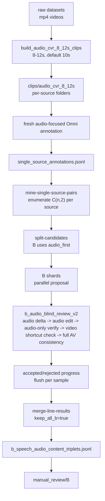

# Audio Dataset A/B Lines 构造流程

日期：2026-05-11
更新：2026-05-13

这份文档说明当前音频敏感 CVR 数据集的 A/B 两条线如何构造、如何运行、以及服务器大规模实验应该怎么调度。它不替换旧的 943 条视觉 CVR 数据集，也不修改原始 raw 视频；它是在旧 CVR 构造方法基础上，针对 audio-sensitive retrieval 做出的安全扩展。

## 1. 当前结论

本轮正式进入 Audio-CVR v1 大规模构造，执行顺序固定为 **B 线优先**：

- 旧 B 线数据不再作为主数据保留；正式 B 线只使用最新 `b_audio_blind_review_v2` 方法。
- 切片长度改为 `8-12s`，默认 `10s`；低于 `8s` 的旧 6s 切片不进入主构造。
- 所有 raw datasets 都先经过 B 线；只要 B 线 accepted，就全部保留，不再按 `target-b-count` 或 subtype 比例裁剪。
- A 线暂时不跑大规模；等 B 线数量和质量稳定后，再看 A 线数量并做合理分配。
- 当前服务器推荐入口是 `scripts/run_audio_cvr_v1_b_first_4gpu_fast.sh`，它负责四卡 Omni 服务、切片、B-first pipeline 三件事。

## 2. 输入与输出

原始数据根目录：

```text
/data02/pretrained_model/cvr_learn/cvr_data/composed_omni_retrieval
```

raw datasets 目录：

```text
/data02/pretrained_model/cvr_learn/cvr_data/composed_omni_retrieval/raw
```

服务器当前需要纳入 Audio-CVR v1 的 raw 数据集布局必须按下表理解，不能只扫 `video/` 子目录：

| 数据集 | 必扫视频目录 | 当前用途 | 备注 |
|---|---|---|---|
| `daily_omni` | `raw/daily_omni/video/` | 通用音视频样本 | `audio/` 是独立 wav，不作为视频源 |
| `hdtf` | `raw/hdtf/videos/`, `raw/hdtf/clips/` | B 线 speech_content | 既有原视频也有切片，低于 8s 的会被跳过 |
| `avatar` | `raw/avatar/`, `raw/avatar/video/` | 音频/说话/事件补充 | 目录结构可能有根目录 mp4，也可能有 `video/` |
| `vggsound` | `raw/vggsound/scratch/` | music / sound_event | 不在 `video/` 下，必须递归扫 `scratch/` |
| `vgg_monoaudio` | `raw/vgg_monoaudio/inter_class/mixed/` | sound/music 补充 | `target_audio/` 是 wav，不作为视频源 |
| `worldsense` | `raw/worldsense/videos/` | 通用音视频样本 | 只扫视频目录，不扫 `audios/` 和 `subtitles/` |
| `VoxCeleb` | `/data02/pretrained_model/cvr_learn/cvr_data/audio_datasets/VoxCeleb/` | 后续 B 线 speech pair | 仍在下载中，本轮默认排除 |

正式 Audio-CVR v1 切片输出：

```text
/data02/pretrained_model/cvr_learn/cvr_data/composed_omni_retrieval/clips/audio_cvr_8_12s
```

每个子文件夹代表一个原视频，内部是 8-12 秒切片，默认约 10 秒。旧 CVR 方法里最有价值的结构仍然保留：**同一个源视频文件夹内枚举所有时间顺序 pair，让 Omni 直接比较 reference 和 target 两段视频，再由 Omni final verifier 最终审核**。

主要输出：

- `single_source_annotations.jsonl`：fresh audio-focused clip annotation。
- `b_candidates.jsonl`：B 线候选 pair。
- `b_speech_audio_content_triplets.jsonl`：正式 B 线 triplets，保留所有 accepted。
- `manual_review/B/`：人工审核样本包。
- `summary.json`：数量、accepted/rejected、`keep_all_b` 等汇总。

## 3. A/B 两条线目标

**A 线：`visual_audio_anchor`**

- 目标：音频上下文相似或连续，但视觉发生明显变化。
- `edit_text` 只描述视觉变化，不能提 audio、speech、music、sound、voice、transcript。
- 合格风格：同一新闻/节目/比赛/直播音频上下文中，画面从主播切到洪水航拍、比赛现场、室外事故画面等。
- 科学作用：验证“音频作为上下文锚点”是否帮助视觉 CVR。A 线不一定要求 audio-on 明显强于 audio-off。

**B 线：`speech_audio_content`**

- 目标：视觉上下文尽量锁定，主要差异来自说话内容、音乐或清楚的非语音音频事件。
- `edit_text` 只能描述声音内容变化，尤其是 speech topic/content 的变化。
- 合格风格：同一人物、同一直播/演讲/访谈/比赛转播场景中，前一个 10 秒讲预算，后一个 10 秒讲医疗；或同类比赛画面中 target 有明显欢呼、掌声、音乐、环境声。
- 科学作用：这是证明 audio 有效的主线。预期 e5/audio-on 在 B 线上应强于 audio-off，因为不听声音很难检索对。

## 4. 关键原则

1. 不改旧 943 条数据，不改 raw 视频，不 remux，不生成视频。
2. B 线不能复用旧普通视觉描述来做正式数据；B 线必须使用 fresh audio-focused annotation。
3. 同源文件夹内枚举所有时间顺序 pair，不只取相邻 pair。
4. 本地规则只做候选排序、日志记录和少量不可救硬边界；不要让本地第二层规则提前杀掉可能正确的样本。
5. 最终是否接受，必须由 Omni final verifier 再看 ref/tgt 视频、听音频后决定。
6. B 线 accepted 样本全部保留，后续再通过人工审核、训练/测试划分和评测分桶来筛选。

## 5. 总流程



## 6. B 线最新方法

B 线当前使用：

```text
--audio-dataset-line speech_audio_content
--audio-line-quality-profile b_audio_blind_review_v2
--acceptance-profile b_audio_blind_review_v2
--b-candidate-mode audio_first
--keep-all-b
```

`b_audio_blind_review_v2` 的核心逻辑：

- 先判断 ref/tgt 音频差异是否真的存在，要求 `audio_delta_strength >= 0.60`。
- `edit_text` 必须来自 audio-only evidence，不能来自视觉 caption 或 full AV 阶段。
- 再做 audio-only final judge，确认 reference 不满足 edit、target 满足 edit。
- 再做 video-only shortcut judge。如果不听声音、只看画面就能定位 target，则拒绝。
- 最后做 full AV consistency，只审核 edit 是否仍成立，不允许重写成视觉 edit。

B 线可以接受：

- 同一人物、同一直播/演讲/访谈场景，说话主题改变。
- 同一比赛或同类转播画面，target 出现明显欢呼、掌声、音乐或环境声。
- 视觉有轻微姿态、镜头、动作变化，只要仍是同一场景/同一人/同类视角，并且音频是主差异。

B 线必须拒绝：

- 主差异是视觉场景、主体、动作、物体、字幕、镜头远近。
- `edit_text` 描述视觉变化。
- 只写 `speech changed`、`different sentence`、`unintelligible`、`A to B` 这类空话。
- reference 也满足 edit，或者 target 不满足 edit。

## 7. 服务器正式运行

当前推荐用四张卡 `0,1,2,3` 启动 Qwen3-Omni 服务，并用高并发但受控的配置跑 B 线。服务器 AI 只能运行命令，不能改代码。

执行命令：

```bash
cd /data02/usr/wangqihao/Demo/test/cvr_clean_main
git pull --ff-only origin main

test -f scripts/run_audio_cvr_v1_b_first_4gpu_fast.sh || { echo "missing fast runner"; exit 1; }

mkdir -p logs

LOG=logs/audio_cvr_v1_b_first_4gpu_fast_$(date +%Y%m%d_%H%M%S).log

setsid nohup bash scripts/run_audio_cvr_v1_b_first_4gpu_fast.sh \
  --root /data02/pretrained_model/cvr_learn/cvr_data/composed_omni_retrieval \
  --single-source-root /data02/pretrained_model/cvr_learn/cvr_data/composed_omni_retrieval/clips/audio_cvr_8_12s \
  --gpu-ids 0,1,2,3 \
  --tensor-parallel-size 4 \
  --max-model-len 16384 \
  --max-num-seqs 8 \
  --propose-shards 64 \
  --propose-parallel-jobs 8 \
  --concurrency 4 \
  --request-timeout-seconds 240 \
  --shard-timeout-seconds 10800 \
  --start-omni auto \
  > "$LOG" 2>&1 < /dev/null &

echo $! | tee logs/audio_cvr_v1_b_first_4gpu_fast.pid
echo "$LOG"
```

默认并发策略：

- vLLM：`GPU 0,1,2,3`，`tensor-parallel-size=4`。
- vLLM context：`max-model-len=16384`，避免 final verifier 轻微超 8192 后整条 fallback。
- vLLM batch：`max-num-seqs=8`。
- annotation：`concurrency=4`，因为这是长多模态请求，过高并发容易让 vLLM 假死。
- proposal：`propose-parallel-jobs=8`，这是主要提速点。
- shards：`64`，让失败/超时可以更细粒度恢复。

如果四卡 16384 OOM，则只把 `--max-model-len` 降到 `12288`；不要先降 B 线质量规则。

## 8. 监控命令

查看主日志：

```bash
cd /data02/usr/wangqihao/Demo/test/cvr_clean_main
tail -f "$(ls -t logs/audio_cvr_v1_b_first_4gpu_fast_*.log | head -1)"
```

查看 GPU：

```bash
nvidia-smi -i 0,1,2,3
```

查看进度：

```bash
cd /data02/usr/wangqihao/Demo/test/cvr_clean_main
LATEST=$(ls -td runs/audio_cvr_v1_b_first_* | head -1)
echo "$LATEST"

wc -l "$LATEST/single_source_annotations.jsonl" 2>/dev/null || true
wc -l "$LATEST/b_candidates.jsonl" 2>/dev/null || true
cat "$LATEST"/b_shards/accepted_progress_*.jsonl 2>/dev/null | wc -l
cat "$LATEST"/b_shards/rejected_progress_*.jsonl 2>/dev/null | wc -l
cat "$LATEST/summary.json" 2>/dev/null || true
```

如果 `/v1/models` 能返回但 `/v1/chat/completions` 超时、GPU 长期 0%，判定为 vLLM 假死。此时停止当前 pipeline，重启 8093 服务，再用同一个 `RUN_ROOT` 从 shard 继续，不要重跑 annotation。

## 9. 降并发恢复

如果 proposal 阶段在 `8` 并发下持续 timeout，可以复用同一个 `RUN_ROOT` 降到 `4` 并发重跑 proposal，不重跑 annotation：

```bash
cd /data02/usr/wangqihao/Demo/test/cvr_clean_main
RUN_ROOT=$(ls -td runs/audio_cvr_v1_b_first_* | head -1)

setsid nohup bash scripts/run_audio_lines_single_source_reuse.sh \
  --root /data02/pretrained_model/cvr_learn/cvr_data/composed_omni_retrieval \
  --single-source-root /data02/pretrained_model/cvr_learn/cvr_data/composed_omni_retrieval/clips/audio_cvr_8_12s \
  --reuse-run-root "$RUN_ROOT" \
  --skip-annotation-refresh \
  --run-b-only \
  --base-url http://127.0.0.1:8093/v1 \
  --model qwen3-omni-30b-a3b-instruct \
  --target-b-count 1000000 \
  --propose-shards 64 \
  --propose-parallel-jobs 4 \
  --request-timeout-seconds 240 \
  --shard-timeout-seconds 10800 \
  --audio-line-quality-profile b_audio_blind_review_v2 \
  --acceptance-profile b_audio_blind_review_v2 \
  --b-candidate-mode audio_first \
  --min-clips-per-folder 2 \
  --min-group-clips 2 \
  --keep-all-b \
  > logs/audio_cvr_v1_b_first_resume_$(date +%Y%m%d_%H%M%S).log 2>&1 < /dev/null &
```

## 10. 验收命令

```bash
cd /data02/usr/wangqihao/Demo/test/cvr_clean_main
LATEST=$(ls -td runs/audio_cvr_v1_b_first_* | head -1)
echo "$LATEST"

cat "$LATEST/summary.json"
cat "$LATEST/audio_line_candidate_summary.json"
wc -l "$LATEST/single_source_annotations.jsonl"
wc -l "$LATEST/b_candidates.jsonl"
wc -l "$LATEST/b_speech_audio_content_triplets.jsonl"

ls "$LATEST/manual_review/B" | head
head -3 "$LATEST/b_speech_audio_content_triplets.jsonl"
```

验收标准：

- `summary.json` 中 `keep_all_b=true`。
- `b_speech_audio_content_triplets.jsonl` 保留所有 accepted B 样本。
- `manual_review/B/` 已生成，可直接人工抽查。
- 日志中不能大量出现 `fallback_pair_proposal`、`Input length exceeds max_model_len`、`Connection refused`。
- 本轮不生成 A 线，不修改旧 943 数据，不启动 e5。

## 11. 后续 A 线

A 线等 B 线完成后再做。原因：

- 8093 的 Qwen3-Omni 是共享瓶颈。
- B 线是最难、最能证明 audio 有效的主线。
- 同时开 A 线会抢 vLLM，增加假死和超时风险。

A 线后续应复用 B 线已经生成的 `single_source_annotations.jsonl`，不要重跑 annotation。A 线数量出来后，再决定 A/B/旧 943 数据如何做 train/val/test 分配。

## 12. 后续 e5/audio 评测原则

后续 e5/audio 评测必须严格对照：

- `audio_on`：reference query 和 target gallery 都开启视频音频。
- `audio_off`：reference query 和 target gallery 都关闭视频音频。

不能只关 reference/query 的音频，否则实验结论不干净。
