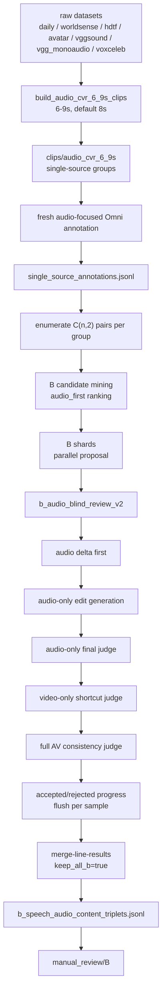

# Audio Dataset A/B Lines 构造流程

日期：2026-05-11
更新：2026-05-15

这份文档说明当前 Audio-CVR 数据集的 A/B 两条线如何构造、为什么这样构造、服务器大规模运行应该如何调度，以及后续 e5/agent 实验应该如何使用这些数据。它不替代旧的 943 条 visual CVR 数据集，不修改任何原始 raw 视频；它是在旧 CVR “同源切片、两两比较、Omni proposal + Omni final verify” 方法基础上，为音频敏感检索新增的安全扩展。

更细的服务器交接命令见：

```text
doc/audio_cvr_large_scale_handoff_20260514.md
```

## 1. 当前结论

当前正式进入 Audio-CVR 大规模构造阶段，执行顺序固定为 **B 线优先**。

- 旧的 B 线数据不再保留为主数据，因为早期方法会接受大量视觉捷径样本。
- 正式 B 线只使用最新 `b_audio_blind_review_v2` 方法。
- 切片窗口改为 `6-9s`，默认 `8s`，输出到新目录 `clips/audio_cvr_6_9s/`。
- 所有 raw datasets 都要先经过 B 线；只要 B 线 accepted，先全部保留，后续再人工审核、训练/验证/测试划分。
- A 线暂时不大规模跑；等 B 线做好后，再根据 A 线可产出数量和研究叙事做合理分配。
- 大规模运行入口是 `scripts/run_audio_cvr_bline_6_9s_full_4gpu.sh`。
- 服务器执行人员只运行命令，不改代码。

## 2. 任务定义

### A 线：`visual_audio_anchor`

目标：音频上下文相似或连续，视觉发生明显变化。

输入输出：

```text
reference_video + visual edit_text -> target_video
```

要求：

- `edit_text` 只描述视觉变化，不能提 audio/speech/music/sound/voice/transcript。
- ref/target 音频应相似、连续或来自同一节目/新闻/比赛/直播上下文。
- 视觉差异要明显，不能只是亮度、镜头远近、手势、小物体变化。
- A 线验证的是“音频作为上下文锚点是否帮助视觉 CVR”，不一定要求 audio-on 明显强于 audio-off。

典型合格样本：

- 同一新闻音频上下文中，画面从主播切到洪水航拍。
- 同一比赛音频上下文中，画面从解说台切到比赛现场。

### B 线：`speech_audio_content`

目标：视觉上下文尽量锁定，主要差异来自 speech、music 或 sound event。

输入输出：

```text
reference_video + audio edit_text -> target_video
```

要求：

- `edit_text` 只能描述声音变化。
- 允许类型：`speech`、`music`、`sound_event`。
- 不允许主差异是场景、人物、动作、物体、字幕、按钮、镜头远近。
- 不允许退化成纯 ASR benchmark；speech 必须嵌在视频场景中，例如新闻、比赛、教程、直播、访谈、表演。
- B 线是证明 audio 对 CVR 有用的主线，预期 audio-on 在 B 线上应强于 audio-off。

典型合格样本：

- 同一人物/同一访谈场景中，speech 从讨论旅行变成讨论建筑出售。
- 同一比赛画面中，target 出现明显欢呼或掌声。
- 同类画面中，背景音乐从安静吉他变成更强的演奏或另一种音乐。

## 3. 数据根目录和数据集清单

固定根目录：

```text
/data02/pretrained_model/cvr_learn/cvr_data/composed_omni_retrieval
```

raw datasets 目录：

```text
/data02/pretrained_model/cvr_learn/cvr_data/composed_omni_retrieval/raw
```

当前大规模 B 线切片输出：

```text
/data02/pretrained_model/cvr_learn/cvr_data/composed_omni_retrieval/clips/audio_cvr_6_9s
```

运行输出：

```text
/data02/usr/wangqihao/Demo/test/cvr_clean_main/runs/audio_cvr_bline_6_9s_full_<timestamp>
```

服务器 raw 数据集结构必须按下表理解，不能只扫 `video/` 子目录。

| 数据集 | 必扫视频目录 | 规模和时长 | 本轮处理规则 |
|---|---|---:|---|
| `daily_omni` | `raw/daily_omni/video/` | 1,196 mp4，约 30s | 重新切 6-9s，默认 8s |
| `worldsense` | `raw/worldsense/videos/` | 1,662 mp4，约 30-540s | 重新切 6-9s |
| `hdtf` | `raw/hdtf/videos/` | 400 长视频，约 30-140s | 只用 `videos/`；不要用低于 6s 的 `clips/` |
| `avatar` | `raw/avatar/` 和 `raw/avatar/video/` | 10,000 mp4，约 10s | 8s + tail clip，使短视频也能形成 pair |
| `vggsound` | `raw/vggsound/scratch/` | 20,000 mp4，约 10-15s | 8s + tail clip，主力 sound/music 来源 |
| `vgg_monoaudio` | `raw/vgg_monoaudio/inter_class/mixed/` | 1,071 mp4，约 8s | 只使用有视频流和音频流的 mp4 |
| `voxceleb` | `raw/voxceleb/vox2_mp4/dev/` | 1,092,009 mp4，约 4-9s，224x224 | 同一父目录短 mp4 聚成 single-source group；跳过 `vox1/` 和 `vox2_aac/` |

VoxCeleb 特别规则：

- `raw/voxceleb/vox2_mp4/dev/` 是主 B 线可用视频。
- `raw/voxceleb/vox1/` 是 wav/txt，不进入主 B 线。
- `raw/voxceleb/vox2_aac/` 是纯音频，不进入主 B 线。
- 6-9s 的 VoxCeleb mp4 会按父目录聚合成 single-source group。
- 父目录内少于 2 个有效 mp4 时，不写入最终 clips/groups manifest。
- 完整 6-9s mp4 用 hardlink/copy 写入 clip cache，避免对百万级短 mp4 做 ffmpeg 重编码。

## 4. 总流程



## 5. B 线最新方法：`b_audio_blind_review_v2`

运行参数：

```text
--audio-dataset-line speech_audio_content
--audio-line-quality-profile b_audio_blind_review_v2
--acceptance-profile b_audio_blind_review_v2
--b-candidate-mode audio_first
--keep-all-b
```

核心思想：先闭眼听，再看画面查捷径。

### 5.1 Audio Delta First

只输入 ref/target 音频，判断声音差异是否真实、具体、可检索。

必须满足：

- `audio_delta_strength >= 0.60`
- 差异类型是 `speech`、`music` 或 `sound_event`
- 不是 `speech changed`、`different sentence`、`A to B`、`unintelligible` 这类空话

### 5.2 Audio-Only Edit Generation

`edit_text` 只能根据 audio-only evidence 生成。

合格格式：

```text
change the speech from discussing {specific ref topic} to discussing {specific target topic}
change the voice from saying "{specific ref phrase}" to saying "{specific target phrase}"
replace {specific ref sound/music} with {specific target sound/music}
add {specific target sound/event} to the audio
remove {specific ref sound/event} from the audio
```

禁止：

- 写视觉变化。
- 写 `target audio`、`speech content changed`、`different tone` 这类空洞文本。
- from/to 内容相同或几乎相同。
- reference 本来就满足 edit。

### 5.3 Audio-Only Final Judge

仍然只听音频，确认：

- `reference_satisfies_edit=false`
- `target_satisfies_edit=true`
- `audio_difference_specific=true`
- `edit_text_audio_only=true`

如果这一关不通过，不能导出。

### 5.4 Video-Only Shortcut Judge

只看静音视频或要求模型忽略声音，判断是否存在视觉捷径。

如果不听声音、只看画面就能定位 target，则拒绝，reason 为：

```text
visual_shortcut_risk
```

典型拒绝：

- `SUBSCRIBE` 按钮、字幕、屏幕文字。
- 人物微笑、手势、走出画面。
- card front/back、物体出现/消失。
- close-up/wide shot 这类镜头变化。

### 5.5 Full AV Consistency Judge

最后输入完整 ref/target 视频和 audio-only edit_text。

这个阶段只允许审核：

- 音频 edit 是否仍然成立。
- 视觉上下文是否足够相近。
- 是否存在明显视觉捷径。

不允许 full AV 阶段重写 edit_text，也不允许把样本改成视觉 CVR。

## 6. 缓存和断点续跑原则

所有阶段都必须“边产出边落盘”。

- 切片：每个 mp4 先写临时文件，成功后原子替换。
- VoxCeleb 短 mp4：完整 6-9s mp4 使用 hardlink/copy，不走 ffmpeg 重编码。
- annotation：每条写入 `single_source_annotations.jsonl`，中断后按 `clip_id` 复用。
- propose：每条写入 `accepted_progress_*.jsonl` 或 `rejected_progress_*.jsonl`。
- merge：可以从 ranked/progress JSONL 重新生成 summary 和 review bundle。

如果进程中断，不要删除 `RUN_ROOT`，不要删除 clip cache。优先重启 vLLM 后用同一个 run 目录续跑。

## 7. 服务器正式运行

推荐直接按更详细的交接文档执行：

```text
doc/audio_cvr_large_scale_handoff_20260514.md
```

核心命令形态如下：

```bash
cd /data02/usr/wangqihao/Demo/test/cvr_clean_main
git pull --ff-only origin main

source /data02/usr/wangqihao/miniconda3/etc/profile.d/conda.sh
conda activate omni_src

mkdir -p logs

RUN_ROOT=/data02/usr/wangqihao/Demo/test/cvr_clean_main/runs/audio_cvr_bline_6_9s_full_$(date +%Y%m%d_%H%M%S)
LOG=logs/audio_cvr_bline_6_9s_full_$(date +%Y%m%d_%H%M%S).log

setsid nohup bash scripts/run_audio_cvr_bline_6_9s_full_4gpu.sh \
  --run-root "$RUN_ROOT" \
  --start-omni auto \
  --gpu-ids 0,1,2,3 \
  --tensor-parallel-size 4 \
  --max-model-len 16384 \
  --max-num-seqs 8 \
  --clip-seconds 8 \
  --min-clip-seconds 6 \
  --max-clip-seconds 9 \
  --propose-shards 64 \
  --propose-parallel-jobs 8 \
  --concurrency 4 \
  --request-timeout-seconds 240 \
  --shard-timeout-seconds 10800 \
  --target-b-count 1000000 \
  > "$LOG" 2>&1 < /dev/null &

echo $! | tee logs/audio_cvr_bline_6_9s_full.pid
echo "$RUN_ROOT"
echo "$LOG"
```

并发策略：

- Qwen3-Omni：GPU `0,1,2,3`，TP=4。
- `max-model-len=16384`，避免 final verifier 超过 8192 后整条失败。
- annotation 并发 `4`，长多模态请求不宜太高。
- propose 并发 `8`，主要提速点。
- shard 数 `64`，便于细粒度恢复。

如果四卡 16384 OOM，优先把 `--max-model-len` 降到 `12288`，不要先放宽 B 线质量规则。

## 8. 监控命令

```bash
cd /data02/usr/wangqihao/Demo/test/cvr_clean_main

PID=$(cat logs/audio_cvr_bline_6_9s_full.pid)
ps -p "$PID" -o pid,pgid,stat,etime,cmd || true

LOG=$(ls -t logs/audio_cvr_bline_6_9s_full_*.log | head -1)
tail -100 "$LOG"

RUN_ROOT=$(ls -td runs/audio_cvr_bline_6_9s_full_* | head -1)
echo "$RUN_ROOT"

cat /data02/pretrained_model/cvr_learn/cvr_data/composed_omni_retrieval/clips/audio_cvr_6_9s/_manifests/audio_cvr_6_9s_summary.json 2>/dev/null || true
wc -l "$RUN_ROOT/single_source_annotations.jsonl" 2>/dev/null || true
wc -l "$RUN_ROOT/b_candidates.jsonl" 2>/dev/null || true
cat "$RUN_ROOT"/b_shards/accepted_progress_*.jsonl 2>/dev/null | wc -l
cat "$RUN_ROOT"/b_shards/rejected_progress_*.jsonl 2>/dev/null | wc -l
nvidia-smi -i 0,1,2,3
```

如果 `/v1/models` 能返回，但 `/v1/chat/completions` 超时且 GPU 长期 0%，判断为 vLLM 假死。此时不要改代码，回传日志；需要重启 8093 服务后，用同一个 `RUN_ROOT` 续跑。

## 9. 验收命令

```bash
cd /data02/usr/wangqihao/Demo/test/cvr_clean_main
RUN_ROOT=$(ls -td runs/audio_cvr_bline_6_9s_full_* | head -1)
echo "$RUN_ROOT"

cat "$RUN_ROOT/summary.json"
wc -l "$RUN_ROOT/b_speech_audio_content_triplets.jsonl"
ls "$RUN_ROOT/manual_review/B" | head
find "$RUN_ROOT/manual_review/B" -maxdepth 2 -type f | head -30

cat /data02/pretrained_model/cvr_learn/cvr_data/composed_omni_retrieval/clips/audio_cvr_6_9s/_manifests/audio_cvr_6_9s_summary.json
```

验收重点：

- `b_speech_audio_content_triplets.jsonl` 存在且有样本。
- `manual_review/B/` 有可审查样本。
- 日志中不能持续大量出现 `Input length exceeds`、`fallback_pair_proposal`、`timeout`、`Connection refused`。
- summary 中 B 线 profile 是 `b_audio_blind_review_v2`。

## 10. 禁止事项

服务器执行人员必须遵守：

- 不要改代码。
- 不要改原始 raw 数据。
- 不要覆盖旧 `clips/audio_cvr_8_12s/`。
- 不要删除 `clips/audio_cvr_6_9s/` 或当前 `RUN_ROOT`。
- 不要跑 A 线。
- 不要跑 e5、AVIGATE、agent。
- 不要启动 VACE 或任何视频生成模型。
- 不要把纯 ASR / 纯音频数据混入主 B 线。

## 11. 后续 A 线

A 线等 B 线完成后再做。

原因：

- B 线是最能证明 audio 有效的主线。
- B 线更难，需要先稳定方法和数据质量。
- Qwen3-Omni 是共享瓶颈，同时跑 A/B 会增加 vLLM 假死和超时风险。

后续 A 线应复用 B 线已经生成的 `single_source_annotations.jsonl`，不要重复跑 annotation。A 线数量出来后，再决定 A/B/旧 943 如何做 train/val/test 配比。

## 12. 后续 e5/audio 评测原则

后续 e5/audio 评测必须严格对照：

- `audio_on`：reference query 和 target gallery 都开启视频音频。
- `audio_off`：reference query 和 target gallery 都关闭视频音频。

不能只关 reference/query 的音频，否则实验结论不干净。

B 线的预期结果：

- 如果模型真的利用 audio，`audio_on` 应明显强于 `audio_off`。
- 如果 `audio_on` 没有优势，说明当前 backbone 存在音频-视频-文本对齐不足，这是后续训练 e5/omni embedding 的主要动机。

## 13. B 线反 ASR 退化分层

B 线不再把 ASR-risk 样本简单删除，而是先全量收集，再分层使用。这样既保留训练量，也避免主 benchmark 被质疑成 ASR retrieval。

核心定义：

```text
B 线不是 audio determines target，
而是 audio edit under preserved video context determines target。
```

merge 阶段会给每条 B accepted 样本写入：

- `split_tier`: `main`、`extended` 或 `diagnostic`。
- `benchmark_eligible`: 只有 `main` 为 true。
- `training_eligible`: `main` 和 `extended` 为 true。
- `diagnostic_reason`: 解释为什么样本降级为诊断集。
- `b_subtype`: `speech_topic_in_video_context`、`music` 或 `sound_event`。
- `video_context_strength`、`asr_degeneracy_risk`、`audio_delta_strength`、`visual_shortcut_risk`、`audio_only_solvability`、`full_av_required`。

新增输出文件：

```text
b_all_audio_cvr_triplets.jsonl
b_main_audio_cvr_triplets.jsonl
b_extended_audio_cvr_triplets.jsonl
b_diagnostic_asr_risk_triplets.jsonl
```

兼容文件 `b_speech_audio_content_triplets.jsonl` 仍然保留，内容等同所有 B accepted。

三层含义：

- `B-main`：低 ASR 风险、高视频语境、强 audio delta，用于论文主 benchmark。
- `B-extended`：中等风险、质量合格，用于训练或预训练 audio-aware retriever。
- `B-diagnostic`：ASR-risk、generic talking-head、transcript-like edit 等样本，不进主表，只做附录和诊断。

`B-main` 会优先保留 `music` 和 `sound_event`，并限制 `speech_topic_in_video_context` 占比，避免 speech 主导主测试集。

## 14. B 线 inverse augmentation 与 AudioDelta 训练记录

inverse augmentation 是 B 线后处理，不替代 `b_audio_blind_review_v2` 正向构造流程。正向 accepted 后，系统可以尝试生成反向样本：

```text
forward: reference audio A -> target audio B, edit_text = A -> B
inverse: reference audio B -> target audio A, edit_text = B -> A
```

反向样本不能自动继承正向 accepted，必须重新通过：

- audio-only verifier：确认新 reference 不满足 inverse edit，new target 满足 inverse edit。
- video-only shortcut judge：确认不听声音不能定位 target。
- full AV consistency：确认完整视频中 inverse edit 仍成立。

新增后处理命令：

```bash
python3 -m app.audio_lines_single_source augment-b-inverse \
  --run-root "$RUN_ROOT" \
  --input-path "$RUN_ROOT/b_main_audio_cvr_triplets.jsonl" \
  --max-records 20 \
  --base-url http://127.0.0.1:8093/v1 \
  --api-key EMPTY \
  --model qwen3-omni-30b-a3b-instruct
```

新增输出：

```text
b_inverse_candidates.jsonl
b_inverse_accepted.jsonl
b_inverse_rejected.jsonl
b_train_bidirectional_triplets.jsonl
b_inverse_summary.json
```

`b_train_bidirectional_triplets.jsonl` 是训练用文件，包含正向样本和通过复验的反向样本。clean benchmark 不默认翻倍，`b_main_audio_cvr_triplets.jsonl` 仍保留原始方向。

为服务 AudioDelta-E5，每条训练记录会补充结构化字段：

- `direction`: `forward` 或 `inverse`。
- `edit_type`: `add`、`remove`、`replace`、`increase`、`decrease` 或 `unknown`。
- `audio_delta_type`: `speech_topic`、`speech_phrase`、`music` 或 `sound_event`。
- `old_audio` / `new_audio`: edit-type-aware delta loss 使用的端点。
- `audio_delta_hard_negatives`: typed hard negatives，包括 `reference`、`visual_hard`、`audio_hard`、`asr_hard`。
- `visual_constraint`: 视觉语境与视觉捷径诊断字段。
- `shortcut_label`: `clean_audio_delta`、`ASR-like`、`visual-shortcut`、`audio-only-shortcut` 或 `ambiguous`。
- `source_disjoint_group_id`、`pair_group_id`、`inverse_pair_group_id`: 用于 source-disjoint 和 pair-group-disjoint split。

训练推荐使用正向 + 反向；val/test 默认每个 `pair_group_id` 只保留一个方向，避免泄漏和重复统计。
