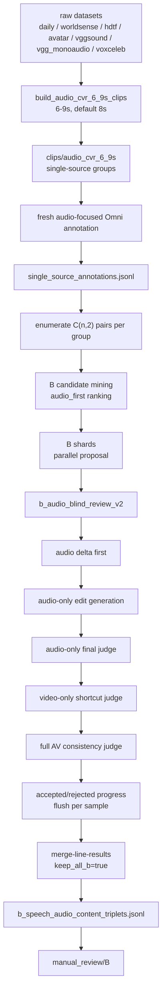

# Audio Dataset A/B Lines 构造流程

日期：2026-05-11
更新：2026-05-16

这份文档说明当前 Audio-CVR 数据集的 A/B 两条线如何构造、为什么这样构造、以及最终会产出哪些文件和字段。它不替代旧的 943 条 visual CVR 数据集，不修改任何原始 raw 视频；它是在旧 CVR “同源切片、两两比较、Omni proposal + Omni final verify” 方法基础上，为音频敏感检索新增的安全扩展。

## 1. 当前结论

当前正式进入 Audio-CVR 大规模构造阶段，执行顺序固定为 **B 线优先**。

- 旧的 B 线数据不再保留为主数据，因为早期方法会接受大量视觉捷径样本。
- 正式 B 线只使用最新 `b_audio_blind_review_v2` 方法。
- 切片窗口改为 `6-9s`，默认 `8s`，输出到新目录 `clips/audio_cvr_6_9s/`。
- 所有 raw datasets 都要先经过 B 线；只要 B 线 accepted，先全部保留，后续再人工审核、训练/验证/测试划分。
- A 线暂时不大规模跑；等 B 线做好后，再根据 A 线可产出数量和研究叙事做合理分配。
- 本文只写方法和产物，不写部署或执行命令。

## 2. 任务定义

### A 线：`visual_audio_anchor`

目标：音频上下文相似或连续，视觉发生明显变化。

输入输出：

```text
reference_video + visual edit_text -> target_video
```

要求：

- `edit_text` 只描述视觉变化，不能提 audio/speech/music/sound/voice/transcript。
- ref/target 音频应相似、连续或来自同一节目/新闻/比赛/直播上下文。
- 视觉差异要明显，不能只是亮度、镜头远近、手势、小物体变化。
- A 线验证的是“音频作为上下文锚点是否帮助视觉 CVR”，不一定要求 audio-on 明显强于 audio-off。

典型合格样本：

- 同一新闻音频上下文中，画面从主播切到洪水航拍。
- 同一比赛音频上下文中，画面从解说台切到比赛现场。

### B 线：`speech_audio_content`

目标：视觉上下文尽量锁定，主要差异来自 speech、music 或 sound event。

输入输出：

```text
reference_video + audio edit_text -> target_video
```

要求：

- `edit_text` 只能描述声音变化。
- 允许类型：`speech`、`music`、`sound_event`。
- 不允许主差异是场景、人物、动作、物体、字幕、按钮、镜头远近。
- 不允许退化成纯 ASR benchmark；speech 必须嵌在视频场景中，例如新闻、比赛、教程、直播、访谈、表演。
- B 线是证明 audio 对 CVR 有用的主线，预期 audio-on 在 B 线上应强于 audio-off。

典型合格样本：

- 同一人物/同一访谈场景中，speech 从讨论旅行变成讨论建筑出售。
- 同一比赛画面中，target 出现明显欢呼或掌声。
- 同类画面中，背景音乐从安静吉他变成更强的演奏或另一种音乐。

## 3. 数据目录逻辑和数据集清单

本文只描述相对目录逻辑，不写机器执行细节。

```text
raw/
clips/audio_cvr_6_9s/
runs/audio_cvr_bline_6_9s_full_<timestamp>/
```

raw 数据集结构必须按下表理解，不能只扫 `video/` 子目录。

| 数据集 | 必扫视频目录 | 规模和时长 | 本轮处理规则 |
|---|---|---:|---|
| `daily_omni` | `raw/daily_omni/video/` | 1,196 mp4，约 30s | 重新切 6-9s，默认 8s |
| `worldsense` | `raw/worldsense/videos/` | 1,662 mp4，约 30-540s | 重新切 6-9s |
| `hdtf` | `raw/hdtf/videos/` | 400 长视频，约 30-140s | 只用 `videos/`；不要用低于 6s 的 `clips/` |
| `avatar` | `raw/avatar/` 和 `raw/avatar/video/` | 10,000 mp4，约 10s | 8s + tail clip，使短视频也能形成 pair |
| `vggsound` | `raw/vggsound/scratch/` | 20,000 mp4，约 10-15s | 8s + tail clip，主力 sound/music 来源 |
| `vgg_monoaudio` | `raw/vgg_monoaudio/inter_class/mixed/` | 1,071 mp4，约 8s | 只使用有视频流和音频流的 mp4 |
| `voxceleb` | `raw/voxceleb/vox2_mp4/dev/` | 1,092,009 mp4，约 4-9s，224x224 | 同一父目录短 mp4 聚成 single-source group；跳过 `vox1/` 和 `vox2_aac/` |

VoxCeleb 特别规则：

- `raw/voxceleb/vox2_mp4/dev/` 是主 B 线可用视频。
- `raw/voxceleb/vox1/` 是 wav/txt，不进入主 B 线。
- `raw/voxceleb/vox2_aac/` 是纯音频，不进入主 B 线。
- 6-9s 的 VoxCeleb mp4 会按父目录聚合成 single-source group。
- 父目录内少于 2 个有效 mp4 时，不写入最终 clips/groups manifest。
- 完整 6-9s mp4 用 hardlink/copy 写入 clip cache，避免对百万级短 mp4 做 ffmpeg 重编码。
- VoxCeleb 默认不直接进入 `B-main`，优先进入 `B-extended` 或 `B-diagnostic`。
- VoxCeleb 只有在 `video_context_strength >= 0.70`、`asr_degeneracy_risk <= 0.30`、`visual_shortcut_risk=false`、`audio_only_verification.accept=true`、且 `video_only_shortcut.can_identify_target_without_audio=false` 时，才允许进入 `B-main`。
- 这样做是为了避免 B 线被审稿人质疑成 talking-head speech retrieval 或 ASR retrieval。

## 4. 总流程



## 5. B 线最新方法：`b_audio_blind_review_v2`

运行参数：

```text
--audio-dataset-line speech_audio_content
--audio-line-quality-profile b_audio_blind_review_v2
--acceptance-profile b_audio_blind_review_v2
--b-candidate-mode audio_first
--keep-all-b
```

核心思想：先闭眼听，再看画面查捷径。

### 5.1 Audio Delta First

只输入 ref/target 音频，判断声音差异是否真实、具体、可检索。

必须满足：

- `audio_delta_strength >= 0.60`
- 差异类型是 `speech`、`music` 或 `sound_event`
- 不是 `speech changed`、`different sentence`、`A to B`、`unintelligible` 这类空话

### 5.2 Audio-Only Edit Generation

`edit_text` 只能根据 audio-only evidence 生成。

合格格式：

```text
change the speech from discussing {specific ref topic} to discussing {specific target topic}
change the voice from saying "{specific ref phrase}" to saying "{specific target phrase}"
replace {specific ref sound/music} with {specific target sound/music}
add {specific target sound/event} to the audio
remove {specific ref sound/event} from the audio
```

禁止：

- 写视觉变化。
- 写 `target audio`、`speech content changed`、`different tone` 这类空洞文本。
- from/to 内容相同或几乎相同。
- reference 本来就满足 edit。

### 5.3 Audio-Only Final Judge

仍然只听音频，确认：

- `reference_satisfies_edit=false`
- `target_satisfies_edit=true`
- `audio_difference_specific=true`
- `edit_text_audio_only=true`

如果这一关不通过，不能导出。

### 5.4 Video-Only Shortcut Judge

只看静音视频或要求模型忽略声音，判断是否存在视觉捷径。

如果不听声音、只看画面就能定位 target，则拒绝，reason 为：

```text
visual_shortcut_risk
```

典型拒绝：

- `SUBSCRIBE` 按钮、字幕、屏幕文字。
- 人物微笑、手势、走出画面。
- card front/back、物体出现/消失。
- close-up/wide shot 这类镜头变化。

### 5.5 Full AV Consistency Judge

最后输入完整 ref/target 视频和 audio-only edit_text。

这个阶段只允许审核：

- 音频 edit 是否仍然成立。
- 视觉上下文是否足够相近。
- 是否存在明显视觉捷径。

不允许 full AV 阶段重写 edit_text，也不允许把样本改成视觉 CVR。

## 6. 产物和缓存原则

所有阶段都必须“边产出边落盘”。

- 切片：每个 mp4 先写临时文件，成功后原子替换。
- VoxCeleb 短 mp4：完整 6-9s mp4 使用 hardlink/copy，不走 ffmpeg 重编码。
- annotation：每条写入 `single_source_annotations.jsonl`，中断后按 `clip_id` 复用。
- propose：每条写入 `accepted_progress_*.jsonl` 或 `rejected_progress_*.jsonl`。
- merge：可以从 ranked/progress JSONL 重新生成 summary 和 review bundle。

## 7. 完整产物清单

### 7.1 Clip cache

`clips/audio_cvr_6_9s/` 是新的切片缓存，不覆盖旧 `clips/audio_cvr_8_12s/`。

主要产物：

- 每个 source group 一个文件夹，里面是 6-9s clip，默认 8s。
- 每个 clip 保留原视频的音频轨，后续 B 线需要听声音。
- VoxCeleb 这类 6-9s 短 mp4 直接 hardlink/copy 到 cache，避免重编码。
- `_manifests/audio_cvr_6_9s_summary.json`：记录数据集来源、source 数、clip 数、跳过原因、切片参数。
- `_manifests/audio_cvr_6_9s_clips.jsonl`：每行一个 clip，包含 `clip_id`、`dataset`、`source_id`、`output_path`、`duration_seconds`、`group_id`。
- `_manifests/audio_cvr_6_9s_groups.jsonl`：每行一个 single-source group，包含同一原视频或同一父目录下的 clip 列表。

### 7.2 Annotation cache

annotation 阶段的目标是让 Omni 对每个 clip 做 audio-focused 描述。后续 A/B 线都应该复用这批描述。

主要产物：

- `single_source_annotations.jsonl`：核心 clip 描述，每行一个 6-9s clip。
- `single_source_whole_annotation.jsonl`：如果存在 whole/window 级视频，则记录整体上下文。
- `clips_to_annotate.jsonl`：需要标注的 clip manifest。
- `audio_refresh_clips.jsonl`：需要重新 audio-focused 描述的 clip。
- `annotation_reuse_report.json/jsonl`：记录哪些 annotation 被复用、哪些缺失、哪些需要刷新。

每条 annotation 重点字段：

- `clip_id`、`output_path`、`dataset`、`source_clip_id`、`group_id`。
- `summary`、`subjects`、`actions`、`scene`、`attributes`。
- `speech`、`speakers_and_transcript`、`speech_topic_or_step`、`speech_role`。
- `audio_events`、`non_speech_audio_events`、`music_description`、`ambient_sound`。
- `video_context_type`、`video_context_strength`、`asr_degeneracy_risk`。

### 7.3 Candidate files

candidate 阶段在同一个 group 内枚举 pair。一个 5 段 source video 理论上会产生 `5*4/2=10` 个候选 pair。

主要产物：

- `a_candidates.jsonl`：A 线候选，强调视觉差异大、音频上下文相似。
- `b_candidates.jsonl`：B 线候选，强调视觉上下文保留、声音差异强。
- `split_candidates_summary.json`：记录 A/B 候选数、拒绝原因、candidate ranking 参数。

每条 B candidate 重点字段：

- `reference_clip_id`、`target_clip_id`、`reference_video`、`target_video`。
- `audio_dataset_line=speech_audio_content`。
- `scores` 和 `quality`：包含 `visual_context_similarity`、`visual_delta_strength`、`video_context_strength`、`asr_degeneracy_risk`。
- `difference`：候选阶段的粗差异提示，不作为最终 edit_text。

### 7.4 Proposal shards and progress

proposal 阶段将候选分成多个 shard。每条样本都会立刻写 progress，避免中断后全部重跑。

主要产物：

- `b_shards/b_shard_*.jsonl`：每个 shard 的输入候选。
- `b_shards/ranked_*.jsonl`：每个 shard 的完整模型输出。
- `b_shards/accepted_progress_*.jsonl`：逐条落盘的 accepted 样本。
- `b_shards/rejected_progress_*.jsonl`：逐条落盘的 rejected 样本和拒绝原因。

每条 ranked/progress 重点字段：

- `accepted`、`final_omni_accept`、`single_source_pair_acceptance_issues`。
- `edit_text`：最终可检索音频编辑文本。
- `audio_delta_analysis`：audio-only delta first 的结果。
- `audio_edit_generation`：audio-only edit text 生成结果。
- `audio_only_verification`：只听声音的 final judge。
- `video_only_shortcut`：只看静音视频的视觉捷径判断。
- `full_av_consistency`：完整音视频一致性审核。
- `audio_only_reference_content`、`audio_only_target_content`。
- `video_context_strength`、`asr_degeneracy_risk`、`visual_shortcut_risk`、`audio_delta_strength`。
- `hard_negatives`：候选阶段或后处理得到的难负样本路径。

### 7.5 Merge outputs

merge 阶段把 shard 结果合并成正式数据文件。

核心兼容输出：

- `b_speech_audio_content_triplets.jsonl`：所有 B accepted 样本，兼容旧命名。
- `b_all_audio_cvr_triplets.jsonl`：所有 B accepted 样本，语义更明确。

分层输出：

- `b_main_audio_cvr_triplets.jsonl`：主 benchmark。低 ASR 风险、高视频语境、强 audio delta。
- `b_extended_audio_cvr_triplets.jsonl`：训练/预训练候选。质量合格但风险略高或 speech 比例受限。
- `b_diagnostic_asr_risk_triplets.jsonl`：ASR-risk、generic talking-head、transcript-like edit 等诊断样本。

按 subtype 输出：

- `b_speech_context_triplets.jsonl`
- `b_music_triplets.jsonl`
- `b_sound_event_triplets.jsonl`

统计输出：

- `summary.json`：总览 A/B ranked、accepted、tier 数量、subtype 分布、拒绝原因。
- `b_context_cvr_summary.json`：B 线专用统计，包括 tier 分布、ASR-risk 分布、speech/music/sound_event 数量。

### 7.6 Manual review bundle

manual review 用于人工抽查样本质量。

主要产物：

- `manual_review/B/sample_*/reference.mp4`
- `manual_review/B/sample_*/target.mp4`
- `manual_review/B/sample_*/edit_text.txt`
- `manual_review/B/sample_*/metadata.json`

`metadata.json` 必须能看到：

- `split_tier`、`benchmark_eligible`、`training_eligible`。
- `b_subtype`、`diagnostic_reason`。
- `audio_only_reference_content`、`audio_only_target_content`。
- `audio_delta_analysis`、`audio_only_verification`、`video_only_shortcut`、`full_av_consistency`。
- `video_context_strength`、`asr_degeneracy_risk`、`visual_shortcut_risk`。

### 7.7 Inverse augmentation outputs

inverse augmentation 是后处理，只用于训练增强和 edit direction 学习，不直接让 clean benchmark 翻倍。

主要产物：

- `b_inverse_candidates.jsonl`：尝试反向的样本。
- `b_inverse_accepted.jsonl`：通过反向三层复验的样本。
- `b_inverse_rejected.jsonl`：反向失败样本和原因。
- `b_train_bidirectional_triplets.jsonl`：训练用正向 + 反向合集。
- `b_inverse_summary.json`：反向尝试数、接受数、拒绝原因分布。

每条 inverse 样本重点字段：

- `is_inverse=true`、`derived_from_inverse=true`。
- `forward_pair_id`、`inverse_pair_group_id`。
- `forward_edit_text`、`inverse_edit_text`。
- `inverse_generation_rule`。
- `inverse_audio_only_verification`、`inverse_video_only_shortcut`、`inverse_full_av_consistency`。
- `inverse_accept`、`inverse_reject_reason`。

### 7.8 AudioDelta-E5 training fields

为了服务后续 AudioDelta-E5，每条 B 线训练记录不只保存 triplet，还要保存结构化训练字段。

核心字段：

- `direction`: `forward` 或 `inverse`。
- `edit_type`: `add`、`remove`、`replace`、`increase`、`decrease` 或 `unknown`。
- `audio_delta_type`: `speech_topic`、`speech_phrase`、`music` 或 `sound_event`。
- `old_audio`、`new_audio`：edit-type-aware delta loss 使用的端点。
- `audio_delta_hard_negatives`: typed hard negatives，包括 `reference_negative`、`visual_hard`、`audio_hard`、`asr_hard`。
- `hard_negative_missing_reasons`: 某类 hard negative 没挖到时的缺失原因。
- `visual_constraint`: 视觉语境和视觉捷径诊断。
- `shortcut_label`: `clean_audio_delta`、`ASR-like`、`visual-shortcut`、`audio-only-shortcut` 或 `ambiguous`。
- `source_disjoint_group_id`、`pair_group_id`、`inverse_pair_group_id`。

这些字段对应后续训练和实验：

- `edit_type`、`old_audio`、`new_audio` 支持 edit-type-aware delta。
- `audio_delta_hard_negatives` 支持 hard negative curriculum。
- `reference_negative` hard negative 支持 reference-as-negative。
- `source_disjoint_group_id` 和 `inverse_pair_group_id` 支持无泄漏 split。
- `shortcut_label` 支持 shortcut diagnosis。

### 7.9 Hard negatives 生成逻辑

`audio_delta_hard_negatives` 不只是保存若干路径，而是服务 AudioDelta-E5 的 typed hard negative curriculum。

固定负样本：

- `reference_negative`：reference 自己固定作为 negative，因为 reference 尚未发生 edit，不能是答案。

可挖掘负样本：

- `visual_hard`：同 source/group 内视觉相似，但 audio edit 不成立的 target。
- `audio_hard`：audio 内容相似，但视频上下文不同的 target。
- `asr_hard`：speech 关键词或主题相似，但不是正确 target pair 的 target。

如果某类 hard negative 挖不到，不伪造样本；对应字段可以为空，但必须在 `hard_negative_missing_reasons` 中记录原因，例如：

```json
{
  "visual_hard": "no_same_source_visual_candidate",
  "audio_hard": "no_cross_context_audio_candidate",
  "asr_hard": "no_speech_keyword_candidate"
}
```

## 8. 后续 A 线

A 线等 B 线完成后再做。

原因：

- B 线是最能证明 audio 有效的主线。
- B 线更难，需要先稳定方法和数据质量。
- Qwen3-Omni 是共享模型瓶颈，同时跑 A/B 会增加长多模态请求的排队和超时风险。

后续 A 线应复用 B 线已经生成的 `single_source_annotations.jsonl`，不要重复跑 annotation。A 线数量出来后，再决定 A/B/旧 943 如何做 train/val/test 配比。

## 9. 后续 e5/audio 评测原则

后续 e5/audio 评测必须严格对照：

- `audio_on`：reference query 和 target gallery 都开启视频音频。
- `audio_off`：reference query 和 target gallery 都关闭视频音频。

不能只关 reference/query 的音频，否则实验结论不干净。

B 线的预期结果：

- 如果模型真的利用 audio，`audio_on` 应明显强于 `audio_off`。
- 如果 `audio_on` 没有优势，说明当前 backbone 存在音频-视频-文本对齐不足，这是后续训练 e5/omni embedding 的主要动机。

## 10. B 线反 ASR 退化分层

B 线不再把 ASR-risk 样本简单删除，而是先全量收集，再分层使用。这样既保留训练量，也避免主 benchmark 被质疑成 ASR retrieval。

核心定义：

```text
B 线不是 audio determines target，
而是 audio edit under preserved video context determines target。
```

merge 阶段会给每条 B accepted 样本写入：

- `split_tier`: `main`、`extended` 或 `diagnostic`。
- `benchmark_eligible`: 只有 `main` 为 true。
- `training_eligible`: `main` 和 `extended` 为 true。
- `diagnostic_reason`: 解释为什么样本降级为诊断集。
- `b_subtype`: `speech_topic_in_video_context`、`music` 或 `sound_event`。
- `video_context_strength`、`asr_degeneracy_risk`、`audio_delta_strength`、`visual_shortcut_risk`、`audio_only_solvability`、`full_av_required`。

新增输出文件：

```text
b_all_audio_cvr_triplets.jsonl
b_main_audio_cvr_triplets.jsonl
b_extended_audio_cvr_triplets.jsonl
b_diagnostic_asr_risk_triplets.jsonl
```

兼容文件 `b_speech_audio_content_triplets.jsonl` 仍然保留，内容等同所有 B accepted。

三层含义：

- `B-main`：低 ASR 风险、高视频语境、强 audio delta，用于论文主 benchmark。
  - `audio_delta_strength >= 0.70`
  - `video_context_strength >= 0.45`
  - `asr_degeneracy_risk <= 0.55`
  - `visual_shortcut_risk=false`
  - `audio_only_verification.accept=true`
  - `video_only_shortcut.can_identify_target_without_audio=false`
- `B-extended`：中等风险、质量合格，用于训练或预训练 audio-aware retriever，不进入主 benchmark。
  - `audio_delta_strength >= 0.60`
  - 允许中等 ASR risk，但不能有明显视觉捷径、空洞 edit_text 或 reference/target 方向错误。
- `B-diagnostic`：ASR-like、visual shortcut、ambiguous、generic talking-head、transcript-like edit 等样本，不进主表，只做附录和诊断。

`B-main` 会优先保留 `music` 和 `sound_event`，并限制 `speech_topic_in_video_context` 占比，避免 speech 主导主测试集。

## 11. Split 强规则：source-disjoint + pair-group-disjoint

数据集切分不能随机按样本切，必须按 source 和 pair group 强约束切分。

强规则：

- train / val / test 必须按 `raw_source_id` 或 `source_disjoint_group_id` 分组切分。
- 同一个 raw source 不能跨 split。
- 同一个 `pair_group_id` 的正向和反向样本不能跨 split。
- 同一个 `inverse_pair_group_id` 不能跨 train / val / test。
- `test-main` 每个 `pair_group_id` 只保留一个方向。
- inverse 样本默认只进入 `train` 或 `test-inverse diagnostic`，不直接进入 `test-main`。

对应产物：

```text
b_splits/train.jsonl
b_splits/val.jsonl
b_splits/test_main.jsonl
b_splits/test_inverse_diagnostic.jsonl
b_splits/diagnostic.jsonl
b_splits/split_summary.json
```

`split_summary.json` 必须记录 group 数量、各 split 数量和 `leakage_violations`。如果发现 raw source 或 pair group 跨 split，应该视为构造错误，而不是人工忽略。

## 12. B 线 inverse augmentation 与 AudioDelta 训练记录

inverse augmentation 是 B 线后处理，不替代 `b_audio_blind_review_v2` 正向构造流程。正向 accepted 后，系统可以尝试生成反向样本：

```text
forward: reference audio A -> target audio B, edit_text = A -> B
inverse: reference audio B -> target audio A, edit_text = B -> A
```

反向样本不能自动继承正向 accepted，必须重新通过：

- audio-only verifier：确认新 reference 不满足 inverse edit，new target 满足 inverse edit。
- video-only shortcut judge：确认不听声音不能定位 target。
- full AV consistency：确认完整视频中 inverse edit 仍成立。

新增后处理入口是 `augment-b-inverse`。它读取 `b_main_audio_cvr_triplets.jsonl` 或指定的 B 线输入文件，输出反向候选、反向 accepted/rejected，以及训练用正反双向合集。

新增输出：

```text
b_inverse_candidates.jsonl
b_inverse_accepted.jsonl
b_inverse_rejected.jsonl
b_train_bidirectional_triplets.jsonl
b_inverse_summary.json
```

`b_train_bidirectional_triplets.jsonl` 是训练用文件，包含正向样本和通过复验的反向样本。clean benchmark 不默认翻倍，`b_main_audio_cvr_triplets.jsonl` 仍保留原始方向。

为服务 AudioDelta-E5，每条训练记录会补充结构化字段：

- `direction`: `forward` 或 `inverse`。
- `edit_type`: `add`、`remove`、`replace`、`increase`、`decrease` 或 `unknown`。
- `audio_delta_type`: `speech_topic`、`speech_phrase`、`music` 或 `sound_event`。
- `old_audio` / `new_audio`: edit-type-aware delta loss 使用的端点。
- `audio_delta_hard_negatives`: typed hard negatives，包括 `reference_negative`、`visual_hard`、`audio_hard`、`asr_hard`。
- `hard_negative_missing_reasons`: 某类 hard negative 没挖到时的原因。
- `visual_constraint`: 视觉语境与视觉捷径诊断字段。
- `shortcut_label`: `clean_audio_delta`、`ASR-like`、`visual-shortcut`、`audio-only-shortcut` 或 `ambiguous`。
- `source_disjoint_group_id`、`pair_group_id`、`inverse_pair_group_id`: 用于 source-disjoint 和 pair-group-disjoint split。

训练推荐使用正向 + 反向；val/test 默认每个 `pair_group_id` 只保留一个方向，避免泄漏和重复统计。
