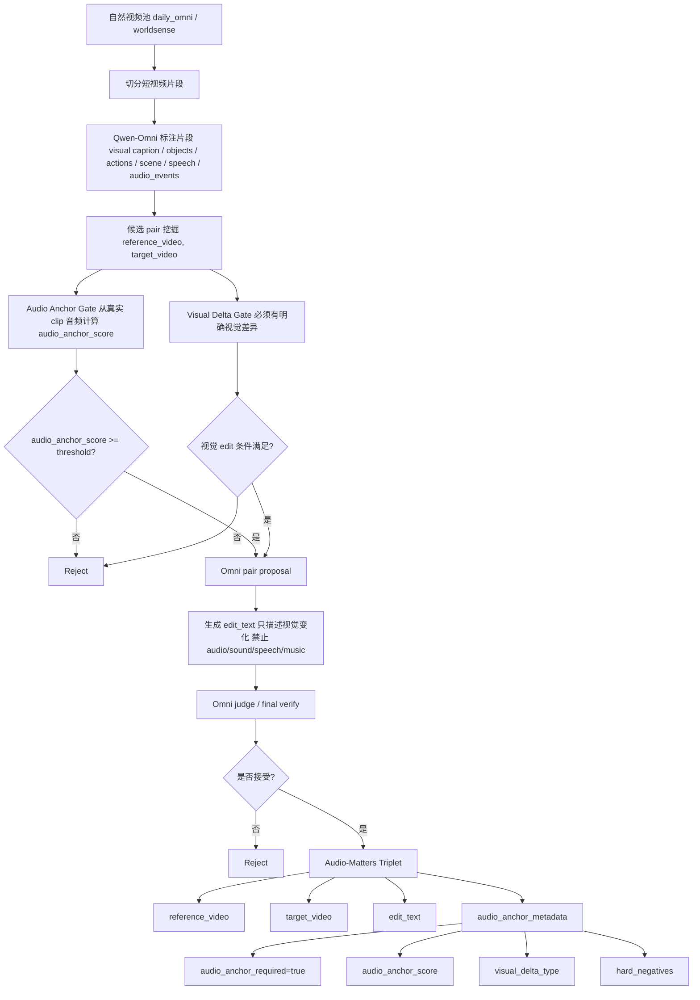

# Audio-Matters Natural Pipeline Handoff 2026-05-10

## 1. 背景

当前目标不是改动已有 943 条 CVR 数据集，也不是用 VACE 或生成式视频模型造数据。新的目标是构造一批 **audio-matters** 自然样本：

- 数据来源仍然是现有自然视频池：`daily_omni / worldsense`。
- 先切分自然视频片段，再用 Qwen-Omni 标注每个片段。
- 从候选片段中挖掘 `reference_video, target_video` pair。
- 约束条件是：ref/target 音频相似或相同，但视觉内容有明确差异。
- `edit_text` 只描述视觉变化，禁止把 audio/sound/speech/music 写成主差异。

这样构造出来的数据才能测试一个关键问题：当视觉编辑成立、音频本身又是稳定锚点时，CVR 模型是否能正确利用音频信息，而不是把音频当噪声。

## 2. 已完成的代码工作

### 2.1 自然 audio-matters 构造入口

新增并完善了 `app.audio_matters_natural`，用于从自然视频标注结果中构造 audio-matters 候选。

核心流程：

1. 读取 `detective_annotations.jsonl` 和 `clip_groups.jsonl`。
2. 用 ffmpeg 从实际 clip 文件中抽取音频。
3. 用 numpy 计算 ref/target 的音频签名向量和 `audio_anchor_score`。
4. 过滤出视觉差异明确、音频相似度高的候选。
5. 调用现有 Omni pair proposal / judge / verify 逻辑生成最终 pair。
6. 导出 `audio_matters_triplets.jsonl`。

重要输出：

- `audio_matters_mined_candidates.jsonl`
- `audio_matters_mining_summary.json`
- `judged_audio_matters_pair_proposals.jsonl`
- `accepted_audio_matters_pairs.jsonl`
- `accepted_audio_matters_pairs.progress.jsonl`
- `audio_matters_triplets.jsonl`
- `audio_matters_triplets_summary.json`

### 2.2 高并发运行脚本

新增并完善了：

```bash
scripts/run_audio_matters_natural_omni.sh
```

脚本支持：

- 复用已有 run 的 `clip_groups.jsonl`、`extracted_event_clips.jsonl`、`detective_annotations.jsonl`。
- `--audio-workers` 并发抽音频特征。
- `--propose-shards` 和 `--propose-parallel-jobs` 并行跑 Omni pair proposal。
- 只使用已经启动的 `http://127.0.0.1:8093/v1` Qwen3-Omni 服务，不启动/停止任何 Omni 服务。
- 不访问 8092。
- 不调用 VACE。
- 不修改旧的 943 数据集。

### 2.3 实时日志和逐条落盘

根据要求，已经改成“每生成一个样本就有输出和日志”。

现在有三类实时可见信号：

1. mining 阶段：

```text
[audio-matters-natural] accepted candidate candidate_id=... audio_anchor_score=... difference_type=...
```

2. Omni 接受一个 pair 时：

```text
[propose-group-pairs] ACCEPTED_SAMPLE proposal_index=... accepted_current=... proposal_id=... reference_video=... target_video=... edit_text=...
```

同时会追加写入：

```bash
accepted_audio_matters_pairs.progress.jsonl
```

3. 导出最终 triplet 时：

```text
[audio-matters-natural] GENERATED_TRIPLET index=... sample_id=... reference_video=... target_video=... edit_text=...
```

并行 shard 的日志现在也会实时 `tee` 回主日志，因此 `tail -f "$LOG"` 能看到每个 shard 的进度。

## 3. 遇到的问题

### 3.1 旧 run 的 clips 已被清理

服务器检查发现某个旧 run 里的 `extracted_event_clips.jsonl` 仍在，但里面记录的 `clips/.../*.mp4` 文件已经不存在。

结果：

- 236 个 clip 全部 `missing_or_unreadable_audio`。
- 无法复用这个 run 做 audio feature。

结论：

复用 annotation 前必须确认实际 clip 文件还在，因为 audio-matters 的音频相似度不是从 annotation 猜出来的，而是从真实 clip 文件用 ffmpeg 重新计算。

### 3.2 `np.frombuffer` 只读数组 bug

服务器报错：

```text
app/audio_matters_natural.py:91
np.nan_to_num(samples, copy=False)
ValueError: assignment destination is read-only
```

原因：

- `np.frombuffer(completed.stdout, dtype=np.float32)` 返回只读数组。
- `np.nan_to_num(..., copy=False)` 会尝试原地修改。
- 只读数组不能原地写，所以所有 audio feature 都失败，最终 0 candidates。

修复：

```python
samples = np.nan_to_num(samples)
```

即允许 numpy 生成可写 copy。

### 3.3 服务器 AI 不能修改代码

明确规则：

- 服务器 AI 只能运行命令、检查文件、回传日志。
- 服务器 AI 不允许修改 `app/`、`scripts/`、`tests/` 等仓库代码。
- 如果服务器遇到代码 bug，必须停止并回传完整报错，由本地 Codex 修改、测试、提交、推送。

这个规则是为了防止服务器临时改代码导致仓库状态混乱。

## 4. 已提交的关键 commit

最新远程 `main` 已推送到：

```text
f9eab26 Fix audio-matters progress logging
```

相关历史：

```text
b2ec17e Add natural audio-matters dataset mining
3b4ac53 Expose audio-matters triplet metadata
13a205c Speed up audio-matters reuse pipeline
f9eab26 Fix audio-matters progress logging
```

`f9eab26` 包含：

- 修复 `np.frombuffer` 只读数组导致 audio feature 全失败的问题。
- 增加 accepted sample 实时 progress JSONL。
- 增加 `ACCEPTED_SAMPLE` 和 `GENERATED_TRIPLET` 日志。
- 让并行 proposal shard 日志实时汇总到主日志。
- 增加测试覆盖。

## 5. 本地验证

已通过：

```bash
python -m unittest tests.test_audio_matters_natural -v
python -m unittest tests.test_scripts.ScriptTests.test_audio_matters_natural_script_uses_natural_omni_pipeline -v
python -m unittest discover -v
```

全量回归结果：

```text
Ran 302 tests
OK
```

本地 Windows 环境没有 `bash` 命令，所以没有执行 `bash -n scripts/run_audio_matters_natural_omni.sh`。脚本行为由 `tests/test_scripts.py` 做字符串级回归检查，服务器 Linux 环境实际运行时仍需观察日志。

## 6. 推荐服务器运行流程

服务器 AI 必须先更新到 `f9eab26`：

```bash
cd /data02/usr/wangqihao/Demo/test/cvr_clean_main
git pull --ff-only origin main
git rev-parse --short HEAD
test "$(git rev-parse --short HEAD)" = "f9eab26" || { echo "code is not f9eab26, stop"; exit 1; }
```

确认 bug 修复单测：

```bash
python -m unittest tests.test_audio_matters_natural.AudioMattersNaturalTests.test_audio_signature_accepts_read_only_frombuffer_array -v
```

### 6.1 如果有可复用 run

复用前必须验证 clip 文件真实存在，并且音频可读。不要只看 annotation 文件存在。

```bash
SRC_RUN=/path/to/reusable/run
test -f "$SRC_RUN/clip_groups.jsonl" || { echo "missing clip_groups"; exit 1; }
test -f "$SRC_RUN/extracted_event_clips.jsonl" || { echo "missing extracted_event_clips"; exit 1; }
test -f "$SRC_RUN/detective_annotations.jsonl" || { echo "missing detective_annotations"; exit 1; }

ROOT=/data02/pretrained_model/cvr_learn/cvr_data/composed_omni_retrieval SRC_RUN="$SRC_RUN" python - <<'PY'
import json
import os
from pathlib import Path

root = Path(os.environ["ROOT"])
run = Path(os.environ["SRC_RUN"])
checked = 0
missing = 0
for line in (run / "extracted_event_clips.jsonl").read_text(encoding="utf-8").splitlines():
    if not line.strip():
        continue
    row = json.loads(line)
    path = Path(str(row.get("output_path", "")))
    if not path.is_absolute():
        path = root / path
    checked += 1
    if not path.exists():
        missing += 1
print({"checked": checked, "missing": missing})
if checked == 0 or missing:
    raise SystemExit("clip files missing; do not reuse this run")
PY
```

通过后再跑：

```bash
mkdir -p logs
RUN_ROOT=runs/audio_matters_natural_reuse_fast_$(date +%Y%m%d_%H%M%S)
LOG=logs/audio_matters_natural_reuse_fast_$(date +%Y%m%d_%H%M%S).log

setsid nohup bash scripts/run_audio_matters_natural_omni.sh \
  --reuse-run-root "$SRC_RUN" \
  --run-root "$RUN_ROOT" \
  --audio-workers 16 \
  --max-audio-candidates 480 \
  --max-proposals 480 \
  --max-accepted-pairs 200 \
  --propose-shards 8 \
  --propose-parallel-jobs 8 \
  --pair-request-timeout-seconds 180 \
  --propose-timeout-seconds 7200 \
  --skip-review-bundle \
  > "$LOG" 2>&1 < /dev/null &

echo $! | tee logs/audio_matters_natural_reuse_fast.pid
echo "$RUN_ROOT"
echo "$LOG"
tail -f "$LOG"
```

### 6.2 如果没有可复用 run

重新从自然视频池切片、标注、挖 pair：

```bash
mkdir -p logs
RUN_ROOT=runs/audio_matters_natural_fresh_fast_$(date +%Y%m%d_%H%M%S)
LOG=logs/audio_matters_natural_fresh_fast_$(date +%Y%m%d_%H%M%S).log

setsid nohup bash scripts/run_audio_matters_natural_omni.sh \
  --run-root "$RUN_ROOT" \
  --prepare-start-stage plan \
  --max-source-videos 120 \
  --concurrency 8 \
  --audio-workers 16 \
  --max-audio-candidates 480 \
  --max-proposals 480 \
  --max-accepted-pairs 200 \
  --propose-shards 8 \
  --propose-parallel-jobs 8 \
  --pair-request-timeout-seconds 180 \
  --annotation-pass-timeout-seconds 3600 \
  --propose-timeout-seconds 7200 \
  --skip-review-bundle \
  > "$LOG" 2>&1 < /dev/null &

echo $! | tee logs/audio_matters_natural_fresh_fast.pid
echo "$RUN_ROOT"
echo "$LOG"
tail -f "$LOG"
```

## 7. 运行中应该看什么

实时日志：

```bash
tail -f "$LOG"
```

接受样本实时进度：

```bash
tail -f "$RUN_ROOT/accepted_audio_matters_pairs.progress.jsonl"
```

关键日志关键词：

```bash
grep -E "accepted candidate|ACCEPTED_SAMPLE|GENERATED_TRIPLET|missing_audio|feature_ok_count|ERROR" "$LOG" | tail -100
```

验收检查：

```bash
cat "$RUN_ROOT/audio_matters_mining_summary.json"
wc -l "$RUN_ROOT/audio_matters_mined_candidates.jsonl"
wc -l "$RUN_ROOT/accepted_audio_matters_pairs.jsonl"
wc -l "$RUN_ROOT/audio_matters_triplets.jsonl"
head -3 "$RUN_ROOT/audio_matters_triplets.jsonl"
```

必须确认：

- `actual_audio_feature_summary.feature_ok_count > 0`
- `audio_source == "actual_extracted_clip_audio_via_ffmpeg"`
- `audio_matters_triplets.jsonl` 每行有：
  - `reference_video`
  - `target_video`
  - `edit_text`
  - `audio_anchor_required: true`
  - `audio_anchor_score`
  - `visual_delta_type`
- `target_caption` 不进入最终 triplet manifest。

## 8. Mermaid 流程图



## 9. 给服务器 AI 的硬规则

服务器 AI 只能做这些事：

1. `git pull --ff-only origin main`
2. 运行脚本
3. 查看日志
4. 统计行数
5. 回传错误和产物摘要

服务器 AI 不能做这些事：

1. 不能修改 `app/` 代码。
2. 不能修改 `scripts/` 代码。
3. 不能修改 `tests/` 代码。
4. 不能用 `sed`、`cat > file`、`python - <<PY` 去现场 patch 仓库源码。
5. 不能启动/停止已有 Omni3 服务，除非用户明确要求。

如果服务器运行中再次出现代码错误，必须停止并回传完整日志，由本地 Codex 修复后再推送。
