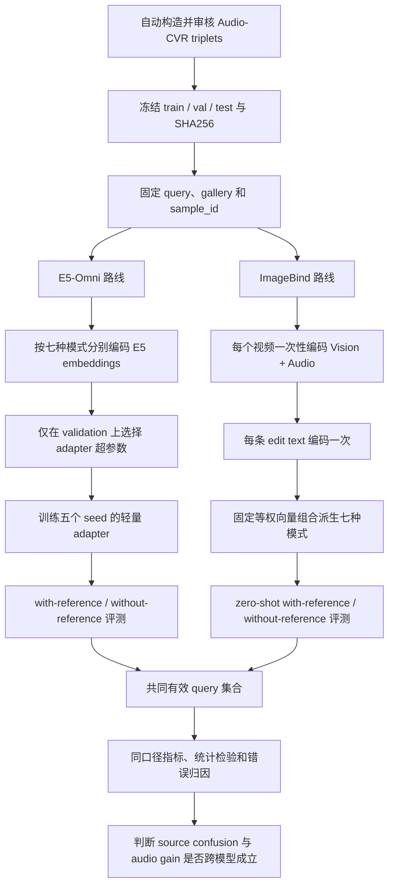
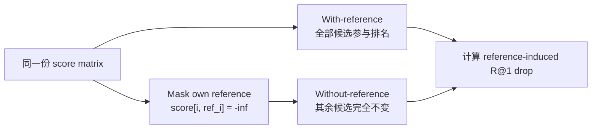
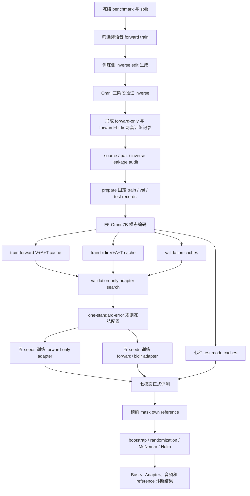
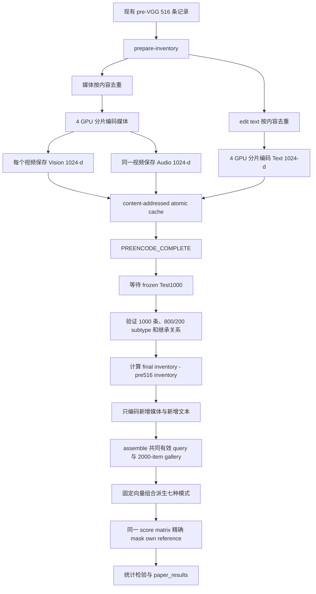
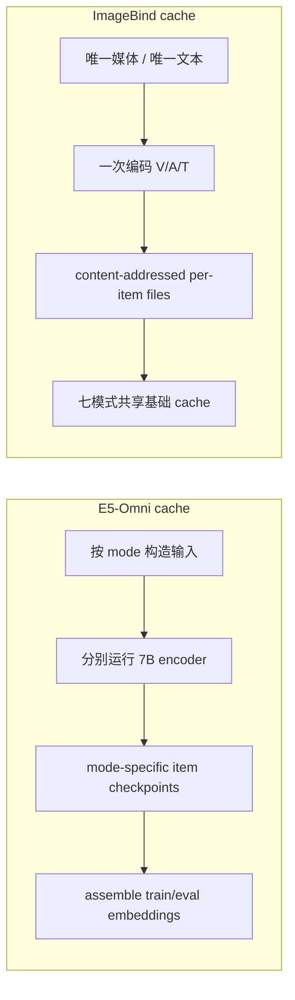
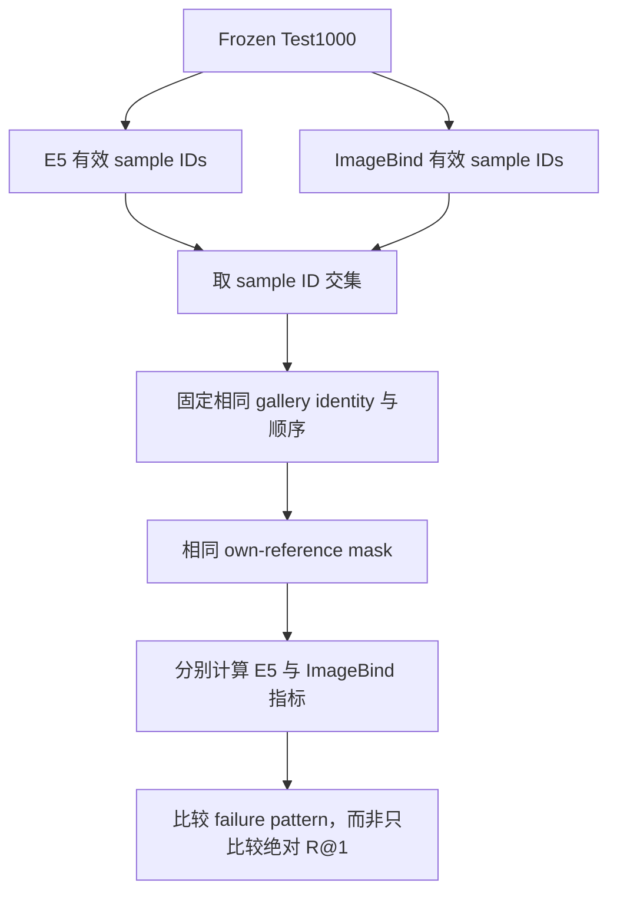

# Audio-CVR：E5-Omni 与 ImageBind 实验流程说明

> 文档日期：2026-07-23  
> 目的：解释 E5-Omni 与 ImageBind 的实验是否相同、各自要经过哪些步骤，以及最终怎样进行公平的跨模型比较。

## 1. 先说结论：两者不是同一套模型流程

E5-Omni 和 ImageBind **共用同一套数据与评测协议**，但模型计算过程并不相同。

- 共同部分：冻结的数据划分、同一批 query、同一 gallery、相同的 reference masking、相同指标和统计检验。
- E5-Omni：冻结 7B backbone，先编码不同模态输入，再用训练集训练轻量 low-rank residual adapter。
- ImageBind：完全零训练，分别编码视觉、音频和文本基础向量，再用固定的向量加法组成七种模态输入。

最简洁的理解是：

```text
E5-Omni = task-adapted baseline
ImageBind = independent zero-shot baseline
```

ImageBind 不是 E5 实验的简单复刻。它的价值是检查论文中的核心发现是否只属于 E5-Omni，还是也会出现在另一种独立的音视频表征模型中。

## 2. 两条路线的整体关系



## 3. 核心差异对照

| 项目 | E5-Omni | ImageBind-Huge |
|---|---|---|
| 论文角色 | 任务适配 baseline | 独立 zero-shot baseline |
| backbone | E5-Omni-7B | ImageBind-Huge |
| backbone 是否训练 | 否，冻结 | 否，冻结 |
| 是否训练额外参数 | 是，low-rank residual adapter | 否 |
| embedding 维度 | 3584 | 1024 |
| 训练数据 | Audio-CVR train；可含经 Omni 验证的 inverse | 不使用训练数据 |
| validation 用途 | 选择 rank、steps、learning rate 等 | 不选模型权重；只做协议检查 |
| 七模态如何得到 | 七种输入 payload 分别经过 E5 编码 | 一次得到 V/A/T，再固定加和 |
| 视频编码次数 | 不同模式需要独立 cache | 每个视频一次，同时保存 V 与 A |
| 文本编码 | 作为 E5 query payload 的一部分 | 每个唯一 edit text 编码一次 |
| 随机种子 | adapter 最终跑五个 seed | 模型推理确定性运行一次 |
| 主要比较 | Base E5 vs Adapter；V+A+T vs V+T | zero-shot V+A+T vs V+T |
| reference 干预 | 在相同 score/cache 上精确 mask | 在同一 score matrix 上精确 mask |
| 主要科学作用 | 证明少样本任务适配后能否使用音频 | 证明问题是否跨模型存在 |

## 4. 两个模型共用的实验基础

### 4.1 Query 定义

每个 query 都由以下内容定义：

```text
query = reference video/audio + edit_text
positive = target video/audio
```

Audio-CVR 要求：

```text
reference 不满足 edit_text
target 满足 edit_text
视觉语境尽量保持
目标主要由声音事件或音乐变化区分
```

### 4.2 最终 reference-aware gallery

最终 Test1000 的主 gallery 设计为：

```text
1000 target positives
+ 1000 unchanged references
= 2000 gallery items
```

所有 1000 个 query 共用同一个全局 gallery。对任意 query `i`：

- `with-reference`：保留完整 2000 项。
- `without-reference`：只屏蔽 query `i` 自己的 reference。
- 其他 999 个 query 的 reference 仍然保留。
- 不新增随机视频，不重新编码，不重新计算非 reference 分数。

因此，两个条件之间唯一变化是：当前 query 的 unchanged reference 是否可以参与排名。



### 4.3 共同指标

两个模型都必须报告：

```text
R@1 / R@5 / R@10
MRR
target rank mean / median
target_beats_reference
target-reference score gap
reference rank
reference-induced R@1 drop
top-1 错误中 reference 获胜的比例
sound_event / music 分项
dataset 分项
```

统计检验统一采用：

```text
20,000 次 query-paired bootstrap confidence interval
20,000 次 paired randomization test
McNemar test
Holm multiple-comparison correction
```

## 5. E5-Omni 完整实验流程

### 5.1 E5 路线的目的

E5 路线回答两个问题：

1. 原始 Base E5-Omni 能否直接理解 directional audio edit？
2. 冻结 backbone 后，少量 Audio-CVR 数据训练的轻量 adapter 能否改善检索？

adapter 是 baseline，不是本文的主要算法贡献。论文的核心仍是数据构造、reference-aware protocol 和实验发现。

### 5.2 E5 流程图



### 5.3 第一步：训练数据准备

历史 Test150 正式实验采用：

```text
forward train = 65
sound_event = 48
music = 17
unique source = 65
```

训练侧可以做 inverse augmentation：

```text
原方向：A + edit(A -> B) -> B
反方向：B + independently generated edit(B -> A) -> A
```

inverse 不能简单交换路径后机械改文本，必须重新经过 Omni 验证：

```text
audio-only directional verification
muted-video shortcut rejection
full-AV consistency verification
```

历史运行中 65 条 forward 产生 24 条通过审核的 inverse，因此 bidirectional training set 为 89 条 directional records。它们仍只代表 65 个独立 source pair，不能写成 89 个独立场景。

### 5.4 第二步：泄漏审计

训练前必须检查：

```text
train / val / test 的 raw_source_id 两两不交叉
pair_group_id 两两不交叉
inverse_pair_group_id 两两不交叉
同一方向不得重复
forward 与合法 inverse 可以共享逻辑 sample，但 direction 必须不同
媒体文件必须存在
test SHA256 必须保持不变
```

任何一项失败都应停止，不允许通过修改 test 来适应训练结果。

### 5.5 第三步：prepare records

`prepare` 把 JSONL 数据转换为 E5 可编码的结构化记录，并固定：

```text
query sample_id
reference media
edit text
positive target
reference negative
typed hard negatives
gallery index
positive_gallery_index
```

训练、validation 和 test 分开准备。test 不能参与超参数选择。

### 5.6 第四步：七种模态分别编码

E5 的七种模式不是先得到三个向量后做加法，而是按照不同输入 payload 分别送入 E5-Omni。

| 模式 | Query 输入 | Candidate 输入 | Audio 状态 |
|---|---|---|---|
| `T-only-fullAV` | edit text | full AV video | candidate 保留音频 |
| `V-only` | muted reference video | muted candidate video | 关闭 |
| `A-only` | reference audio | candidate audio | audio-only |
| `V+T` | muted reference + edit text | muted candidate | 两侧关闭音频 |
| `A+T` | reference audio + edit text | candidate audio | audio-only |
| `V+A` | full reference AV | full candidate AV | 开启 |
| `V+A+T` | full reference AV + edit text | full candidate AV | 开启 |

因此 E5 通常会生成独立 cache：

```text
cache_test_T_only_fullAV
cache_test_V_only
cache_test_A_only
cache_test_V_T
cache_test_A_T
cache_test_V_A
cache_test_V_A_T
```

这也是 E5 编码比 ImageBind 更耗时的主要原因：同一个视频在不同输入协议下可能需要重新进入模型。

### 5.7 第五步：只在 validation 上选择 adapter

当前正式少样本流程使用 low-rank residual adapter：

```text
y = normalize(x + B(A(x)))
A: 3584 -> rank
B: rank -> 3584
```

`B` 零初始化，使 adapter 初始输出严格等于 Base E5。

粗筛配置：

```text
rank = {16, 32}
steps = {50, 100, 200, 400}
learning rate = {3e-4, 1e-3}
batch size = 8
coarse seed = 13
```

共 16 个 coarse 配置。选前 4 个后，再用 seeds `{13, 23, 42}` 在 validation 上复核，并按 one-standard-error 规则优先选择更低 rank、更少 steps 的配置。

test 在这个阶段完全不可读取。

### 5.8 第六步：五 seed 最终训练

冻结超参数后，分别训练：

```text
Forward-only adapter
Forward+Bidir adapter
```

固定 seeds：

```text
13, 23, 42, 71, 101
```

每个 seed 都保存：

```text
adapter.pt
adapter_config.json
train_summary.json
loss_curve.jsonl
```

所有 loss curve 必须检查 NaN/Inf。

### 5.9 第七步：正式评测

每个 adapter 对七种模式评测，并对 `V+T`、`V+A+T` 额外执行精确 reference masking。

主要比较是：

```text
Adapter vs Base E5
V+A+T vs V+T
With-reference vs Without-reference
Forward+Bidir vs Forward-only
```

late fusion 权重只能在 validation 上选择，不能用 test 调整。

## 6. ImageBind 完整实验流程

### 6.1 ImageBind 路线的目的

ImageBind 不参与 Audio-CVR adapter 训练。它用于回答：

```text
source/reference confusion 是否也出现在另一种独立模型中？
加入 audio 后的方向性变化是否具有跨模型证据？
```

因此，ImageBind 的结果不追求超过 E5 adapter。即使零样本 Recall 较低，只要 reference masking 的影响稳定，也能为论文提供独立诊断证据。

### 6.2 ImageBind 流程图



### 6.3 第一步：准备去重 inventory

ImageBind 不直接按 query 重复编码文件，而是先建立两类 inventory：

```text
media_inventory.jsonl
text_inventory.jsonl
```

同一个视频即使同时出现在多个 query、target、reference 或 hard negative 中，也只编码一次。

当前 pre516 审计得到：

```text
records = 516
unique media = 1,044
unique edit texts = 469
sound_event = 414
music = 102
```

这些数量来自内容去重后的实际 inventory，因此不应简单按 `516 x 2` 推断视频数。

### 6.4 第二步：内容寻址缓存

每个媒体缓存原子写入一个 `.npz`：

```text
vision_embedding
audio_embedding
resolved_media_path
file_size
mtime
model_hash
preprocessing_version
finite_check
```

每个文本保存一个 `.npy`。cache key 由模型版本、规范化媒体路径或文本以及预处理版本共同决定。

编码策略：

```text
GPU 4 -> shard 0/4
GPU 5 -> shard 1/4
GPU 6 -> shard 2/4
GPU 7 -> shard 3/4
batch size = 2
OOM 时仅当前 worker 降为 batch size = 1
每完成一项立即落盘
```

如果某个 worker 失败，其他 shard 不需要重跑。恢复时只扫描并补齐缺失 cache key。

### 6.5 第三步：516 到 Test1000 的增量编码

ImageBind 流程分为两个阶段：

```text
Stage A：先编码当前 516 条对应的唯一媒体和文本
Stage B：Test1000 冻结后，只编码新增部分
```

Test1000 出现后必须先验证：

```text
record count = 1000
sound_event / music = 800 / 200
原 516 条 sample_id 全部可追溯
source / pair leakage = 0
test SHA256 已记录
```

随后计算：

```text
delta media = final media inventory - pre516 media inventory
delta text = final text inventory - pre516 text inventory
```

只有 delta 会进入 GPU。此前完成的 516 部分直接复用。

### 6.6 第四步：一次缓存派生七种模式

ImageBind 与 E5 最大的计算差别就在这里。

所有基础向量先做 L2 normalization，然后固定等权组合：

| 模式 | Query embedding | Candidate embedding |
|---|---|---|
| `T-only-fullAV` | `T(edit)` | `norm(V(candidate)+A(candidate))` |
| `V-only` | `V(reference)` | `V(candidate)` |
| `A-only` | `A(reference)` | `A(candidate)` |
| `V+T` | `norm(V(reference)+T(edit))` | `V(candidate)` |
| `A+T` | `norm(A(reference)+T(edit))` | `A(candidate)` |
| `V+A` | `norm(V(reference)+A(reference))` | `norm(V(candidate)+A(candidate))` |
| `V+A+T` | `norm(V(reference)+A(reference)+T(edit))` | `norm(V(candidate)+A(candidate))` |

没有权重搜索，也不使用 test 选择融合系数。这样可以保持 ImageBind baseline 的零样本独立性。

### 6.7 第五步：组装与有效集合

组装阶段产生：

```text
imagebind_embeddings.npz
gallery.jsonl
records.jsonl
encoding_exclusion_manifest.jsonl
assembly_summary.json
```

若个别媒体无法编码：

1. 记录失败媒体和异常。
2. 排除受影响 query。
3. with/without-reference 和七种模式必须使用相同有效 query 集合。
4. E5 与 ImageBind 的最终横向表应在共同 query 交集上重算。
5. 排除率不得超过预设阈值，当前阈值为 1%。

### 6.8 第六步：评测与统计

必跑的四个核心条件：

```text
ImageBind V+T with-reference
ImageBind V+T without-reference
ImageBind V+A+T with-reference
ImageBind V+A+T without-reference
```

其余模式由同一基础 cache 直接派生。ImageBind 没有 adapter seed，因此不报告“五 seed 模型方差”；但仍然在 query 维度运行 bootstrap、randomization 和 McNemar 检验。

## 7. 缓存与断点恢复对照



| 问题 | E5-Omni | ImageBind |
|---|---|---|
| 最小保存单位 | 某 mode 下的单个 payload embedding | 单个媒体的 V/A 或单个文本 T |
| 七模式能否共享全部编码 | 不能 | 能 |
| 新增 query 后如何补 | 对受影响 mode 编码新增 payload | 只编码新增 cache key |
| 崩溃恢复 | 从 mode 的 item checkpoint / completed cache 恢复 | 扫描 content cache，只补缺失项 |
| 最终大文件 | 每个 mode 的 embeddings NPZ | 一份基础 embeddings NPZ，再派生模式 |

两条路线都必须遵守：

```text
逐项原子落盘
shard 独立 manifest
失败项单独记录
禁止因一个坏视频丢弃全部已完成编码
禁止从头重编已经存在且校验通过的 item
```

## 8. 最终怎样公平比较 E5 与 ImageBind

跨模型比较不能直接拿两个不一致 gallery 或不同有效 query 的数字放在一起。最终必须执行以下对齐：



最终建议表格：

| 模型 | 训练方式 | 模式 | With-ref R@1 | No-ref R@1 | Ref-induced drop | Target beats ref | Gap |
|---|---|---|---:|---:|---:|---:|---:|
| Base E5-Omni | zero-shot | V+T | 待填 | 待填 | 待填 | 待填 | 待填 |
| Base E5-Omni | zero-shot | V+A+T | 待填 | 待填 | 待填 | 待填 | 待填 |
| E5 + adapter | few-shot | V+T | 待填 | 待填 | 待填 | 待填 | 待填 |
| E5 + adapter | few-shot | V+A+T | 待填 | 待填 | 待填 | 待填 | 待填 |
| ImageBind-Huge | zero-shot | V+T | 待填 | 待填 | 待填 | 待填 | 待填 |
| ImageBind-Huge | zero-shot | V+A+T | 待填 | 待填 | 待填 | 待填 | 待填 |

这里最重要的不是 ImageBind 一定要胜过 E5，而是检查以下模式是否重复出现：

```text
保留 reference 时，target 是否经常被 unchanged reference 压制？
只 mask own reference 后，R@1 是否明显上升？
加入 audio 后，target-reference gap 是否改善？
错误是否集中为 source/reference confusion？
```

## 9. 不同结果应该怎样解释

### 情况 A：两个模型移除 reference 后都大幅提升

可以支持：

> Source-target confusion is a cross-model failure mode rather than an artifact of one E5 adapter.

### 情况 B：两个模型的 V+A+T 都高于 V+T

可以支持：

> Audio provides additional evidence for directional retrieval under preserved visual context.

### 情况 C：E5 的 audio gain 明显，ImageBind 只有 margin 改善

应写成：

> Audio consistently improves target-source separation, while gains in top-1 retrieval depend on the representation and task adaptation.

不能声称所有模型的 R@1 都显著受益。

### 情况 D：ImageBind with-reference 和 without-reference 都很低

ImageBind 仍可作为外部零样本 baseline，但不能用它证明 source confusion 的普遍性。此时论文主张应主要依赖 E5、Base E5 和 OmniCVR 的配对诊断。

## 10. 当前代码入口与产物路径

### 10.1 E5-Omni

核心代码：

```text
app/e5_audio_delta_train.py
app/audio_cvr_paper_experiment.py
scripts/run_audio_cvr_fewshot_bidir_final.sh
```

关键阶段：

```text
prepare
cache-embeddings
train-adapter
eval
aggregate-final
```

历史少样本正式结果目录使用 `audiocvr_fewshot_bidir_final_*` 命名。Test1000 增量 E5 流水线使用独立 overlap run，不能把 pre-VGG cache 状态误写成最终 Test1000 已完成。

### 10.2 ImageBind

核心代码：

```text
app/audio_cvr_external_baseline.py
scripts/run_audio_cvr_imagebind_incremental.sh
third_party/imagebind_5120b6bb/
```

命令入口：

```text
prepare-inventory
cache-imagebind
audit-cache
prepare-delta
assemble
evaluate
summarize
```

当前服务器 run：

```text
runs/imagebind_overlap_pre516_test1000_20260723_010521
```

状态含义：

```text
RUNNING / pre516_cache       正在编码当前516部分
PREENCODE_COMPLETE           516部分已持久化，等待Test1000
RUNNING / final1000_delta    正在补编码新增部分
RUNNING / assemble           正在组装统一有效集合
RUNNING / evaluate           正在派生七模式并评测
RUNNING / statistics         正在做统计检验
COMPLETE                     全部正式结果已生成
```

## 11. 论文中如何定位两套实验

建议正文采用以下表述：

```text
E5-Omni + low-rank adapter:
our task-adapted few-shot baseline on the frozen Audio-CVR split.

ImageBind-Huge:
an independent zero-shot audiovisual baseline used to test whether
source-target confusion transfers beyond the E5-Omni model family.
```

不要写成：

```text
我们对 E5 和 ImageBind 使用了相同训练方法。
```

正确写法是：

```text
两者使用相同的数据、gallery 干预和评测指标，但采用不同的表征与适配机制。
```

这恰恰增强了论文证据：如果不同模型在同一 reference-aware protocol 下暴露相似错误，就更能说明问题来自任务本身，而不是某个 adapter 的偶然行为。

## 12. 最终验收清单

### 数据与协议

- [ ] Test1000 数量与 SHA256 固定。
- [ ] sound_event/music 分布为冻结配置。
- [ ] train/val/test source、pair、inverse leakage 为 0。
- [ ] E5 与 ImageBind 使用相同 sample ID 交集。
- [ ] gallery identity 和顺序一致。
- [ ] without-reference 每个 query 只 mask 自己的 reference。

### E5

- [ ] Base E5 和 adapter 均有结果。
- [ ] adapter 超参数只由 validation 选择。
- [ ] 五个 final seeds 完整。
- [ ] 七模态 cache 完整。
- [ ] loss curve 无 NaN/Inf。
- [ ] forward-only 与 forward+bidir 使用同一最终超参数。

### ImageBind

- [ ] 所有媒体只编码一次并同时保存 V/A。
- [ ] 所有文本按内容去重。
- [ ] pre516 cache 被 Test1000 正确复用。
- [ ] 只编码 final delta。
- [ ] 编码排除率不超过 1%。
- [ ] 七模式由固定公式派生，无 test 权重调优。

### 统计与写作

- [ ] 报告 R@K、MRR、rank、target-over-source 和 gap。
- [ ] 报告 exact source masking 前后差值。
- [ ] 报告 paired CI、randomization、McNemar 和 Holm。
- [ ] 人工核验 core150 与 full Test1000 分开报告。
- [ ] ImageBind 被描述为 independent zero-shot baseline。
- [ ] adapter 被描述为 task-adapted baseline，不包装为主要方法创新。

## 13. 一句话总结

```text
E5 与 ImageBind 的评测协议相同，但实验过程不同：
E5 通过冻结 7B backbone 后训练轻量 adapter 学习 Audio-CVR，
ImageBind 不训练，只用固定的 V/A/T 向量组合进行独立零样本验证；
最终二者在相同 query、gallery 和 reference masking 下比较，
用于判断 source confusion 与 audio directionality 是否跨模型成立。
```
