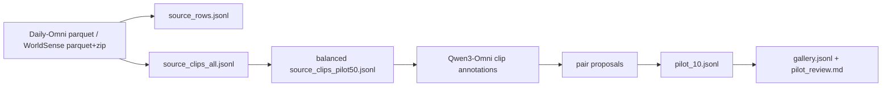

# Omni Composed Video Retrieval 数据构造阶段总结

Last updated: 2026-04-22

## 1. 项目目标

当前项目的目标不是继续把 MSRVTT 当作主要评测集，而是构造一个更适合 **Omni 全模态组合视频检索** 的新数据集。

我们真正需要的数据形式是：

```text
reference video + edit text + visual/audio cues -> target video
```

也就是说，模型或 agent 看到一个参考视频，再看到一段编辑文本，比如：

```text
change one cat into two cats
replace quiet background with dog barking
change the person from standing still to dancing
```

然后需要从候选视频库里找出符合编辑要求的 target video。

这个任务包含三类信息：

- 视频模态：人物、物体、场景、动作、数量、颜色、文字等。
- 音频模态：音乐、说话声、掌声、动物叫声、机器声等。
- 编辑文本：描述 reference 到 target 的变化。

我们前面已经确认：MSRVTT 更适合普通 video-text retrieval，不适合天然构造 `reference-target-edit` 三元组。因此这一步开始转向新数据构造。

## 2. 已经做了什么

### 2.1 准备 Qwen3-Omni 模型

服务器上已经从 ModelScope 下载并准备了 Qwen3-Omni 模型：

```text
/data02/pretrained_model/cvr_learn/cvr_model/03_audio_vlm2vec_backbone/qwen3-omni-30b-a3b-instruct
/data02/pretrained_model/cvr_learn/cvr_model/03_audio_vlm2vec_backbone/qwen3-omni-30b-a3b-captioner
```

当前实际跑通数据构造链路的是 Instruct 服务：

```text
http://127.0.0.1:8093/v1
```

服务返回的模型 id：

```text
/data02/pretrained_model/cvr_learn/cvr_model/03_audio_vlm2vec_backbone/qwen3-omni-30b-a3b-instruct
```

### 2.2 下载并整理原始数据集

目前使用两个原始数据源：

```text
Daily-Omni
WorldSense
```

统一数据根目录：

```text
/data02/pretrained_model/cvr_learn/cvr_data/composed_omni_retrieval
```

原始数据放在：

```text
/data02/pretrained_model/cvr_learn/cvr_data/composed_omni_retrieval/raw_datasets/daily_omni
/data02/pretrained_model/cvr_learn/cvr_data/composed_omni_retrieval/raw_datasets/worldsense
```

### 2.3 写了数据归一化代码

新增的数据处理代码主要包括：

```text
app/composed_sources.py
app/composed_data.py
app/composed_omni.py
scripts/prepare_composed_sources.sh
scripts/run_composed_pilot50.sh
```

其中：

- `composed_sources.py` 负责把 Daily-Omni 和 WorldSense 归一化成统一 manifest。
- `composed_data.py` 负责 annotation、pair proposal、pilot validation。
- `composed_omni.py` 负责调用 OpenAI-compatible vLLM/Qwen3-Omni 服务。
- `prepare_composed_sources.sh` 是服务器 source prepare 脚本。
- `run_composed_pilot50.sh` 是服务器 pilot50 一键脚本。

### 2.4 当前测试情况

最新相关提交：

```text
ed52cd9498fc02a65d9afdd02aec936d5ee9d008
```

本地和服务器单元测试都通过：

```text
Ran 37 tests
OK
```

## 3. 原始数据集长什么样

### 3.1 Daily-Omni 原始形态

Daily-Omni 是 parquet 数据。每一行大致包含：

```json
{
  "video_id": "...",
  "video": "...",
  "audio": "...",
  "question": "...",
  "candidates": ["A. ...", "B. ...", "C. ...", "D. ..."],
  "answer": "..."
}
```

它本来更像视频问答数据。特点是：

- 视频和音频可能嵌在 parquet 里。
- 有 question / candidates / answer。
- 视频通常是完整短视频，不一定天然是 reference-target pair。
- 一些问题关注音画同步，比如“某段音频出现时画面是什么”。

处理时，我们把 parquet 里的视频和音频物化出来，写到：

```text
raw/daily_omni/video/*.mp4
raw/daily_omni/audio/*.wav
```

### 3.2 WorldSense 原始形态

WorldSense 也是多模态视频数据。它的特点是：

- 视频文件分布在压缩包里。
- 有 `video_caption`、`question`、`candidates`、`answer`、`subtitle_path` 等字段。
- 很多样本包含较细的视频描述和问答信息。

原始 zip 解压后的视频路径类似：

```text
raw_datasets/worldsense/_extracted/videos_chunk_003/videos/ALfOUzDH.mp4
```

WorldSense 更适合提供一些带字幕、音乐、表演、教学、游戏等场景的视频片段。

## 4. 原始数据如何变成当前数据

整体流程如下：



### 4.1 source rows

归一化后生成：

```text
metadata/source_rows.jsonl
```

每一行表示原始数据集的一条 row，统一字段类似：

```json
{
  "source_row_id": "daily_omni_xxx",
  "dataset": "daily_omni",
  "split": "train",
  "row_index": 1,
  "source_file": "...parquet",
  "video_id": "...",
  "video_path": "...mp4",
  "audio_path": "...wav",
  "text_fields": {
    "question": "...",
    "candidates": ["..."],
    "answer": "..."
  },
  "raw_columns": ["answer", "audio", "candidates", "question", "video", "video_id"]
}
```

这一步的意义是：不管原始数据集字段多乱，先统一成“这一条原始数据来自哪里、对应视频在哪里、文本字段是什么”。

### 4.2 source clips

归一化后生成：

```text
metadata/source_clips_all.jsonl
metadata/source_clips_pilot50.jsonl
```

当前还没有大规模做人工切片，所以大部分 clip 暂时是 whole source video：

```json
{
  "clip_id": "worldsense_ALfOUzDH",
  "source_path": "/data02/.../ALfOUzDH.mp4",
  "output_path": "raw_datasets/worldsense/_extracted/videos_chunk_003/videos/ALfOUzDH.mp4",
  "start_seconds": 0.0,
  "end_seconds": 0.0,
  "duration_seconds": 0.0,
  "role": "source_clip",
  "notes": "whole source video; run manual clipping before final pilot if this video is too long",
  "dataset": "worldsense",
  "source_row_ids": ["..."],
  "text_fields": {"question": "...", "answer": "..."}
}
```

当前 source prepare 结果：

```text
source rows: 4368
unique clips: 2858
pilot clips: 50
Daily-Omni: 1196 rows / 1196 clips
WorldSense: 3172 rows / 1662 clips
WorldSense archives extracted: 13
```

`source_clips_pilot50.jsonl` 已经做了数据源平衡：

```text
Daily-Omni: 25
WorldSense: 25
```

## 5. 当前数据集长什么样

当前已经完成的是一个 **pilot50 数据构造流程**，它不是最终数据集，而是验证链路的中间结果。

输出目录：

```text
/data02/usr/wangqihao/Demo/test/cvr/runs/composed_pilot50_20260422
```

### 5.1 clip annotations

文件：

```text
clip_annotations_pilot50.jsonl
```

每条视频经过 Qwen3-Omni 标注后，变成结构化描述：

```json
{
  "clip_id": "daily_omni_-gnfUTPmnNU",
  "output_path": "raw/daily_omni/video/test-00005-of-00010_103_video.mp4",
  "summary": "A person holds up a small, decorated bookmark with a tassel...",
  "subjects": ["person", "bookmark", "tassel"],
  "object_counts": {"person": 1, "bookmark": 5, "tassel": 1},
  "actions": ["holding", "displaying"],
  "scene": "indoor setting with a table",
  "attributes": ["decorative", "colorful"],
  "on_screen_text": ["50 Handmade Business Ideas", "..."],
  "speech": ["A female voice narrates the introduction..."],
  "audio_events": ["speech"],
  "modalities": ["visual", "audio"]
}
```

pilot50 标注结果：

```text
clip_count: 50
annotated_count: 50
fallback_count: 1
```

这说明：Qwen3-Omni 标注链路基本跑通，50 条里只有 1 条 fallback。

### 5.2 pair proposals

文件：

```text
pilot_pair_proposals.jsonl
```

每条 proposal 表示一个候选 `reference -> edit -> target` 样本：

```json
{
  "proposal_id": "proposal__edde96e36dd389c1",
  "reference_video": ".../BnseaLEM.mp4",
  "target_video": ".../test-00003-of-00010_56_video.mp4",
  "edit_text": "Change the musician from a young man playing violin to a man playing clarinet, and replace the piano with a trombone.",
  "modalities": ["visual", "audio"],
  "reference_caption": "A young man plays the violin...",
  "target_caption": "A man in a black shirt plays a clarinet...",
  "difference": {
    "type": "object_presence",
    "from": "piano",
    "to": "trombone",
    "description": "The piano in the background is replaced by a trombone on the table."
  },
  "hard_negatives": ["...", "...", "..."],
  "quality": {
    "same_context_score": 0.18,
    "edit_match_score": 0.263,
    "target_uniqueness_score": 0.878
  },
  "fallback_used": false
}
```

当前 proposal 结果：

```text
candidate_count: 40
proposal_count: 40
fallback_count: 0
```

这说明：修复 pair candidate 过严的问题后，已经能从 pilot50 中生成足够多的 proposal。

### 5.3 pilot_10

文件：

```text
pilot_10.jsonl
```

从 40 条 proposal 中自动选出 10 条，作为第一版小样本 composed retrieval 数据。

当前结果：

```text
pilot_count: 10
audio_count: 6
object_change_count: 4
action_count: 0
difference_type_counts:
  object_presence: 4
  scene: 6
fallback_count: 0
```

自动验收：

```text
sample_count_between_5_and_10: PASS
audio_samples_at_least_2: PASS
object_change_samples_at_least_2: PASS
action_samples_at_least_1: FAIL
```

这说明：当前 pilot_10 已经满足数量、音频样本、对象变化样本要求，但还缺少动作变化样本。

### 5.4 gallery

文件：

```text
gallery.jsonl
```

gallery 是检索候选库，包含 target 和 hard negatives：

```json
{
  "gallery_id": "gallery__300f2b64c0696b1d",
  "video_path": "raw/daily_omni/video/test-00003-of-00010_56_video.mp4",
  "sample_ids": ["covr_pilot_0005"],
  "roles": ["target"]
}
```

当前 gallery 结果：

```text
gallery_count: 21
```

## 6. 我们遇到的难题，以及怎么解决

### 6.1 WorldSense 视频在 zip 里，路径对不上

问题：

WorldSense 的 parquet 里有相对视频路径，但实际视频在 zip 包中。第一次跑 annotation 时，WorldSense 视频路径不存在。

解决：

在 `app/composed_sources.py` 里加入自动解压逻辑：

```text
raw_datasets/worldsense/*.zip -> raw_datasets/worldsense/_extracted/
```

并优先解析真实存在的视频路径。

结果：

```text
WorldSense archives: 13
extracted_archives: 13
missing_root: 0
```

### 6.2 Daily-Omni 的视频/音频嵌在 parquet 里

问题：

Daily-Omni 不一定直接给普通视频文件路径，而是 parquet 行里包含 video/audio 数据。

解决：

在 source prepare 阶段把 embedded video/audio 物化到磁盘：

```text
raw/daily_omni/video/*.mp4
raw/daily_omni/audio/*.wav
```

并在 `source_rows.jsonl` 中记录 `video_path` 和 `audio_path`。

### 6.3 Qwen3-Omni 返回字段类型不稳定

问题：

模型有时会把 `speech` 返回成字符串，而不是数组；有时把 difference type 写成 `subject`，而我们只允许：

```text
object_count
object_presence
attribute
action
scene
audio_event
speech
```

解决：

在 `app/composed_omni.py` 中加入归一化：

- 字符串形式的 `speech` 自动转成数组。
- `subject/person/object/entity` 映射到 `object_presence`。
- `sound/audio/music` 映射到 `audio_event`。
- `activity/movement` 映射到 `action`。
- `location/background` 映射到 `scene`。

这样避免模型因为一个近义字段名导致整条 proposal fallback。

### 6.4 pair candidate 过滤太严格

问题：

第一次跑 pilot50 时，50 条视频只生成了 1 条 pair proposal。

原因：

当前 pilot50 来自 Daily-Omni 和 WorldSense 的混合来源，视频之间普遍比较分散。旧逻辑要求较高的 same context score 和较少 changed types，导致大部分候选 pair 被过滤掉。

解决：

在 `app/composed_data.py` 中做了保守放宽：

- 最多保留 40 个 pair candidates。
- 降低最小 context 分数。
- 允许更多 changed types。
- hard negatives 不再要求一定有正 context score。

结果：

```text
candidate_count: 40
proposal_count: 40
fallback_count: 0
```

### 6.5 当前 pair 质量还不够像最终任务

问题：

虽然 pilot50 流程跑通了，但自动生成的 pilot_10 里有不少是大场景切换，例如：

```text
podium speech -> blue background speech
pixel art game -> astronomy compilation
indoor white background -> stadium
```

这类样本更像普通视频检索，不够像我们真正想要的 composed retrieval。

理想样本应该更像：

```text
same room, one cat -> same room, two cats
same stage, violin -> same stage, clarinet
same kitchen, chopping -> same kitchen, frying
same video style, no barking -> dog barking
```

结论：

当前流程证明“能构造”，但还没证明“能稳定构造高质量 composed retrieval 样本”。

## 7. 当前数据集和目标数据集的差距

### 7.1 当前数据集

当前 pilot_10 的特点：

- 数量够：10 条。
- 有音频样本：6 条。
- 有对象变化：4 条。
- 有 scene 变化：6 条。
- 没有 action 主类型样本。
- same_context_score 普遍偏低，大多在 0.13-0.19 左右。
- 一些 edit text 包含多个变化，不够单一。

所以它适合作为：

```text
pipeline smoke test
模型调用链路验证
schema 验证
初步人工 review 样本
```

但还不适合作为：

```text
正式训练集
正式 benchmark
论文里展示的高质量代表样本
```

### 7.2 我们真正需要的数据集

目标数据集每条样本应该长这样：

```json
{
  "sample_id": "covr_000001",
  "reference_video": "clips/source_xxx_ref.mp4",
  "target_video": "clips/source_xxx_target.mp4",
  "edit_text": "change one cat into two cats",
  "modalities": ["visual"],
  "reference_caption": "A mouse stands beside one cat in the same cartoon room.",
  "target_caption": "A mouse stands beside two cats in the same cartoon room.",
  "difference": {
    "type": "object_count",
    "from": "one cat",
    "to": "two cats",
    "description": "the number of cats increases from one to two"
  },
  "hard_negatives": [
    "clips/source_xxx_one_cat_wrong_action.mp4",
    "clips/source_xxx_two_dogs.mp4",
    "clips/source_xxx_two_cats_different_scene.mp4"
  ],
  "quality": {
    "same_context_score": 0.85,
    "edit_match_score": 0.9,
    "target_uniqueness_score": 0.8
  },
  "source": {
    "platform": "internal_source_or_open_dataset",
    "url": "...",
    "license_note": "internal research pilot only"
  }
}
```

关键要求：

- reference 和 target 背景尽量相似。
- 变化尽量单一。
- edit text 只描述变化，不重写完整视频。
- target 在 gallery 中唯一满足 edit。
- hard negatives 要难，而不是随机视频。
- 至少覆盖视觉、音频、语音/音乐、动作等不同类型。

## 8. 原始数据到目标数据的推荐路径

### 8.1 不要直接从全局 2858 clips 里随机配对

这次 pilot50 的问题说明：随机混合 Daily-Omni 和 WorldSense 后，候选之间往往太不相似。

更好的策略是：

```text
先聚类/分组，再组内配对
```

分组方式可以是：

- 同一 `video_id`
- 同一原始视频切出来的不同片段
- 同一系列/同一账号视频
- 相似 `video_caption`
- 相似 `subjects`
- 相似 `scene`
- 相似 `audio_events`

### 8.2 先做 clip segmentation

当前很多 clip 还是 whole source video。下一步应该对长视频切成短片段：

```text
3-15 秒一个 clip
每个 clip 尽量只有一个主要事件
保留音频
```

这一步很关键。比如一个 60 秒视频里可能包含：

```text
clip 1: one person speaking
clip 2: two people speaking
clip 3: music starts
clip 4: applause
```

这些片段天然适合组成 reference-target-edit。

### 8.3 组内构造 pair

推荐优先构造这些类型：

```text
object_count:
  one cat -> two cats
  one person -> three people

object_presence:
  no dog -> dog appears
  no instrument -> guitar appears

action:
  standing -> dancing
  sitting -> jumping
  preparing -> performing

audio_event:
  no music -> music starts
  quiet -> applause
  speech -> singing

speech:
  no speech -> narrator speaking
  one speaker -> multiple speakers
```

### 8.4 再做人工 review

自动流程只能筛候选，最终高质量 pilot 必须人工过一遍：

- reference 是否真的不满足 edit。
- target 是否真的满足 edit。
- hard negatives 是否真的难。
- edit_text 是否只描述一个变化。
- 音频样本是否必须听音频才能判断。

## 9. 当前结论

这阶段已经完成了三件重要的事：

1. **工程链路打通**
   - 原始数据下载。
   - 数据归一化。
   - WorldSense 解压。
   - Daily-Omni 媒体物化。
   - Qwen3-Omni 标注。
   - pair proposal。
   - pilot_10 和 gallery 生成。

2. **发现了真实瓶颈**
   - 不是模型跑不动。
   - 不是数据读不出来。
   - 而是高质量 composed retrieval pair 不能靠随机跨数据集配对获得。

3. **明确了下一步方向**
   - 先做同视频/同系列/同场景内配对。
   - 先切短 clip，再构造 pair。
   - 提高 same_context_score。
   - 增加 action/audio_event 类型样本。
   - 减少大场景切换样本。

一句话总结：

```text
现在的数据构造 pipeline 已经跑通；下一步的重点不是继续盲目扩大数量，而是把 pair 生成从“全局宽松配对”改成“同上下文细粒度配对”。
```

## 10. 建议的下一步任务

### 10.1 短期

先不要跑更大规模。优先做：

```text
从 source_clips_all.jsonl 中按 source/video_id/series 聚类
挑选 5-10 个同上下文视频组
每组切 3-15 秒短 clip
用 Qwen3-Omni 标注短 clip
只在组内 propose pairs
人工 review 10 条高质量样本
```

### 10.2 中期

把数据构造代码升级为：

```text
group source clips
extract temporal clips
annotate grouped clips
propose intra-group pairs
rank by same_context_score and edit clarity
balance difference types
export pilot/dev/test
```

### 10.3 长期

正式数据集应该包含：

```text
视觉编辑样本
音频编辑样本
语音编辑样本
视觉+音频联合编辑样本
hard negative gallery
人工 review 标签
agent retrieval benchmark
```

这样才能真正支撑“Omni 全模态组合视频检索 + agentic retrieval”的论文叙事。
