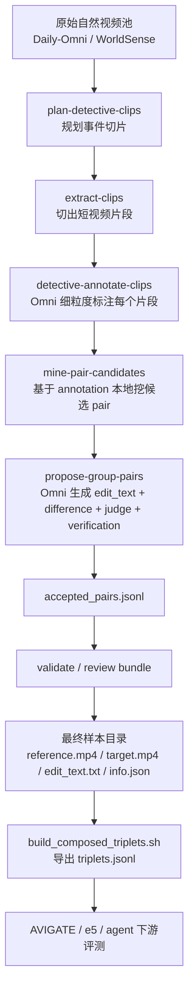
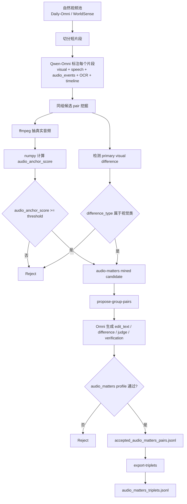

# CVR 数据集构造全流程说明 2026-05-10

## 0. 这份文档解决什么问题

这份文档是给“现在要继续接手这套 CVR 数据处理链路的人”写的，目标不是只讲一个脚本怎么跑，而是把下面几件事一次讲清楚：

1. 我这次具体做了什么。
2. 旧 `CVR / 943` 数据集到底是什么结构，怎么被后续实验消费。
3. 旧 CVR 数据集的上游构造方法，在当前代码仓库里能确认到哪一步。
4. 新的 `audio-matters` 自然样本链路是怎么设计、怎么实现、怎么运行的。
5. 中间遇到了哪些坑，为什么会失败，我是怎么修掉的。
6. 初学者如果要完全掌握这套流程，还需要补哪些知识点。

这份文档尽量做到两件事：

- 只写我能从当前代码和现有产物直接核实的内容。
- 对无法 100% 从仓库直接追溯的部分，明确标成“保守推断”，不把推断写成事实。

## 1. 一句话总览

当前仓库里其实有两条不同层级的链路：

1. 旧 `CVR / 943` 主线：
   从 Omni 标注和 pair proposal 出发，最终得到一批已经物化好的样本目录，每个样本目录里有 `reference.mp4 / target.mp4 / edit_text.txt / info.json`。后续 AVIGATE 和 e5 实验，实际消费的就是这批“已经造好的样本”。

2. 新 `audio-matters natural` 主线：
   不碰旧 943 数据，不生成视频，不做 VACE，而是重新从自然视频池里切片、标注、挖掘“音频高度相似但视觉有差异”的 pair，构造一个新的子数据集，用来专门测试“音频到底什么时候对 CVR 有帮助”。

核心区别是：

- 旧 943 是“已经存在的 CVR 数据集成品”。
- 新 audio-matters 是“新的上游构造链路”，目标是补旧数据集中音频真正有判别力的样本。

## 2. 我这次具体做了什么

### 2.1 已完成的新增工作

我这次主要做的是 `audio-matters natural` 这条新链路，不去动旧 943 数据的默认行为。

新增和修改的核心入口有：

- `app/audio_matters_natural.py`
- `scripts/run_audio_matters_natural_omni.sh`
- `app/composed_data.py`
- `tests/test_audio_matters_natural.py`
- `tests/test_composed_data.py`
- `tests/test_scripts.py`

我做的事情可以概括成 4 类：

1. 新增自然音频锚点样本挖掘模块
   - 从已有自然视频切片和 Omni 标注中，计算真实音频相似度。
   - 只保留“音频相似 / 相同，但视觉存在明确变化”的候选 pair。

2. 新增高并发运行脚本
   - 支持复用旧 run 的 `clip_groups / extracted_event_clips / detective_annotations`。
   - 支持多线程抽音频特征。
   - 支持 proposal shard 并行打 Omni3 服务。

3. 新增实时日志和逐条进度输出
   - mining 阶段每接受一个候选，立刻打印日志。
   - propose 阶段每接受一个 pair，立刻输出 `ACCEPTED_SAMPLE`。
   - export 阶段每生成一个 triplet，立刻输出 `GENERATED_TRIPLET`。

4. 新增独立 `audio_matters` acceptance profile
   - 不改旧 `final` profile。
   - 只对新的自然音频锚点链路生效。
   - 允许自然视频里“存在少量竞争性次差异”的样本继续进入 video verification，而不是在本地 gate 被一刀切掉。

### 2.2 这次修掉的关键 bug

#### Bug 1：`np.frombuffer` 只读数组导致所有音频特征提取失败

问题位置是 [app/audio_matters_natural.py](/C:/Users/29785/Desktop/research/app/audio_matters_natural.py)。

原来的问题是：

- `ffmpeg` 输出的字节流经过 `np.frombuffer(...)` 后得到的是只读数组。
- 后面调用 `np.nan_to_num(samples, copy=False)` 试图原地写回。
- 结果直接抛 `ValueError: assignment destination is read-only`。
- 这会让所有 clip 的 audio feature 都变成 `None`，然后 mining 阶段看起来像“没有候选”，其实是“音频特征全失败”。

修法很简单但很关键：

```python
samples = np.nan_to_num(samples)
```

也就是允许 numpy 生成一个可写副本。

#### Bug 2：音频锚点评分在 mining 里存在，但到了 propose 阶段丢失

这个问题发生在旧的一轮服务器诊断里：

- mining summary 里 `audio_anchor_score >= 0.86`
- 但 proposal/judged 记录里的 `quality.audio_anchor_score` 全是 `null`

根因是：

- mining record 里有 `quality.audio_anchor_score`
- 但后面 `_candidate_from_mined_record -> _effective_pair_quality -> _carry_local_gate_quality` 这一串没有把这些字段稳定带下去

我做的修复是：

- 把 `audio_anchor_score`
- `audio_anchor_context_score`
- `audio_anchor_min_rms`
- `audio_anchor_required`
- `edit_primary_modality`

统一纳入 proposal / effective quality 的传递链。

现在如果 mining 阶段已经算出了音频锚点评分，后面 judged record 和 accepted record 都能看到它。

#### Bug 3：旧 `final` profile 对自然 audio-matters 样本过严，导致 0 accepted

之前服务器跑出来是：

- mined = 313
- judged = 313
- accepted = 0

最集中的拒绝理由是：

- `observable_difference gate found no concrete visual delta evidence`
- `single_main_difference failed: competing stronger difference`

这个现象本身不代表样本都坏，而是说明：

- 自然视频的相邻片段经常同时带一点 `attribute + action + scene` 混合变化
- 旧 `final` profile 更适合“更干净、更单差异”的主数据集
- 它不适合直接拿来筛自然音频锚点数据

我没有去放松旧 `final`，而是单独新增了 `audio_matters` profile：

- 旧 CVR 主线仍然走 `final`
- 新 audio-matters 主线默认走 `audio_matters`

这点非常重要，因为它保证了：

- 我们不会把旧 943 数据集的筛选标准弄乱
- 我们只是在新任务上加一套新的 acceptance 逻辑

## 3. 先把“旧 CVR / 943”讲清楚

### 3.1 旧 943 数据集的下游形态

这部分我是可以直接确认的。

当前后续实验真正使用的旧数据集，目录级形态是这样的：

```text
/data02/usr/wangqihao/Demo/test/data/<sample_id>/
  reference.mp4
  target.mp4
  edit_text.txt
  info.json
  (有些样本还可能带 reference_annotation.json 等辅助文件)
```

然后仓库里的 [scripts/build_composed_triplets.sh](/C:/Users/29785/Desktop/research/scripts/build_composed_triplets.sh) 和 [app/composed_triplets.py](/C:/Users/29785/Desktop/research/app/composed_triplets.py) 会做一件事：

- 读取这些已经造好的样本目录
- 校验四个必要文件是否都在
- 抽出核心字段
- 输出一个稳定的 `triplets.jsonl`

它生成的每行字段包括：

- `sample_id`
- `reference_video`
- `target_video`
- `edit_text`
- `reference_caption`
- `source`
- `difference_type`
- `accepted`
- `final_omni_accept`
- `final_omni_quality_score`
- `reference_clip_id`
- `target_clip_id`

这一步很重要，但要注意：

`build_composed_triplets.sh` 不是“构造 CVR 样本”的上游生成器，它只是“把已经存在的样本目录重打包成统一 manifest”。

### 3.2 旧 943 的上游构造，在代码里能确认到哪一步

这部分需要分成“可验证”和“保守推断”。

#### 可验证部分

从 [scripts/run_omni_detective_pilot.sh](/C:/Users/29785/Desktop/research/scripts/run_omni_detective_pilot.sh) 和 [app/composed_data.py](/C:/Users/29785/Desktop/research/app/composed_data.py) 可以直接确认，旧主线的上游设计是：

1. `plan-detective-clips`
   - 从原始 source clips 里规划要切的事件片段。

2. `extract-clips`
   - 真正把规划出来的 clip 切出来。

3. `detective-annotate-clips`
   - 用 Omni 给每个 clip 做细粒度标注。
   - 标注里会包括：
     - `summary`
     - `subjects`
     - `object_counts`
     - `actions`
     - `scene`
     - `attributes`
     - `speech`
     - `audio_events`
     - `visible_text`
     - `storyline / events / detective_notes`

4. `mine-pair-candidates`
   - 基于这些 annotation 先做本地候选挖掘。
   - 这一步不是直接让 Omni 在全空间里硬搜 pair，而是先用启发式规则把可能的 pair shortlist 出来。

5. `propose-group-pairs`
   - 再把 shortlist 候选交给 Omni 去：
     - 提案 `edit_text`
     - 判断主差异类型
     - judge
     - verification
     - 最终决定 accept / reject

6. `validate-pilot` / `build-review-bundle`
   - 对 accepted pairs 做检查和人工 review 物料输出。

这说明旧主线的真实理念不是“拿两个视频直接让 Omni 编故事”，而是：

`先分片 -> 先标注 -> 先本地筛候选 -> 再用 Omni 进行结构化 pair proposal / judge / verify`

这也是你之前一直强调的那件事：旧 CVR 的数据不是靠编辑模型或者生成模型造出来的，而是靠 Omni 的观察、比较、编辑指令生成、质量判断链路构造出来的。

#### 保守推断部分

我现在能从仓库直接确认：

- accepted pairs 会产出 `accepted_pairs.jsonl`
- review bundle 会把 `reference.mp4 / target.mp4 / edit_text.txt / metadata.json` 这种结构物化到 review 目录里

但我暂时没有在仓库里找到一个“唯一明确的一键脚本”，能直接证明现在 `/data02/usr/wangqihao/Demo/test/data` 这 943 个最终样本目录就是由哪一个命令一步生成的。

所以更稳妥的说法是：

- 上游 pair proposal / accepted pair / review bundle 这条链路，我可以从代码直接验证。
- 当前 `/data/.../test/data` 里的 943 目录，是已经完成物化和整理的最终 CVR 样本资产。
- `build_composed_triplets.sh` 则是从这批最终资产再导出 manifest，供后续 AVIGATE 和 e5 实验使用。

我不建议把“accepted pair -> 943 最终目录”的最后一步写成某个我没完全验证的一键命令。

## 4. 旧 CVR 主线到底是怎么设计的

### 4.1 设计目标

旧 CVR 主线想解决的是：

给定 `reference_video + edit_text`，系统应该能找到 `target_video`。

所以一个好样本必须满足：

1. `reference` 和 `target` 处在足够相近的上下文里。
2. `target` 确实体现了 edit。
3. `reference` 本身不能已经满足 edit。
4. `edit_text` 只能描述一个主差异，不能是散乱 caption。
5. 这个差异要可观察、可验证，而不是只靠想象。

### 4.2 为什么先做 annotation，再做 pair

如果直接在视频级别随机配对，会有两个大问题：

1. 上下文不一致
   - reference 和 target 根本不是一个语境里的东西。

2. edit_text 不可控
   - 你会得到一些看似有差异、但不是“参考视频经过一个局部编辑后得到目标视频”的 pair。

所以旧主线的设计非常合理：

- 先让 Omni 把每个片段“看清楚”
- 再在结构化 annotation 上做 pair mining
- 最后才让 Omni 写 edit_text 和做最终判断

这比“先有 pair 再硬写描述”稳得多。

### 4.3 旧 CVR 主线的标准流程图



## 5. 新 `audio-matters natural` 主线怎么设计

### 5.1 它要解决什么问题

你后面提出的判断非常关键：

旧数据集虽然有音频轨，但大多数样本的主差异仍然是视觉的，而且构造时并没有刻意要求“音频必须是强锚点”。

结果就是：

- 很多样本里，音频其实是噪声
- e5 或 Omni 即使把音频听进去了，也未必有帮助
- 从统计上看，音频没用的情况比有用的情况多

所以新链路不是要替代旧 CVR，而是要额外构造一批“audio really matters”的样本。

### 5.2 audio-matters 的定义

第一版我落地成了这样：

`reference` 和 `target` 的音频非常相似，甚至几乎相同，但视觉内容有明确差异；edit_text 只描述视觉变化。

这类样本的意义是：

- 如果模型只看视觉，可能会把 pair 当成普通视觉差异
- 如果模型能把音频当作上下文锚点，就更容易知道 reference 和 target 其实来自同一个语境

换句话说，这条链路不是在造“音频编辑”数据，而是在造“音频帮助视觉 composed retrieval”数据。

### 5.3 为什么这条链路不能从 943 里简单筛

你后来指出这一点是对的：

如果只是从 943 里筛，那只是“从旧成品里挑子集”，不是“重新构造一个面向 audio-matters 的数据集方法”。

所以后来我改成了真正的上游自然链路：

- 输入是自然视频池
- 重新切 clip
- 重新标注
- 重新算真实音频相似度
- 重新提案 pair

这样才是新的构造方法，而不是旧数据集的二次过滤。

### 5.4 新链路的标准流程



## 6. 新链路具体怎么做

### 6.1 输入资产

新链路依赖三类资产：

1. 原始视频池
   - `Daily-Omni`
   - `WorldSense`

2. 切片和分组产物
   - `clip_plan_detective.jsonl`
   - `clip_groups.jsonl`
   - `extracted_event_clips.jsonl`

3. Omni 标注产物
   - `detective_annotations.jsonl`

### 6.2 mining 阶段做什么

[app/audio_matters_natural.py](/C:/Users/29785/Desktop/research/app/audio_matters_natural.py) 的 `mine-candidates` 会：

1. 读取每个组里的 clip。
2. 通过 `ffmpeg` 从 clip 文件里抽单声道音频。
3. 用 `numpy` 做一个轻量音频签名向量。
4. 计算 `audio_anchor_score`。
5. 同时基于 annotation 检测视觉主差异。
6. 过滤掉：
   - 音频太弱
   - 音频不相似
   - 主差异不是视觉类
   - 视觉差异太弱

输出的是 `audio_matters_mined_candidates.jsonl`。

### 6.3 propose 阶段做什么

然后 `scripts/run_audio_matters_natural_omni.sh` 会把这些 mined candidates 交给 [app/composed_data.py](/C:/Users/29785/Desktop/research/app/composed_data.py) 里的 `propose-group-pairs`。

这一步 Omni 会做四件事：

1. 写 `edit_text`
2. 选择 `difference.type`
3. 做 `judge`
4. 做 `verification`

但和旧 `final` 不同的是，新链路现在默认走 `audio_matters` acceptance profile：

- 它仍然要求 edit 是视觉主差异
- 仍然要求 target 满足 edit、reference 不满足 edit
- 仍然要求 video verification 通过
- 但不再把自然视频里轻微的竞争性次差异直接当场判死

### 6.4 export 阶段做什么

`accepted_audio_matters_pairs.jsonl` 会被导出为 `audio_matters_triplets.jsonl`。

它的最终目标格式跟下游 CVR 任务是一致的：

- `reference_video`
- `target_video`
- `edit_text`
- `audio_anchor_score`
- `visual_delta_type`
- `hard_negatives`

### 6.5 运行脚本

当前主脚本是 [scripts/run_audio_matters_natural_omni.sh](/C:/Users/29785/Desktop/research/scripts/run_audio_matters_natural_omni.sh)。

它支持两种用法：

1. fresh run
   - 从 plan / extract / annotate 开始

2. reuse run
   - 复用已有的 `clip_groups / extracted_event_clips / detective_annotations`
   - 这样可以节省大量时间

## 7. 现在有哪些东西可以复用，哪些不能乱复用

### 7.1 可以复用的

对于新 `audio-matters natural` 链路，以下产物可以复用：

- `clip_groups.jsonl`
- `extracted_event_clips.jsonl`
- `detective_annotations.jsonl`

前提是：

- 对应的 clip 文件还真实存在
- 不是只剩 manifest，视频本体已经被清理掉

### 7.2 不能乱复用的

下面这些不能因为“看起来像”就直接复用：

1. 旧 e5 结果
   - 如果当时根本没启用视频音频读取，那些结果不能拿来代表“含音频”的 e5 实验。

2. 缺失 clip 本体的旧 run
   - 如果 `extracted_event_clips.jsonl` 还在，但 `clips/...mp4` 已经不存在，那它不能再用于音频特征抽取。

3. 旧 `final` profile 下的 0 accepted 诊断结果
   - 可以用来做失败分析
   - 但不能用来证明“audio-matters 数据方法本身不行”
   - 它更多说明的是“profile 不匹配”

## 8. 这次遇到的问题和解决方式

### 8.1 问题一：旧 run 只有 manifest，没有 clip 文件

现象：

- `extracted_event_clips.jsonl` 有记录
- 但 `clips/...mp4` 实际不存在

影响：

- 无法从真实视频里抽音频
- 也就无法计算真正的 `audio_anchor_score`

处理方式：

- 以后复用旧 run 前，先检查 clip 文件是否存在
- 不存在就不能走 `--reuse-run-root`，只能重新 extract

### 8.2 问题二：音频特征提取全失败，但表面看像“没有候选”

现象：

- mining 输出 0 candidates
- 但根因其实是音频特征提取失败

修法：

- 修掉 `np.frombuffer` 只读数组 bug
- 增加 summary 和日志，让 `feature_ok_count / missing_or_unreadable_audio` 直接可见

### 8.3 问题三：proposal 阶段把 audio 分数丢了

现象：

- mining 时有高 `audio_anchor_score`
- judged proposal 里全是 `null`

修法：

- 把 `audio_anchor_*` 字段贯穿到 effective quality
- 让 proposal、acceptance、export 都能看到

### 8.4 问题四：0 accepted 不是样本都坏，而是 gate 不匹配

现象：

- 313 mined
- 313 judged
- 0 accepted

判断：

- 旧 `final` 更适合主数据集
- 自然音频锚点样本需要独立 profile

修法：

- 新增 `audio_matters` acceptance profile
- 默认只给新脚本用
- 不改旧 943 的默认标准

## 9. 对初学者来说，这套流程最容易混淆的点

### 9.1 “构造数据集”和“导出 manifest”不是一回事

很多人第一次看会把下面两件事混起来：

1. 上游构造样本
   - 这是 `plan / extract / annotate / mine / propose / verify`

2. 下游导出 triplets
   - 这是 `build_composed_triplets.sh`

前者是在“造数据”，后者是在“整理已经造好的数据”。

### 9.2 “有音频轨”不等于“模型真的用了音频”

这个坑你前面已经抓得很准了。

一个视频文件里有音频轨，并不代表：

- 模型处理器真的去读了音频
- embedding 真的融合了音频

所以实验设计里一定要区分：

- 文件里有没有音频
- 代码里有没有启用读音频
- 模型推理时有没有真正消费音频

### 9.3 accepted=0 不一定代表数据方法失败

它也可能代表：

- acceptance profile 太严
- judge prompt 不适配当前样本类型
- 本地 gate 过早把 video verification 截断了

所以看到 0 accepted 的第一反应不应该是“方法废了”，而应该先看：

- mined 数量
- proposal 数量
- reject reason 分布
- 是 judge 拒绝，还是 local gate 拒绝

## 10. 初学者要补哪些知识，才能完全掌握这套流程

如果一个同学想从“能跑脚本”提升到“真的能独立维护这套数据链路”，我建议按下面顺序补知识。

### 10.1 必修：文件与媒体基础

- `ffmpeg` 的基本用法
  - 抽音频
  - 切片
  - 看媒体流
- 视频容器和编码基础
  - `mp4`
  - video stream / audio stream
  - duration / fps / sample rate

### 10.2 必修：Python 数据管线基础

- `jsonl` 的读写
- `Pathlib`
- manifest 驱动的数据处理
- 如何让中间产物可恢复、可复用、可诊断

### 10.3 必修：多阶段 pipeline 设计

- 为什么要把流程拆成：
  - plan
  - extract
  - annotate
  - mine
  - propose
  - validate
- 每一阶段产什么文件
- 哪些阶段失败后可以断点续跑

### 10.4 必修：多模态 annotation 理解

- `summary` 和 `reference_caption` 的区别
- `actions / object_counts / scene / attributes`
- `speech` 和 `audio_events` 的区别
- 为什么 `visible_text` 经常是风险项而不是优质主差异

### 10.5 必修：pair mining 思维

- 什么叫“same context”
- 什么叫“single main difference”
- 什么叫“hard negative”
- 为什么随机配对很容易造出假样本

### 10.6 必修：质量控制思维

- judge 和 verification 不是什么关系
- 为什么要有 local gate
- 为什么要把 reject reason 结构化
- 为什么 accepted 数量不是唯一指标，reject 分布同样重要

### 10.7 进阶：多模态检索与评测

- AVIGATE 在这里扮演什么角色
- e5-omni 的 query / gallery 是怎么构造的
- 为什么 `reference + edit -> target` 不能直接套普通 T2V
- `R@1 / R@5 / R@10` 和 trace 分析该怎么看

## 11. 我建议接下来怎么用这份文档

如果你的目标是“继续把这套系统做扎实”，建议这样用：

1. 先把这份文档通读一遍，先分清旧主线和新主线。
2. 再对着 [scripts/build_composed_triplets.sh](/C:/Users/29785/Desktop/research/scripts/build_composed_triplets.sh)、[scripts/run_omni_detective_pilot.sh](/C:/Users/29785/Desktop/research/scripts/run_omni_detective_pilot.sh)、[scripts/run_audio_matters_natural_omni.sh](/C:/Users/29785/Desktop/research/scripts/run_audio_matters_natural_omni.sh) 三个入口脚本各读一遍。
3. 读 [app/composed_triplets.py](/C:/Users/29785/Desktop/research/app/composed_triplets.py)、[app/composed_data.py](/C:/Users/29785/Desktop/research/app/composed_data.py)、[app/audio_matters_natural.py](/C:/Users/29785/Desktop/research/app/audio_matters_natural.py) 时，不要按代码顺序死读，而是按“输入 -> 中间产物 -> 输出”的思路倒着读。
4. 真正上服务器跑的时候，先确认你是在“造新数据”还是“整理旧数据”，不要混用命令。

## 12. 最后一句最重要的话

旧 `943` 数据集现在应该被当成“冻结的主数据资产”；
新的 `audio-matters natural` 则应该被当成“独立的补充型上游构造链路”。

最安全的工作原则是：

- 不改旧默认行为
- 不覆盖旧数据目录
- 所有新实验都写到新的 run 目录
- 所有 acceptance 逻辑新增 profile，不要直接改旧 `final`

这样我们才是在“扩一条新路”，而不是把原来的主干道挖塌。
