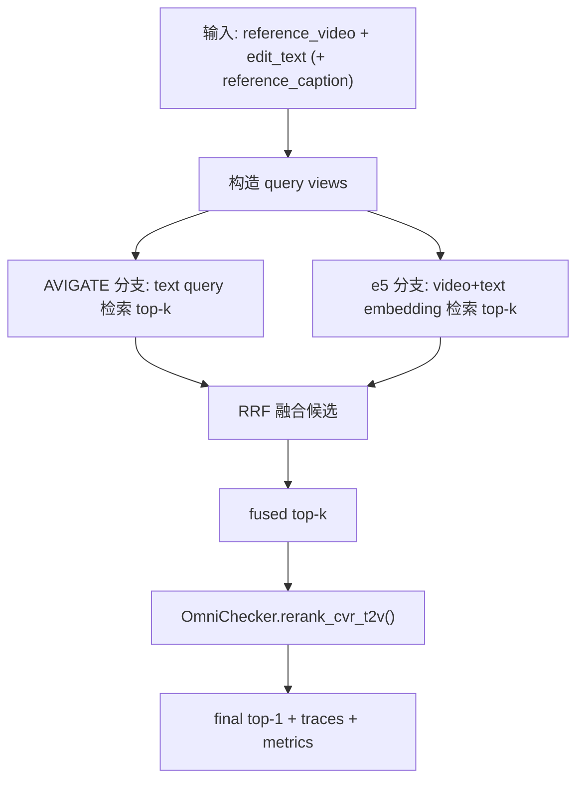

# CVR 系统现状说明（2026-05-09）

## 1. 这份文档是给谁看的
这份文档面向**没接触过 AVIGATE / Omni / CVR** 的同学。  
目标是让你看完后能回答这几个问题：

1. 我们现在系统做到哪一步了？
2. 最近改了什么？解决了什么问题？
3. 一条数据是怎么从输入走到结果的？
4. 输入输出长什么样？
5. 我要怎么在服务器上跑起来？

---

## 2. 一句话总览
我们现在已经从“单一 AVIGATE 检索 + Omni 重排”升级成了“**AVIGATE + e5-omni 双路召回 + Qwen2.5-Omni 验证重排**”的完整 CVR 流水线（第一版，推理版，无训练）。

---

## 3. 当前状态（截至 2026-05-09）

### 3.1 已经完成
1. 保留了原有能力（不破坏旧链路）：
   - `T2V agent`（文本 -> 视频）
   - `V2T agent`（视频 -> 文本）
2. 新增了 e5-omni 分支（composed retrieval）：
   - 支持 `reference_video + edit_text -> embedding query`
   - 支持 target gallery 建索引并缓存
3. 新增了候选融合：
   - AVIGATE top-k + e5 top-k 通过 `RRF` 融合
4. 新增了 CVR agent case：
   - 用融合候选交给 Omni 做最终验证重排
5. 新增了统一评测入口与脚本：
   - `python -m app.eval cvr-full-eval`
   - `scripts/run_cvr_e5_full_eval.sh`
6. 测试通过：
   - 全量 `292` 个测试通过（含新增 CVR 集成测试）

### 3.2 还没做（后续）
1. combiner/projection 训练
2. hard negative mining 回流训练
3. e5 LoRA 微调
4. 用 agent 反馈做蒸馏

---

## 4. 这次我做了什么（代码层）

## 4.1 新增模块
1. `app/e5_omni_runtime.py`  
   - 负责加载 e5-omni、编码文本/视频/视频+文本
2. `app/e5_omni_index.py`  
   - 负责 target 视频 embedding 索引构建与缓存
3. `app/cvr_query_builder.py`  
   - 负责构造三种 query 视图（AVIGATE 文本、e5 文本、e5 复合）
4. `app/cvr_fusion.py`  
   - 负责 AVIGATE/e5 候选融合（RRF）
5. `app/cvr_pipeline.py`  
   - 负责四条评测链路：
     - AVIGATE baseline（选定样本）
     - e5-only
     - AVIGATE+e5 fusion
     - AVIGATE+e5+agent final

## 4.2 扩展现有模块
1. `app/omni_checker.py`
   - 新增 `rerank_cvr_t2v(...)` 协议与实现
2. `app/avigate_agent.py`
   - 新增 `run_cvr_agent_case(...)`
   - trace 增加 `avigate_hits/e5_hits/fused_hits/final_result` 等字段
3. `app/eval.py`
   - 新增命令：`cvr-full-eval`
4. `scripts/run_cvr_e5_full_eval.sh`
   - 服务器执行脚本（不下载 e5，不启动 Omni，不改代码）

## 4.3 解决的核心问题
1. 以前候选来源单一（主要 AVIGATE），现在变成双路召回，召回鲁棒性更好。
2. 以前缺少统一 CVR 入口，现在有 `cvr-full-eval` 一键跑全流程。
3. 以前 trace 主要是单源，现在支持多源证据，便于分析“为什么命中/没命中”。

---

## 5. 流程图（只看最新 Full CVR）


---

## 6. 输入与输出（最新流程）

## 6.1 输入（最小集合）
1. `triplets.jsonl`（每行一条）：
   - `sample_id`
   - `reference_video`
   - `target_video`
   - `edit_text`
   - `reference_caption`
2. staged gallery（AVIGATE 使用）：
   - `split.csv`
   - `data.json`
   - `video_root/`
   - `audio_root/`
3. 模型路径：
   - AVIGATE checkpoint
   - CLIP weight
   - e5-omni 本地目录
   - Omni API（Qwen2.5-Omni）用于 agent 重排

## 6.2 输出
`cvr-full-eval` 会产出：
1. `avigate_baseline/summary.json` + `traces.jsonl`
2. `e5_only/summary.json` + `traces.jsonl`
3. `fusion/summary.json` + `traces.jsonl`
4. `agent/summary.json` + `traces.jsonl`（如果不 `--skip-agent`）
5. 根目录：
   - `comparison.json`
   - `comparison.md`

---

## 7. 例子（从输入到输出，最新流程）

## 7.1 一条样本输入（概念）
```json
{
  "sample_id": "000123_daily_case",
  "reference_video": "/data/.../000123_daily_case/reference.mp4",
  "target_video": "/data/.../000123_daily_case/target.mp4",
  "edit_text": "把红色外套改成黑色外套",
  "reference_caption": "一个人在街边行走，穿着红色外套"
}
```

## 7.2 系统内部怎么做
1. AVIGATE query:  
   `"一个人在街边行走，穿着红色外套. Edit: 把红色外套改成黑色外套."`
2. e5 query:  
   输入是 `{video: reference.mp4, text: "把红色外套改成黑色外套 ..."}`
3. 两路各出 top-k 候选：
   - AVIGATE 候选可能偏“语义相似”
   - e5 候选可能偏“编辑方向相似”
4. RRF 融合后，把候选交给 Omni 判断：
   - 哪个候选最像“reference 经过 edit 后”的结果
5. 输出 `final_result.video_id` 和完整证据 trace

## 7.3 你会看到的最终对比
`comparison.md` 里至少有这几行：
1. `AVIGATE baseline`
2. `e5-omni only`
3. `AVIGATE + e5 fusion`
4. `AVIGATE + e5 fusion + Qwen2.5-Omni Agent`（如果启用 agent）

---

## 8. 如何运行（服务器）

如果 e5 已下载中/已下载好，直接用：
```bash
bash scripts/run_cvr_e5_full_eval.sh \
  --staged-root /data02/usr/wangqihao/Demo/test/cvr_clean_main/runs/<your_run>/staged \
  --run-root /data02/usr/wangqihao/Demo/test/cvr_clean_main/runs/cvr_e5_full_<timestamp>
```

可选参数：
1. `--sample-size 200`：先烟测
2. `--skip-agent`：只跑检索不跑 Omni
3. `--avigate-topk / --e5-topk / --fused-topk`：调候选规模

---

## 9. 结论
当前系统已经具备“**可运行、可评测、可分析 trace**”的 full CVR 推理链路。  
下一阶段重点不在“能不能跑”，而在“怎么把 recall 和 final top1 持续抬高”：优先做 hard negative + 轻量 combiner 训练，再考虑 LoRA。
