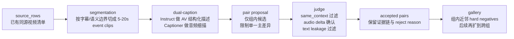

# 面向 Reference + Edit 到 Target 的 Composed Retrieval 数据构造开源方案调研

执行摘要：对你当前这条 `reference video + edit text + visual/audio cues -> target video` 数据构造链路来说，最值得立刻接入的不是再找一个“大而全”的替代仓库，而是把现有开源能力拆成几层来用：用 Omni-Captioner / Qwen3-Omni 补 annotation 与 audio observer，用 Daily-Omni / LIVEVQA 补过滤与 judge，用 CogStream / VideoMind 补分段与时序验证，把 OmniGAIA 留作中长期的 event-graph pair miner。RoadSocial、WorldSense、RAVEN/AVS-QA 更适合作为数据源、压力测试或可选增强，而不是短期主线。这个判断的核心原因很简单：你现在已经把 same-context 做出了明显效果，真正短板是音频覆盖、edit 清晰度和 accepted rate，而不是上下文本身。citeturn5view5turn26view0turn6view3turn7view0turn9view1turn23view0turn22view2

## 现状与选型判断

按你给我的 2026-04-22 最新总结，你的 pipeline 已经从 `source_rows / source_clips_all` 走到了 `clip_plan_detective -> clip_groups -> extracted_event_clips -> detective_annotations -> judged_pair_proposals -> accepted_pairs`；而且最关键的成果是你已经从“整段视频乱配对”切到了“同上下文组内配对”，accepted 样本的 `same_context_avg` 已经提升到 0.84。当前最新一轮 pilot 的问题不是“配不出来”，而是 accepted pair 只有 5 对、其中 audio 相关只有 1 对，`audio_samples_at_least_2` 仍然失败；并且你虽然已经下载了 `Qwen3-Omni-30B-A3B-Captioner` 和 `Thinking`，但主链路里真正在线使用的仍是 `Qwen3-Omni-30B-A3B-Instruct`。这意味着你的下一步不该优先扩源，而该优先补 annotation / difference extraction / judge 三层里的音频链路。这个结论也与 Omni-Captioner、Daily-Omni、WorldSense 这些项目公开材料表现出的方向一致：当前开源方案里，最有效的增益点确实集中在更细的 audio-visual annotation、时序对齐与质量过滤，而不是单纯多抓一些视频。citeturn5view5turn6view3turn33view0

下面所有“适配层”“优先级”都不是原作者原生术语，而是我按你现有七层 pipeline 重新映射后的工程判断。模块记号统一如下：`✓` 表示原生提供，`△` 表示可以借用或轻改，`×` 表示基本没有。

## 候选项目逐项评估

**Omni-Captioner / Omni-Detective** 的模块画像是：`captioner✓ / detective✓ / segmentation△ / pair-miner× / judge△ / gallery×`。它是与你当前问题最贴合的候选，因为官方仓库已经明确给出了 Omni-Detective 的 agentic data generation 框架，以及可下载的 `Qwen3-Omni-30B-A3B-Captioner` 音频细粒度 caption 模型；同时，README 还明确说明当前最小实现的 toolbox 只包含一个音频语言模型，且 Captioner 是单轮、仅音频输入、建议片长不超过 30 秒。仓库还把音视频版详细 caption 能力挂到了 Qwen3.5-Omni / offline demo 上，但我这次检索没有找到独立可下载的 Qwen3.5-Omni 权重条目，所以我把“音视频权重”按未公开处理。对你而言，它最应该替换的是 `annotation`，其次会直接增强 `difference extraction` 和 `judge`，但它本身不是 pair miner，也不是 gallery builder。优点是：音频、说话人、环境声、可闻事件这些正好是你当前最短板的部分；缺点是：你不能把它当作“一键替代整条 pipeline”的现成件。推荐集成方式是：把它变成你现有 `audio_observer` 的核心模型，与现有 Instruct 的 AV 结构化描述组成 dual-caption。优先级是**必做**。落地评估：需要 `Qwen3-Omni-30B-A3B-Captioner`、`Qwen3-Omni-30B-A3B-Instruct`、ffmpeg；如果沿用你现有服务接口，通常 3–5 人日能接通。关键风险是 schema 漂移和长音频细节衰减。预期改进：`same_context` 低到中，`audio_coverage` 高，`edit_clarity` 中，`hard_negatives` 低。citeturn5view5turn26view0turn5view3

**Qwen3-Omni 官方仓库与模型族** 的模块画像是：`captioner✓ / detective△ / segmentation× / pair-miner× / judge△ / gallery×`。它本身不是数据构造 pipeline，但它是把你从闭源 API 依赖里解放出来、并支撑 Omni-Captioner / Daily-Omni 风格标注最现实的 backbone。官方仓库给出了 Instruct、Thinking、Captioner 三个模型，并支持手动下载；其中 Instruct 和 Thinking 支持音频、视频、文本输入，Captioner 则是专门的细粒度音频描述模型。对你来说，它能直接替代 `annotation` 和部分 `judge` 层的闭源推理调用，而且非常适合作为 Daily-Omni、LIVEVQA 这类 pipeline 里原先依赖 GPT / Gemini 的开源替代底座。它的优点是部署路径清楚、代码和模型权重公开，缺点是它不是为 retrieval 三元组格式专门设计的，最终还是要靠你自己定义输出 schema。推荐方式是：短期只用 Instruct + Captioner；Thinking 暂时不进主线，只留给复杂失败样本复判。优先级同样是**必做**。落地评估：需要 Qwen3-Omni repo、HF/ModelScope 权重、你现有 OpenAI-compatible server 或 vLLM/Transformers；通常 2–4 人日。关键风险是显存和吞吐。预期改进：`same_context` 低，`audio_coverage` 中到高，`edit_clarity` 中，`hard_negatives` 低。citeturn26view1turn26view0turn19search6

**Daily-Omni** 的模块画像是：`captioner△ / detective✓ / segmentation✓ / pair-miner✓ / judge✓ / gallery×`。这是目前公开材料里非常接近“可规模化 AV QA 生成 pipeline”的一个项目。论文明确把它的自动流程分成 `video annotation -> revision -> audio-visual temporal alignment -> QA generation -> optimization` 五步，并说明人工质检只花了约 30 小时、最终 manual acceptance rate 约 30%；GitHub 仓库也确实把 `captioning.py、revision.py、qa_generation.py、question_optimize.py、qa_filter.py` 等模块放了出来。更有价值的是，论文中的 Daily-Omni Agent 明确展示了一个你几乎可以直接借用的套路：先把音频和视频切成几个时间段，分别做视觉标注、音频标注和 ASR，再做一致性修订与对齐，最后进入 reasoning/judge。对你的 pipeline 来说，Daily-Omni 最适合增强 `annotation、difference extraction、pair proposal、judge` 四层，尤其是 judge：它那套“剔除 text-only 就能答出来的问题”和“用更难 distractor 重写选项”的思路，非常适合被你改写成 composed retrieval 的 pair filter。缺点是它最终目标是多选 QA，不是 ref-edit-target；而且 repo 的 QA 生成默认依赖 API key。推荐方式是：不要照搬它的数据格式，而是借用它的**五段式质检逻辑**。优先级是**必做**。落地评估：若你用本地 Qwen3-Omni 替换外部 API，工程量通常 4–7 人日；最大的风险是 prompt 需要从 QA 迁移成差分描述。预期改进：`same_context` 中，`audio_coverage` 中，`edit_clarity` 高，`hard_negatives` 中。citeturn6view3turn4view1turn25view0

**CogStream** 的模块画像是：`captioner× / detective× / segmentation✓ / pair-miner✓ / judge△ / gallery△`。它最吸引人的地方，不是训练方法，而是它对 streaming video 的数据组织方式：HF 数据卡明确把视频整理为 `event_segments/`、`QA_Dataset/`、`VQA_Dataset/` 三层，并且给每个 segment 附带 `event_timestamp、label、is_visual、COI（相关上下文）` 和 `relevance`。这套 schema 天生就适合你当前的“同组候选 + hard negatives”范式，因为你完全可以把 `COI/relevance` 这类字段翻译成“同源候选”“近邻负样本”“同上下文但不满足 edit 的对照项”。它对 `segmentation、pair proposal、gallery/hard-negatives bookkeeping` 的帮助比对 captioner 更直接。缺点是它不强调音频，而且 GitHub README 与 HF 数据卡在 QA 总量上存在版本不一致：一个写 59,032，一个写 70,987，说明版本管理还不够统一。推荐方式是：优先借它的**event-segment manifest 结构**，而不是去复现它的任务本身。优先级是**建议**。落地评估：如果只是把 schema 和分组逻辑迁移到你现有 manifest，2–4 人日就够；如果要复现训练，工程量会明显变大。预期改进：`same_context` 中到高，`audio_coverage` 低，`edit_clarity` 中，`hard_negatives` 高。citeturn9view1turn9view2turn4view3

**VideoMind** 的模块画像是：`captioner△ / detective✓ / segmentation✓ / pair-miner△ / judge✓ / gallery×`。它的价值在于“像 DeepSearch 一样做视频理解”：官方 README 直接把它总结为“breaking down tasks, localizing and verifying moments, and synthesizing answers”，并公开了 planner / verifier / grounder 三类训练数据与 benchmark。对你的任务来说，它不适合短期替代当前主线，但非常适合中期把 `segmentation -> difference extraction -> judge` 三层从“启发式判断”升级成“时序定位 + 局部验证”。特别是动作变化、顺序变化、短时事件切换这类 edit，VideoMind 的 `localize + verify` 思想会比单段 caption 更可靠。缺点是它偏视频时序，不强调音频；同时，如果你想用它的完整 agent 形态，训练与推理栈都会更重。推荐方式是：中期只借 verifier / localizer 思想，先用在 action 类 pair 上。优先级是**建议**。落地评估：单人 1–2 周；若只做规则化接入而不训练，会更快。预期改进：`same_context` 高，`audio_coverage` 低，`edit_clarity` 高，`hard_negatives` 中。citeturn23view0turn24view1turn24view0

**LIVEVQA** 的模块画像是：`captioner△ / detective× / segmentation✓ / pair-miner✓ / judge✓ / gallery×`。这是一个非常强的“collect -> filter -> generate -> validate”范式参考。项目站把数据构造描述成多阶段 LLM/MLLM-in-the-loop pipeline：对于 YouTube 视频，它先做字幕分段，再用 UVD + perceptual hashing 做 keyframe 提取与去重，再由 LLM 选 top-K 关键帧；GitHub 仓库则把 news / videos / arXiv 三条管线都拆成了可运行脚本，还提供了自动 `start.py` 流程。需要注意的是，官网摘要说完整版 LIVEVQA 达到 107,143 samples，而 HF 上当前最容易直接访问的是 Research Preview，写的是 3,602 个 QA、1,233 个 news instances，并需要用户同意分享联系信息后访问，所以它的公开形态显然还在逐步放出。对你来说，它最适合增强的是 `source_clips、segmentation、judge`：尤其是字幕分段、关键帧去重和 GPT-4.1 验证这三件事。缺点是它更偏“live visual knowledge”，不是原生的 AV retrieval，也不是音频优先。推荐方式是：只借它的**YouTube preprocessing + validation**，不必照搬新闻/arXiv分支。优先级是**建议**。落地评估：需要 UVD、DocLayout-YOLO、ffmpeg、LLM API 或你自己的 Qwen3-Omni；通常 5–8 人日。预期改进：`same_context` 中，`audio_coverage` 低，`edit_clarity` 中，`hard_negatives` 中。citeturn4view2turn7view0turn7view2turn8view1turn3search2

**OmniGAIA / OmniAtlas** 的模块画像是：`captioner△ / detective✓ / segmentation△ / pair-miner✓ / judge✓ / gallery△`。在 2026 年公开项目里，它是我认为最值得你中长期关注的一个，因为它不是简单做 caption 或做 QA，而是明确提出了 **event graph construction**：数据收集之后，先做 Valuable Information Discovery，再迭代扩展 omni-modal event graph，最后才做 QA generation 和 quality review。对 composed retrieval 数据构造来说，这种“事件图 -> 模糊化 -> 难样本 -> 复核”的思路非常适合拿来做 `difference extraction、pair proposal、judge` 的统一骨架。它的缺点同样明显：完整 pipeline 很重，而且论文构造阶段使用了 Gemini-3-Flash 与 DeepSeek-V3.2 这类外部模型，直接复现不是小工程。推荐方式是：先学习它的 event graph 思想，不要上来就复刻整套 benchmark。优先级是**建议**。落地评估：2–4 周比较合理；风险是工程范围膨胀。预期改进：`same_context` 中，`audio_coverage` 中，`edit_clarity` 高，`hard_negatives` 高。citeturn22view2turn22view1

**WorldSense** 的模块画像是：`captioner× / detective× / segmentation× / pair-miner× / judge△ / gallery×`。它本质上更像高质量 benchmark 和 source domain，而不是可复用的数据生成 pipeline。公开页面与 HF 数据卡都强调它包含 1,662 个 audio-visual synchronized videos、3,172 个多选 QA、8 个大域、67 个细类，且所有 QA 都由 80 名 expert annotators 多轮修订完成。对你的实际价值是两点：第一，它本身就是你当前已经接入的 source 之一，所以不需要额外工程成本；第二，它是非常好的**人工音视频耦合质检参照物**，很适合拿来校正你 judge 对“audio 必要性”和“同上下文”的感觉。缺点是它几乎不提供自动扩展方法。推荐方式是：继续把它当 source 与 audit reference，而不是尝试从它身上“复用完整 pipeline”。优先级是**可选**。落地评估：如果只是继续作为 source 与评测参考，几乎零额外工程；收益主要体现在 `audio_coverage` 的校准而不是自动扩量。citeturn16view0turn33view0

**RoadSocial** 的模块画像是：`captioner△ / detective△ / segmentation× / pair-miner✓ / judge✓ / gallery△`。它的强点在于“social video narrative + hard QA tasks”：项目页和论文首页都明确写了 14M frames、414K social comments、13.2K videos、260K socially-informed QA pairs，并且用 Text LLM + Video LLM 的半自动框架去生成 12 类任务。这个项目对你最有参考价值的不是 road-event domain 本身，而是它对**hard negatives / hallucination robustness** 的强调：它还专门引入了无关视频和无关问题来测试 Video LLM 的幻觉。缺点也很明显：领域非常窄；HF 数据集是门控访问，且数据集中写明大量视频只是 web links，版权仍归原平台与作者所有，这会让你在通用 composed retrieval 里遇到 domain mismatch 与 link rot 问题。推荐方式是：只借它的 judge / hard-negative 设计，不要把它当短期主 source。优先级是**可选**。落地评估：如果只复用评测想法，约 3–5 人日；若想吃透其数据与模型，通常 1–2 周。预期改进：`same_context` 低，`audio_coverage` 低，`edit_clarity` 中，`hard_negatives` 高。citeturn4view4turn10view2turn35view0turn11view0turn27search6

**RAVEN / AVS-QA** 的模块画像是：`captioner× / detective× / segmentation× / pair-miner△ / judge✓ / gallery×`。它最有价值的不是“造数据”，而是它公开了一个很强的 **query-conditioned cross-modal gating** 思路：RAVEN 的 QuART 会给不同模态 token 按问题分配 relevance score，论文同时公开了一个 300K 的 AVS-QA 数据集。对你来说，这有两个可借之处：第一，它很适合变成 `judge` 里的一个“音频是否真正必要”的 reranker；第二，它很适合处理“视觉上没变、但背景噪声/说话/音乐变了”的模态冲突场景。它不适合放在前线的原因也很清楚：任务里有 sensor 模态，而你当前 retrieval 样本没有；而且官方 GitHub README 到现在还写着 `Training & Evaluation: Coming Soon`，HF 上能直接看到的是 `RAVEN-AV-7B`，而 `RAVEN-7B-AVS` 在 README 里只有名字没有下载链接，公开程度仍是部分状态。推荐方式是：把它当可选的 audio-aware judge，而不是 source 或 pair miner。优先级是**可选**。落地评估：需要 `siglip-so400m-patch14-384` 与 RAVEN checkpoint，通常 1–2 周。预期改进：`same_context` 低，`audio_coverage` 中，`edit_clarity` 中，`hard_negatives` 中。citeturn17view1turn17view2turn17view3turn31view0turn30view0

**LVSQA / SLFG** 的模块画像是：`captioner× / detective× / segmentation✓ / pair-miner△ / judge× / gallery×`。它的想法其实非常对你胃口：SceneQA 强调场景级理解，SLFG 强调把帧重组为语义连贯 scene frames，论文也明确说 LVSQA 是从 LVBench 里筛了 100 个长视频、用 MLLM-assisted + human refinement 构成 500 个 scene-level QA。但是到我这次检索为止，我没有找到它对应的官方 GitHub / HF 可下载资源；论文页反复写的是“Code and dataset will be released”，所以现阶段它更像一个值得追踪的思路而不是可落地资产。它最可能帮助的是长视频的 `segmentation` 与 action 类 `edit_clarity`。推荐方式是：现在只吸收它“scene-localized grouping”的概念，不进入短中期主线。优先级是**可选**。落地评估：如果后续官方真放代码，1–2 周可试；当前阶段最大风险就是资源未公开。预期改进：`same_context` 高，`audio_coverage` 低，`edit_clarity` 中到高，`hard_negatives` 低。citeturn14search0turn13academia4turn35view2

归纳成一句话：**短期最有用的不是“再找一个更大的 benchmark”，而是把 Omni-Captioner / Qwen3-Omni 接到你的 `audio_observer`，再把 Daily-Omni 的 judge 思路迁进去；中期再考虑 CogStream、VideoMind、OmniGAIA 这些更偏结构化和时序化的增强。**citeturn5view5turn26view0turn6view3turn9view1turn23view0turn22view2

## 关键属性对比表

说明：`C=captioner；D=detective/agent；S=segmentation；P=pair-miner；J=judge；G=gallery builder`。模块与适配层是我按你现有 pipeline 的工程映射，不是原作者原生定义。

| 项目 | 链接 | 开源状态 | 主要模块 | 适配层 | 适配难度 | 优先级 | 备注 |
|---|---|---|---|---|---|---|---|
| Omni-Captioner | GitHub / HF 模型 / 技术报告 / Demo citeturn4view0turn26view0turn0search16 | 代码开；音频权重开；AV 权重未明确公开 | C✓ D✓ S△ P× J△ G× | annotation, difference extraction, judge | 低 | 必做 | 最适合补 `audio_observer` |
| Qwen3-Omni | GitHub / HF 模型集合 citeturn26view1turn19search6 | 代码开；Instruct/Thinking/Captioner 权重开 | C✓ D△ S× P× J△ G× | annotation, judge | 低 | 必做 | 本地化 backbone |
| Daily-Omni | GitHub / HF 数据 / 论文 citeturn4view1turn34view0turn6view3 | 代码开；数据开 | C△ D✓ S✓ P✓ J✓ G× | annotation, difference extraction, pair proposal, judge | 中 | 必做 | 最像“可规模化 AV 过滤流水线” |
| CogStream | GitHub / HF 数据卡 citeturn4view3turn9view1 | 代码开；数据开 | C× D× S✓ P✓ J△ G△ | segmentation, pair proposal, gallery bookkeeping | 中 | 建议 | 适合 event-segment manifest |
| VideoMind | GitHub / HF 数据与 demo citeturn23view0turn24view1 | 代码/模型/数据开 | C△ D✓ S✓ P△ J✓ G× | segmentation, difference extraction, judge | 中到高 | 建议 | 强在 moment localize + verify |
| LIVEVQA | GitHub / HF 预览 / 官网 citeturn4view7turn8view1turn4view2 | 代码开；数据为 preview/gated；完整发布在推进中 | C△ D× S✓ P✓ J✓ G× | source_clips, segmentation, judge | 中到高 | 建议 | 强在 collect/filter/validate |
| OmniGAIA | GitHub / HF / 论文 citeturn21view2turn22view1turn20search10 | 代码/benchmark/models 开 | C△ D✓ S△ P✓ J✓ G△ | difference extraction, pair proposal, judge | 高 | 建议 | 中长期 event-graph 主方案 |
| WorldSense | GitHub / HF / 官网 citeturn4view5turn33view0turn16view0 | 代码开；数据开 | C× D× S× P× J△ G× | source_clips, judge reference | 低 | 可选 | 更像高质量 source 与 audit anchor |
| RoadSocial | 官网 / 论文 / GitHub / HF citeturn4view4turn10view2turn11view0turn27search2 | 推理/eval 代码开；数据门控；权重开；完整 miner 部分公开 | C△ D△ S× P✓ J✓ G△ | source_clips, judge, hard negatives | 中 | 可选 | 领域窄，视频多为 web links |
| RAVEN / AVS-QA | GitHub / HF 模型 / HF 数据 / 论文 citeturn4view6turn31view0turn30view0turn17view1 | 代码开；数据开；权重部分开；训练文档不完整 | C× D× S× P△ J✓ G× | judge | 中到高 | 可选 | 更像 audio-aware reranker |
| LVSQA / SLFG | 论文 / 官方站（论文中提及） citeturn14search0turn13academia4 | 论文称将公开；本次未发现可下载 repo/HF | C× D× S✓ P△ J× G× | segmentation | 高 | 可选 | 先跟踪，不建议当前投入 |

## 三阶段集成路线与最小可行实验

**短期** 的目标应该非常单纯：**不改你的 source 池，不大改 pair miner，只把 annotation 和 judge 补强到能显著提高 audio_ratio。** 这一步只需要下载并部署 `Qwen3-Omni-30B-A3B-Instruct` 与 `Qwen3-Omni-30B-A3B-Captioner`，并沿用你已有的 Qwen3-Omni 服务；参考 Omni-Captioner 对 Captioner 的说明，clip 长度控制在 30 秒内最稳。然后把 Daily-Omni 的两类过滤思想迁入 judge：一类是“text-only leakage filter”，一类是“让 edit 只留下单一主差异”。如果你要做一个真正可验收的 MVP，我建议只取 **10 组同源视频**、每组切成 3–5 个事件片段，总计大约 30–50 clips；只在组内做 candidate pairing，不做跨组扩展。预期指标可以设得很明确：`same_context_avg >= 0.82`（目标 0.85，不低于你当前 0.84 太多）、`audio_ratio >= 0.35`、`proposal->accepted rate >= 0.15`、accepted audio-driven pairs 至少 3 对、人工抽查 10 对里至少 8 对判断为“同上下文且 edit 清楚”。如果做不到这一组指标，就不要急着扩量，而应该先检查 dual-caption 的 schema 与 judge 提词。这个短期 MVP 的工程量大致是 **1–2 周**，其中真正必要的下载就两件事：Instruct 和 Captioner；其余项目暂时只借 prompt 和 schema，不需要全量部署。citeturn26view0turn26view1turn6view3

可以把短期 MVP 清单压缩成六步。第一步，用你现有的 `source_clips_all.jsonl` 先筛 **speech/music/environment-rich** clip，不再随机抽样。第二步，参照 LIVEVQA 的思路按字幕边界或语义边界切片，并保持 5–20 秒、最长不超过 30 秒。第三步，每个 clip 并行跑两路标注：`Instruct -> AV structured caption`，`Captioner -> audio dense caption`。第四步，把输出固化为统一 schema：`storyline, visible_text, speech, speakers, audio_events, acoustic_scene, uncertainties`。第五步，pair proposal 只允许组内候选，并限制 `single_main_difference = true`。第六步，judge 增加三条硬规则：`same_context_score` 过线、Captioner 证实音频差异、文本泄漏不过拟合。若你只想最快验证 prompt，可先用官方 demo 试，再切到本地权重。citeturn7view2turn5view5turn29search1

**中期** 的目标是把“启发式组内配对”升级成“带时序定位和结构化 hard negatives 的 pair miner”。这一阶段最应该接的是 CogStream 和 VideoMind：前者给你 event-segment 的 manifest、`COI/relevance` 这种 hard-negative 组织方式；后者给你动作变化、顺序变化、短时事件变化的 localize/verify 思路。与此同时，可以把 LIVEVQA 的 YouTube collector 当成扩源组件，用来挑出 same-source 且字幕条件好的视频。中期建议把规模扩到 **50 组同源视频、200–300 clips**，并开始记录每个 accepted pair 的 `edit_type` 与 `supporting evidence`。验收建议提高到：`same_context_avg >= 0.85`、`audio_ratio >= 0.40`、`proposal->accepted >= 0.18`、每个 accepted pair 至少绑定 2–3 个 hard negatives，并保证 action / attribute / object / audio 四类差异都不是空桶。这个阶段的工程量大约 **1–3 个月**，取决于你是只借 schema，还是把 VideoMind 的验证器真正接起来。citeturn9view1turn24view1turn4view2

**长期** 的目标才是把你的 pilot 变成真正可发表、可训练、可评测的 composed retrieval 数据集。这里最值得投入的是 OmniGAIA 的 event graph 思路：先做事件发现，再做差分抽取，再做 quality review，而不是直接从 caption 文本里硬凑 pair。到这个阶段，再引入 RoadSocial 的 hallucination robustness、RAVEN 的 audio-aware reranker 和 WorldSense 的 audit role 才有意义。长期规模上，可以把目标设成 **200 组以上同源视频、1000+ clips、300+ accepted pairs**；验收标准建议是：`same_context_avg >= 0.87`、`audio_ratio >= 0.45`、`proposal->accepted >= 0.20`、每个样本 3–5 个 hard negatives、人工抽查通过率 >= 90%。这个阶段通常需要 **3–6 个月**，而且很可能要引入更稳定的 event graph 或 structured judge，而不是只靠单轮 caption 文本。citeturn22view2turn10view2turn17view1

把三阶段再浓缩成一句建议：**先补音频，再补验证，再补结构化 pair miner；不要反过来。** 你现在最值钱的成果已经是 “same-context 这件事做对了”，所以任何新增模块，都应该以“别把 same_context 拉低”为第一验收条件。

## 未决问题与局限

这次检索里有几处公开信息本身存在不一致，必须提前说明。其一，LIVEVQA 的官网摘要给出的是 107,143 samples，但当前 HF Research Preview 写的是 3,602 QA / 1,233 news instances；这意味着它的公开版本与完整版本并非同一层级，我在本报告里按“代码可用、公开数据部分可得”处理。其二，CogStream 的 GitHub README 与 HF 数据卡在 QA 总量上有 59,032 和 70,987 两个数字，我把它视作版本差异，不建议你依赖其“绝对规模”，但它的数据结构仍然有复用价值。其三，LVSQA / SLFG 到目前仍主要停留在“will be released”状态，所以我把它列为 watchlist，而不是可执行选项。其四，Qwen3.5-Omni 在官方公开入口里我主要看到了 HF / ModelScope 的 online/offline demo，而没看到独立可下载权重条目；因此凡是依赖 Qwen3.5-Omni 本体做本地批量推理的方案，都要按“未公开权重”来估风险。citeturn8view1turn3search2turn9view1turn4view3turn14search0turn29search0

## 推荐的短期 MVP 流程图

